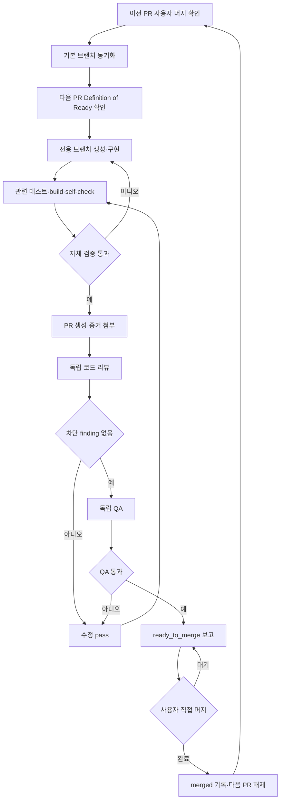

# 개발 PR·리뷰·QA 반복 워크플로

## 목적

PRD의 개발 단위를 독립적으로 검증 가능한 Pull Request로 구현하고, 매 PR마다 코드 리뷰와 QA를 통과한 뒤 사용자가 직접 머지하는 반복 절차를 정의한다. 이 문서는 구현 순서뿐 아니라 다음 개발 단계를 시작할 수 있는 조건을 규정한다.

## 현재 설계 점검 결과

기존 delivery 문서는 작업 ID, 입력, 구현 범위, 성공 조건, 테스트와 증거를 갖추고 있다. 그러나 다음 항목은 명시적 계약이 아니었다.

- 작업 ID를 어떤 PR 단위로 묶는지
- 구현 완료 후 코드 리뷰와 QA를 어떤 순서로 수행하는지
- 리뷰·QA 실패를 누가 고치고 어디까지 재검증하는지
- 사용자가 직접 머지하기 전 다음 개발 PR을 시작하지 않는 규칙
- PR마다 남겨야 하는 공통 증거와 승인 상태

아래 절차가 이 공백을 보완하며 기존 단계별 작업 문서보다 실행 순서에서 우선한다.

## 핵심 원칙

1. 하나의 PR은 하나의 검증 가능한 사용자 결과 또는 기술 계약을 완성한다.
2. 각 PR은 관련 production code와 해당 테스트를 함께 포함한다.
3. 구현자 자체 검증, 독립 코드 리뷰, 독립 QA를 모두 통과해야 `ready_to_merge`가 된다.
4. 구현자가 자신의 작업을 최종 승인하지 않는다.
5. 자동 테스트만으로 UI/프로세스 QA를 대체하지 않는다.
6. 사용자가 직접 PR을 머지한다. Agent와 구현자는 자동 머지하지 않는다.
7. 현재 PR이 기본 브랜치에 머지됐다는 확인 전에는 다음 PR의 구현을 시작하지 않는다.
8. 미결정·차단 요구사항은 임의로 구현하지 않고 별도 PR 단위도 시작하지 않는다.
9. 최종 품질 단계는 매 PR의 QA를 대체하지 않고 전체 회귀를 추가한다.
10. UI PR은 최종 HEAD와 일치하는 개발 화면 캡처가 PR에서 보여야 한다.
11. 단계별 구현은 `CLAUDE.md`의 Superpowers 우선·`task-spec-template` fallback과 분리된 구현/리뷰/QA agent 규칙을 따른다.

## PR 개발 단위 기준

다음 조건을 모두 만족할 때 하나의 PR 단위로 인정한다.

- PR 제목으로 사용자 또는 시스템 결과를 한 문장으로 설명할 수 있다.
- 포함하는 delivery 작업 ID와 요구사항 ID가 명확하다.
- 정상, 실패, 경계 조건을 해당 PR만으로 검증할 수 있다.
- 미완성 API와 UI를 함께 노출하지 않는다. 필요하면 비노출 내부 계약 PR로 분리한다.
- 선행 PR이 머지된 기본 브랜치에서 시작한다.
- 리뷰어가 관련 없는 대규모 변경 없이 전체 diff를 이해할 수 있다.
- 되돌려도 이후 머지된 독립 기능의 데이터가 손상되지 않는다.

파일 수, 줄 수와 작업 시간만으로 PR 크기를 판정하지 않는다. 하나의 결과에 백엔드·도메인·UI가 모두 필요하면 함께 묶되, 서로 독립 검증 가능한 결과 두 개는 분리한다.

## 작업 상태

| 상태 | 의미 | 진입 조건 | 종료 조건 |
| --- | --- | --- | --- |
| `planned` | 순서만 배치됨 | PR 단위표 등록 | 선행 의존성 확인 |
| `ready` | 구현 가능 | 결정·선행 PR·수용 기준 확정 | 브랜치 생성 |
| `in_progress` | 구현 중 | 사용자 머지된 base에서 시작 | 자체 검증 완료 |
| `code_review` | 독립 리뷰 중 | build·관련 테스트·self-check 통과 | 차단 finding 0건 |
| `qa` | 동작 검증 중 | 코드 리뷰 통과 | QA 차단 finding 0건 |
| `fix_required` | 수정 필요 | 리뷰 또는 QA 실패 | 한 번의 수정 pass 후 재검증 |
| `ready_to_merge` | 사용자 머지 대기 | 리뷰·QA·증거 완료 | 사용자 머지 |
| `merged` | 기본 브랜치 반영 | 사용자 머지 확인 | 다음 PR `ready` 전환 |
| `blocked` | 진행 불가 | 결정·환경·선행 산출물 누락 | 원인 해소 후 재계획 |

`ready_to_merge`는 완료가 아니다. `merged`만 후속 구현의 선행 조건을 충족한다.

## 한 PR의 반복 절차



코드 리뷰 finding은 `superpowers:subagent-driven-development`의 task fix/re-review loop를 따른다. QA finding은 하나의 통합 correction pass로 묶고 수정 후 전체 관련 테스트와 영향 경로를 다시 검증한다. 같은 QA 차단 문제가 남으면 PR을 `blocked`로 돌리고 범위·설계를 다시 정한다.

## Skill과 멀티 에이전트 실행

- Claude 개발은 저장소 [CLAUDE.md](../../CLAUDE.md)를 먼저 읽는다.
- Superpowers가 사용 가능하면 `using-superpowers` → `writing-plans` → `using-git-worktrees` → `subagent-driven-development`와 TDD 순서로 실행한다.
- Superpowers를 불러올 수 없으면 등록된 `task-spec-template`로 `docs/tasks/<pr-unit-id>/task-spec.md`를 작성하고 사용자 확인 전 코드를 작성하지 않는다.
- coordinator와 프로젝트 agents `blueprint-task-planner`, `blueprint-implementer`, `blueprint-code-reviewer`, `blueprint-qa-reviewer` 역할을 분리한다.
- implementer는 production/test 파일을 쓰지만 자신의 최종 코드 리뷰나 QA를 승인하지 않는다.
- reviewer와 QA는 서로 다른 agent context를 사용한다. QA는 diff뿐 아니라 실행 중 화면과 프로세스를 검증한다.
- 기계적 소규모 구현만 Haiku를 허용하고, 일반 구현·QA는 Sonnet, 고위험 및 최종 whole-PR review는 Opus를 사용한다.
- 구현 agent를 병렬 실행해 공유 파일을 수정하지 않는다. 리뷰와 QA는 앞 단계 산출물에 의존하므로 순차 실행한다.
- `.claude/agents/` 정의를 새로 추가하거나 수정한 뒤에는 Claude Code session을 재시작해 agent를 다시 로드한다.

## 역할과 책임

### 구현자

- 허용된 PR 범위만 변경한다.
- 테스트를 기능과 함께 작성한다.
- `@sfood/ui` 사용 내역과 직접 구현한 UI 잔여분을 기록한다.
- build, 자동 테스트와 self-check 결과를 PR에 첨부한다.
- finding을 수정하고 수정 영향 범위를 설명한다.
- PR을 머지하지 않는다.

### 코드 리뷰어

- 구현자와 분리된 read-only 관점에서 diff를 검토한다.
- 요구사항 누락, 회귀, 보안, 데이터 무결성, 오류 처리와 테스트 신뢰성을 판정한다.
- UI 변경은 `@sfood/ui` public export와 semantic token 준수를 확인한다.
- finding을 severity, 파일·위치, 재현 근거와 기대 결과로 남긴다.
- 직접 기능 범위를 확장하지 않는다.

### QA

- PR 수용 기준을 사용자 행동과 프로세스 상태 전이로 검증한다.
- 정상 흐름만 아니라 실패, 빈 상태, 재시도, 새로고침과 중복 실행을 확인한다.
- UI 변경은 데스크톱·모바일, 키보드, 포커스와 반응형을 검증한다.
- AI 작업은 fixture 기준 schema, 호출 수, 모델 profile과 실패 시 상태 보존을 확인한다.
- 코드 리뷰 결과를 반복하는 대신 실행 증거를 남긴다.
- 화면 변경이면 최종 HEAD의 개발 화면을 캡처하고 PR에서 직접 볼 수 있게 첨부한다.

### 사용자 승인자

- PR 범위와 제품 결과를 확인한다.
- 코드 리뷰와 QA가 `pass`인지 확인한다.
- 직접 merge하거나 수정·보류를 결정한다.
- 머지 완료를 알림으로써 다음 PR 구현을 승인한다.

## Definition of Ready

다음 항목이 모두 있어야 브랜치를 만든다.

- PR unit ID와 제목
- 포함·제외 범위
- 요구사항 ID와 delivery 작업 ID
- 선행 PR의 `merged` 상태
- 관찰 가능한 수용 기준
- 정상·실패·경계 테스트 목록
- UI 변경 시 화면 ID, viewport와 디자인 시스템 근거
- 데이터/API 변경 시 schema, migration과 rollback 영향
- 미결정 차단 항목 0건

## 구현자 자체 검증

PR 생성 전 최소 검증:

- 해당 작업의 단위·통합·계약 테스트
- `npm run build`
- UI 변경 시 Playwright와 Agent Browser의 동일 핵심 경로 검증
- desktop과 mobile 필수 viewport 확인
- 오류·빈 상태·loading·재시도 확인
- secret, token, 사용자 원문과 임시 결과 파일 미포함 확인
- 관련 Mermaid 문서 변경 시 `npm run docs:check:mermaid`
- `git diff --check`

아직 존재하지 않는 테스트 script가 필요하면 테스트 기반 PR에서 먼저 추가한다. 실행하지 못한 검증은 성공으로 표시하지 않고 제한으로 기록한다.

## 코드 리뷰 gate

다음 중 하나라도 있으면 `fail`이다.

- P0/P1 수용 기준 미구현
- 인증·권한 우회, secret 또는 개인정보 노출
- schema 검증 전 상태 반영
- 사용자 데이터 유실 또는 비원자적 저장
- 관련 없는 파일 변경이나 숨은 범위 확장
- 실패 경로·경계값 테스트 누락
- 임의 디자인 값 또는 중복 UI primitive 추가
- 사용자 직접 머지 원칙을 우회하는 자동 merge 설정

리뷰 결과는 `pass`, `pass_with_non_blocking`, `fail` 중 하나다. `pass_with_non_blocking` 항목은 후속 작업 ID가 있어야 하며 P0 결함에는 사용할 수 없다.

## QA gate

PR 유형별 필수 QA:

| 유형 | 필수 검증 |
| --- | --- |
| 도메인·상태 | 정상/금지 전이, 원자성, revision, 새로고침 |
| API | 정상·400·401·409·429·5xx fixture, 중복 요청, 로그 안전성 |
| AI | schema, 잘못된 ID 거절, 모델 profile, 호출·비용 budget, 입력 보존 |
| 저장 | 생성·업데이트·migration·손상·실패 복구·사용자 격리 |
| UI | desktop/mobile, keyboard, focus, loading/empty/error, 긴 콘텐츠 |
| 문서 | source/revision coverage, ready gate, stale/conflict, 다운로드 내용 |

QA 결과는 `pass` 또는 `fail`이다. 재현할 수 없는 항목은 `pass`가 아니라 `blocked`로 기록한다.

## PR 본문 계약

모든 PR은 다음 정보를 포함한다.

```markdown
## PR Unit
- ID:
- 사용자/시스템 결과:
- 요구사항:
- Delivery 작업:
- 선행 PR:

## Scope
- 포함:
- 제외:

## Acceptance
- [ ] 관찰 가능한 결과

## Validation
- 자동 테스트:
- build:
- 브라우저/프로세스:
- 접근성/반응형:

## Review
- 결과: pending | pass | pass_with_non_blocking | fail
- findings:

## QA
- 결과: pending | pass | fail | blocked
- 환경·fixture:
- 증거:

## Screenshots
- UI 변경 없음 또는 캡처 링크
- desktop 1440×900
- mobile 390×844
- 필요한 loading/empty/error/validation/overlay/completed 상태

## Risk
- 데이터/API/config 영향:
- rollback:
- 알려진 제한:

## Merge
- Agent auto-merge: 금지
- 사용자 merge: pending | merged
```

스크린샷·녹화·대용량 로그는 PR 첨부나 CI artifact로 보관하고 저장소 루트에 커밋하지 않는다. 저장소에는 지속적으로 필요한 fixture와 테스트 코드만 남긴다.

### UI PR 캡처 gate

UI, 레이아웃, 문구, 상태, focus 또는 interaction이 바뀌면 다음을 모두 만족해야 한다.

- 최종 review fix 이후의 HEAD로 캡처한다.
- 최소 desktop 1440×900과 mobile 390×844를 포함한다.
- 해당 task가 바꾼 정상 상태와 적용 가능한 loading, empty, error, validation, overlay, completed 상태를 포함한다.
- 기존 화면 변경을 비교하는 데 의미가 있으면 before/after를 함께 올린다.
- 파일명은 `<pr-unit>-<screen>-<viewport>-<state>.png` 형식이다.
- Playwright로 캡처하고 Agent Browser로 같은 상태의 DOM·interaction을 별도 검증한다.
- secret, token, 개인 이메일, 운영 데이터, 로컬 경로와 관련 없는 창을 포함하지 않는다.
- PR 본문에서 route, viewport, state와 fixture를 설명한다.

임시 파일은 gitignored `.pr-artifacts/<pr-unit>/`에 둔다. 우선 PR attachment로 업로드하며, 환경상 업로드할 수 없으면 최종 최적화 이미지에 한해 `docs/delivery/evidence/<pr-unit>/`에 커밋하고 PR에서 링크한다. 보이는 최종 캡처가 없는 UI PR은 `ready_to_merge`가 아니다.

## PR 단위 실행 순서

아래 순서는 초기 계획이다. 각 행은 독립 PR이며 앞 행의 사용자 머지가 다음 행 구현의 선행 조건이다.

| 순서 | PR unit | 포함 작업 | 검증 가능한 결과 | 상태 |
| ---: | --- | --- | --- | --- |
| 1 | `AUTH-PR-01` 인증 서버 경계 | AUTH-001~003 | AX fixture로 valid 세션만 발급, 위조·재사용 거절 | ready |
| 2 | `AUTH-PR-02` 로그인·보호 라우트 | AUTH-004, 005, 007 | 비인증 UI/API 차단, returnTo와 logout | planned |
| 3 | `AUTH-PR-03` 사용자 저장 격리 | AUTH-006 | 계정 A/B 로컬 프로젝트 교차 노출 0건 | planned |
| 4 | `FND-PR-01` 런타임·디자인 시스템 | FND-001, 002 | React 18과 `@sfood/ui` 단일 기반·샘플 렌더 | planned |
| 5 | `FND-PR-02` 도메인·Agent 계약 | FND-003, 004 | 상태·schema·모델 registry 계약 테스트 | planned |
| 6 | `FND-PR-03` 테스트 기반 | FND-005 | unit/contract/browser test 명령과 CI gate 실행 | planned |
| 7 | `PRJ-PR-01` 라우팅·프로젝트 생성 | PRJ-101, 102 | 홈에서 생성, 잘못된 경로 404 | planned |
| 8 | `PRJ-PR-02` 저장·최근 목록 | PRJ-103, 104 | 새로고침 복구, 20/21 경계와 실패 보존 | planned |
| 9 | `PRJ-PR-03` 작업 공간 셸 | PRJ-105 | desktop/mobile 셸과 탭·저장 상태 복구 | planned |
| 10 | `AI-PR-01` 모델·prompt·budget 기반 | AI-001~003, 008, 009 | Luna/Mini/Terra routing, schema version, budget/eval gate | planned |
| 11 | `CON-PR-01` turn 수명주기 | CON-201, 202, 206, AI-010 | 입력 보존, 인증, 중복 방지와 실패 재시도 | planned |
| 12 | `CON-PR-02` 질문·선택 폼 | CON-203, 204, AI-005 | catalog 질문과 7개 form, 선택 경로 API 0회 | planned |
| 13 | `CON-PR-03` 메시지·AI block | CON-205, AI-004 | 허용 block 렌더, 진행·취소·compaction | planned |
| 14 | `DSG-PR-01` 제안 검토·확정 | DSG-301~303 | 복수 제안 개별 수정·승인·거절 | planned |
| 15 | `DSG-PR-02` 충돌·의존·일괄 처리 | DSG-304, 305, 307 | stale proposal 차단과 atomic 일괄 처리 | planned |
| 16 | `DSG-PR-03` 설계 보드·readiness | DSG-306 | 영역별 상태와 document-ready gate | planned |
| 17 | `DOC-PR-01` Requirements | DOC-401, 402, AI-006 | 코드 plan, Mini draft/review, 추적 가능한 요구사항 | planned |
| 18 | `DOC-PR-02` Requirements ready·PRD | DOC-403, 404, AI-007 | ready 잠금과 Terra PRD, Mini review | planned |
| 19 | `DOC-PR-03` 부분 보완·정합성 | DOC-406, 407 | 선택 section만 patch, 불일치 proposal | planned |
| 20 | `DOC-PR-04` 직접 편집 영향 | DOC-405 | 영향 preview 후 항목별 제외·원자 적용과 stale 계산 | planned |
| 21 | `SRC-PR-01` 파일 제한·추출 | SRC-501, 502 | 지원 파일 추출과 제한·실패 UI | planned |
| 22 | `SRC-PR-02` 근거 연결 | SRC-503 | 발췌 preview와 자료 제거 영향 | planned |
| 23 | `EXP-PR-01` 문서 복사·다운로드 | EXP-505 | 안전한 개별 Markdown 내보내기 | planned |
| 24 | `GDE-PR-01` 설정 가이드 | GDE-504 | 근거 있는 전체 가이드 생성·검토, 면책 문구 포함 | planned |
| 25 | `QLT-PR-01` 접근성·반응형·성능 | QLT-601~603 | 지정 viewport와 키보드·성능 gate | planned |
| 26 | `QLT-PR-02` 보안·전체 회귀·AI eval | QLT-604, 605, 608 | 전체 프로세스와 보안·모델 회귀 통과 | planned |
| 27 | `QLT-PR-03` 사용자 검증·출시 정리 | QLT-606, 607 | P0 결함 0건과 release checklist | planned |

`blocked` 행은 필요한 제품 결정이 기록되기 전까지 건너뛰고 다음 비의존 PR로 순서를 재계획할 수 있다. 단, 의존하는 후속 PR은 시작할 수 없다. 실제 개발 중 PR이 너무 크면 수용 기준을 보존한 채 `-A`, `-B`로 분할하고 이 표와 추적표를 먼저 갱신한다.

## 머지 후 절차

사용자 머지 확인 후에만 다음을 수행한다.

1. 기본 브랜치를 최신 상태로 동기화한다.
2. 머지된 commit과 CI 결과를 기록한다.
3. 추적표의 해당 작업을 `done`으로 바꾸고 PR·테스트 증거를 연결한다.
4. 다음 PR의 선행 조건과 base 동작을 smoke test한다.
5. 다음 PR을 `ready`로 전환하고 새 브랜치를 만든다.

머지 뒤 회귀가 발견되면 다음 기능을 계속 쌓지 않는다. 해당 PR의 revert 또는 hotfix를 별도 사용자 승인 PR로 먼저 처리한다.

## 실행 예시

### 정상 UI PR

1. `blueprint-task-planner`가 Superpowers plan과 화면·상태 acceptance를 작성한다.
2. `blueprint-implementer`가 Sonnet으로 TDD 구현과 self-check를 수행한다.
3. `blueprint-code-reviewer`가 별도 context에서 diff와 spec을 검토한다.
4. finding 수정과 scoped re-review가 끝나면 `blueprint-qa-reviewer`가 Playwright·Agent Browser로 desktop/mobile을 검증한다.
5. QA가 최종 HEAD 캡처를 만들고 PR `Screenshots`에 노출한다.
6. PR은 `ready_to_merge`에서 멈추고 사용자 머지를 기다린다.

### Superpowers 또는 QA 실패

- Superpowers를 호출할 수 없으면 `task-spec-template` 문서를 작성하고 사용자 확인 뒤 같은 4개 project agent를 수동 순차 dispatch한다.
- UI 런타임, Playwright 또는 Agent Browser 중 하나라도 실행할 수 없으면 QA를 `blocked`로 기록한다. 캡처만 올리고 `pass`로 처리하지 않는다.
- QA correction pass 뒤에도 같은 차단 finding이 남으면 PR을 머지 대기로 보내지 않고 task 범위나 설계를 다시 정한다.

## 완료 판정

개발 단계는 코드 작성, PR 생성 또는 QA 통과만으로 완료되지 않는다. 다음 조건이 모두 충족돼야 한다.

- 계획된 PR unit이 사용자에 의해 머지됐다.
- 각 PR에 코드 리뷰와 QA 결과가 있다.
- 차단 finding과 미연결 P0 요구사항이 없다.
- 요구사항 추적표에 PR과 검증 증거가 연결됐다.
- 기본 브랜치의 build와 누적 회귀 테스트가 통과한다.
