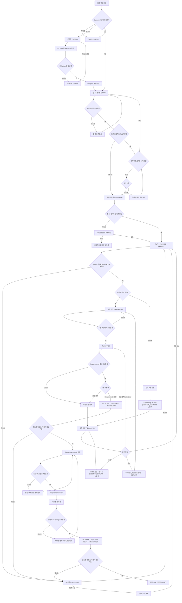

# 전체 프로세스

## 아이디어에서 PRD까지

로그인 성공 전에는 홈과 로컬 프로젝트를 읽지 않는다. 흐름 도중 세션이 만료되면 현재 서버 요청은 `401 AUTH_REQUIRED`로 끝내고, 열린 프로젝트를 화면과 메모리에서 제거한 뒤 `F-SESSION-EXPIRED`를 표시한다. 재인증 성공 후 저장된 마지막 성공 상태를 같은 owner namespace에서 다시 연다.

표준 선택·skip·defer, proposal 승인과 readiness 계산은 AI를 호출하지 않는다. Requirements와 PRD pipeline의 세부 호출·repair 상한은 [문서 생성 프로세스](05-document-generation.md)를 따른다.

## 시작 입력 경로

| 입력 조합 | 판단 | 프로젝트 생성 | 첫 분석 input |
| --- | --- | --- | --- |
| 아이디어만 | trim 후 최소 입력 조건 | 허용 | 아이디어 원문 |
| 지원 파일만 | 하나 이상 extraction ready 필요 | 추출 완료 후 허용 | 파일 발췌 |
| 아이디어 + 파일 | 아이디어 유효, 파일별 독립 검증 | 허용 | 아이디어 + ready 발췌 |
| 빈 입력 + 파일 실패 | 분석 가능한 입력 없음 | 차단 | 없음 |
| 일부 파일 성공 | ready 파일이 하나 이상 | 허용 | 성공 파일만, 실패 상태 유지 |

프로젝트 ID와 첫 사용자 메시지는 생성 transaction에서 한 번만 기록한다. AI 분석 실패가 프로젝트 생성을 되돌리지는 않는다.

## 프로세스 주요 산출물

| 구간 | 반드시 저장되는 결과 |
| --- | --- |
| 프로젝트 생성 | Project, 단일 Thread, 첫 Message, UI preference 초기값 |
| 첫 분석 성공 | Assistant Message, pending Proposal들, GenerationJob 성공 |
| 답변 제출 | User Message, Answer, 요청 Job |
| 제안 승인 | Proposal 처리 상태, DesignItem/AC, revision, ActivityEntry |
| 제안 거절 | Proposal rejected, ActivityEntry; revision 변화 없음 |
| Requirements 생성 | Document/Sections, 사용 designRevision, Job |
| Requirements ready | 문서 상태, 검토 근거, ActivityEntry |
| PRD 생성 | Document/Sections, Requirements와 designRevision 참조, Job |

## 종료가 아닌 중간 완료

PRD draft 생성은 프로세스의 이번 범위 종료점이지만 프로젝트 `completed`를 의미하지 않는다. 사용자는 문서 검토, 설정 가이드 생성, 내보내기 또는 대화를 다시 시작할 수 있다.
