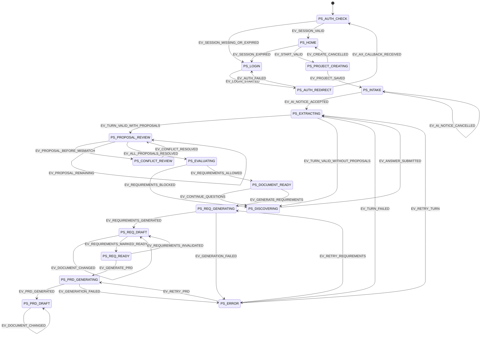

# 프로세스 상태 머신

## 상태 관계



UI의 `F-PRD-LOCKED`, `F-SAVE-ERROR`, `F-DOC-STALE`은 독립 도메인 상태가 아니라 현재 프로세스 상태에 겹치는 파생 Frame이다.

인증 상태는 프로젝트 aggregate보다 상위에 있다. 어떤 프로젝트 상태에서도 `EV_SESSION_EXPIRED`가 발생하면 진행 중 서버 작업을 취소하고 메모리 aggregate를 폐기한 뒤 `PS_LOGIN`으로 전환한다. 재로그인 후에는 인증 사용자 namespace에서 마지막 성공 상태를 다시 읽으며 미저장 메모리 입력의 복구를 보장하지 않는다.

## 핵심 전이표

| 현재 상태 | 사건 | guard | command | 다음 상태/Frame |
| --- | --- | --- | --- | --- |
| `PS_AUTH_CHECK` | session valid | cookie 서명·만료 유효 | user/owner scope 초기화 | `PS_HOME` 또는 returnTo |
| `PS_AUTH_CHECK` | session invalid | 세션 없음·만료·위조 | 민감 상태 제거 | `PS_LOGIN` / `F-LOGIN` |
| `PS_LOGIN` | login 시작 | returnTo가 same-origin path | 임시 returnTo 저장, AX 302 | `PS_AUTH_REDIRECT` |
| `PS_AUTH_REDIRECT` | callback valid | AX `result.valid`, client 일치 | token 폐기, 세션 발급 | `PS_AUTH_CHECK` |
| `PS_HOME` | `EV_START_VALID` | 입력 또는 ready source 존재 | 프로젝트 한도 확인 | `PS_PROJECT_CREATING` |
| `PS_PROJECT_CREATING` | `EV_PROJECT_SAVED` | 저장 성공 | 단일 Thread와 첫 Message 생성 | `PS_INTAKE` / `F-INTAKE` |
| `PS_INTAKE` | `EV_AI_NOTICE_ACCEPTED` | 프로젝트별 미확인 | consent 저장, turn 시작 | `PS_EXTRACTING` |
| `PS_EXTRACTING` | valid proposals | schema와 ID 검증 | pending Proposal 저장 | `PS_PROPOSAL_REVIEW` |
| `PS_PROPOSAL_REVIEW` | proposal 승인 | before가 현재값과 같음 | 원자적 적용·revision 증가 | remaining 또는 evaluating |
| `PS_PROPOSAL_REVIEW` | before 불일치 | target 존재 | mutation 금지 | `PS_CONFLICT_REVIEW` |
| `PS_EVALUATING` | requirements allowed | `G-REQ-ALLOWED` | readiness 저장 | `PS_DOCUMENT_READY` |
| `PS_DOCUMENT_READY` | 생성 선택 | pending/conflict 없음 | snapshot·Job 생성 | `PS_REQ_GENERATING` |
| `PS_REQ_DRAFT` | ready 요청 | `G-REQ-READY` | 문서 상태와 audit 저장 | `PS_REQ_READY` |
| `PS_REQ_READY` | PRD 요청 | `G-PRD-ALLOWED` | snapshot·Job 생성 | `PS_PRD_GENERATING` |
| `PS_PRD_GENERATING` | 생성 성공 | response schema 유효 | Document transaction | `PS_PRD_DRAFT` |

## 금지 전이

| 상태 | 금지 사건 | 결과 |
| --- | --- | --- |
| `PS_LOGIN` | 홈/프로젝트 로드 | 유효 세션 없음 | 차단, 로그인 유지 |
| 모든 비인증 상태 | Blueprint API 실행 | session invalid | `401 AUTH_REQUIRED`, 외부 AI 호출 없음 |
| `PS_PROPOSAL_REVIEW` | 다음 시스템 질문 요청 | 거절, 남은 proposal 수 표시 |
| `PS_CONFLICT_REVIEW` | proposal 직접 적용 | 거절, 기존 confirmed 유지 |
| `PS_EVALUATING` insufficient | Requirements 생성 | 거절, 부족 영역 반환 |
| `PS_REQ_DRAFT` | PRD 생성 | 거절, `F-PRD-LOCKED` |
| `PS_REQ_READY` + revision mismatch | PRD 생성 | Requirements review_required 전환 후 차단 |
| 모든 processing 상태 | 같은 trigger 재실행 | 중복 요청 차단 또는 같은 request 연결 |

## 파생 상태 우선순위

UI Frame은 아래 높은 우선순위를 먼저 적용한다.

```text
저장 오류
> 충돌
> Agent/생성 오류
> 처리 중
> stale/review_required
> 정상 프로세스 상태
```

저장 오류가 있어도 현재 프로세스 상태 값 자체를 `error`로 덮어쓰지 않는다. 재시도 대상을 잃지 않기 위해 오류는 `operation`, `logicalRequestId`, `resumeState`를 가진 별도 상태로 관리한다.
