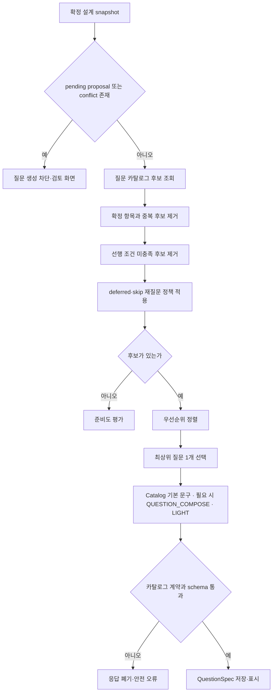
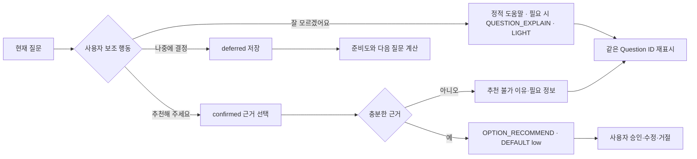

# 질문과 답변 판단

## 다음 질문 결정 흐름



Agent는 질문 topic, 대상 item type, answer mode와 required 여부를 변경할 수 없다. 문구, 도움말, 같은 수준의 선택 후보와 추천 이유만 작성한다.

질문 후보 선택까지 AI 호출은 없다. `QUESTION_COMPOSE`는 선택된 질문 하나의 표현만 작성하며 strict question block을 반환한다.

## 후보 포함 guard

질문 `q`는 다음 식이 모두 참일 때만 후보가 된다.

```text
target(q) is missing or deferred/review_required
AND prerequisites(q) are satisfied
AND no semantic-equivalent confirmed item exists
AND q is not current/pending
AND retryPolicy(q) allows asking again
```

`review_required`는 원래 질문을 그대로 반복하지 않는다. 바뀐 선행 결정과 기존 답의 차이를 설명하는 확인 질문으로 변환한다.

## 우선순위 비교

숫자 점수는 내부 정렬에만 사용할 수 있으며 UI에 표시하지 않는다. 비교 순서는 다음과 같다.

1. Requirements 생성 차단을 해소하는 핵심 항목
2. 여러 후속 결정을 여는 선행 항목
3. 보안·개인정보·권한·외부 연동 위험
4. 현재 대화와 직접 연결된 항목
5. 일반 제약과 기술 세부사항
6. 최근 유사 질문 피로도가 낮은 항목

동률이면 문제 → 목표 → 사용자 → 시나리오 → 기능 → 수용 기준 → 범위 → 데이터/권한 → 운영 → 성공/위험 순서다.

## 답변 행동 결정표

| 사용자 행동 | 유효성 판단 | 저장 결과 | Agent 호출 | 다음 단계 |
| --- | --- | --- | --- | --- |
| 표준 선택 | 허용 value, min/max 검사 | UserAnswer + Message | 없음 | 로컬 proposal/다음 질문 판단 |
| 직접 입력 | allowCustomAnswer, 길이/형식 | 원문과 분류 분리 | `TURN_ANALYZE` DEFAULT | proposal 생성 |
| 표준 + 직접 입력 | multiple에서만 허용 정책 확인 | 선택 순서와 원문 | 예 | proposal 생성 |
| `잘 모르겠어요` | allowUnknown | 도움 요청 Message | 정적 도움말, 필요 시 `QUESTION_EXPLAIN` LIGHT | 같은 질문 재표시 |
| `추천해 주세요` | 허용 여부와 confirmed 근거 존재 | 추천 요청 Message | `OPTION_RECOMMEND` DEFAULT low | proposal 검토 |
| `나중에 결정` | allowDefer | deferred DesignItem + 근거 | 선택적 | 준비도 평가 후 다음 질문 |
| `건너뛰기` | required=false | skip history | 아니오 | 다음 질문 |
| 유효하지 않은 값 | schema 불일치 | 입력만 유지 | 아니오 | field 오류 |

## 선택 유형별 검증

| mode | 제출값 | 핵심 검증 | 잘못된 경우 |
| --- | --- | --- | --- |
| `single` | value 1개 | options 또는 custom 1개 | 제출 차단 |
| `multiple` | value 배열 | 중복 없음, min/max | count 오류 |
| `text` | 원문 | trim, 길이, required | field 오류 |
| `number` | number | finite, min/max/step | 단위 포함 오류 안내 |
| `range` | start/end | start ≤ end, 경계 | 두 field 연결 오류 |
| `rank` | value 순서 | 중복 없음, 대상 집합 일치 | 누락/중복 표시 |
| `confirm` | accept/reject/edit | 명시적 선택 | 선택 요청 |

지원하지 않는 `answerMode`가 Agent에서 오면 질문 schema 실패다. 요구사항의 “text로 안전하게 대체”는 카탈로그 버전 불일치 같은 클라이언트 표시 안전장치로만 적용하며, 해당 답변을 자동 제출하거나 확정하지 않는다.

## 도움·추천 분기



추천은 일반 proposal과 동일하며 추천 배지가 승인 효력을 갖지 않는다.

## 재질문 규칙

- `잘 모르겠어요`: 설명 후 같은 ID를 유지하고 attempt를 증가시킨다.
- optional skip: 선행 결정이 바뀌거나 사용자가 직접 돌아오기 전까지 자동 재질문하지 않는다.
- deferred: 문서 오픈 이슈에 포함하고, readiness가 ready 후보이거나 관련 기능이 바뀌면 다시 검토 제안할 수 있다.
- validation error: 새 Message/Job을 만들지 않고 같은 로컬 입력을 수정한다.
- Agent 빈 proposal: 확정된 것으로 간주하지 않고 구체적인 보완 질문을 만든다.

## 테스트 관찰점

- 어떤 후보들이 제거됐고 최종 질문이 왜 선택됐는지 비식별 debug trace로 확인 가능해야 한다.
- 같은 snapshot과 context는 같은 catalog question ID를 선택해야 한다.
- Agent 표현이 달라져도 target, answer mode, guard와 다음 상태는 달라지지 않는다.
- 표준 선택·skip·defer에서 불필요한 분석 호출이 발생하지 않는지 request ledger로 검증한다.
- 하나의 자유 답변 분석이 여러 block과 atomic proposal을 한 호출로 반환하는지 검증한다.
