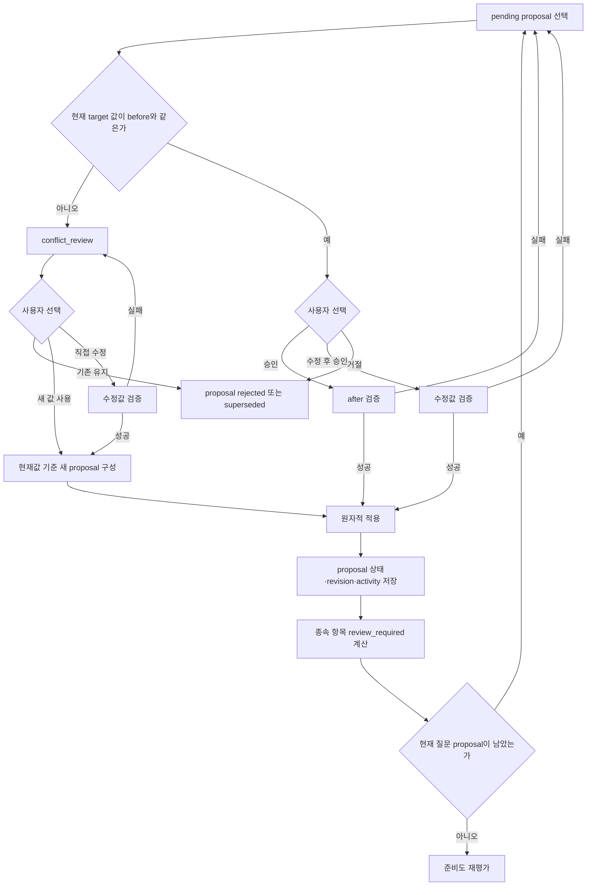
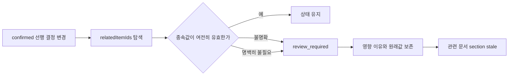

# 제안 처리와 준비도

## 제안 처리 흐름



## 사용자 선택 결과

| 선택 | Proposal | DesignItem | revision | 다음 판단 |
| --- | --- | --- | --- | --- |
| 승인 | `accepted` | after 적용/confirmed | +1 transaction당 1 | 종속 영향 → 남은 제안 |
| 수정 후 승인 | `edited_and_accepted` | 수정값 적용/confirmed | +1 | 종속 영향 → 남은 제안 |
| 거절 | `rejected` | 변경 없음 | 변화 없음 | 남은 제안 |
| 기존 유지 | `rejected` 또는 `superseded` | 기존 confirmed 유지 | 변화 없음 | 남은 제안 |
| 새 값 사용 | `accepted` | 최신 before 기준 적용 | +1 | 종속 영향 |
| 직접 수정 | `edited_and_accepted` | 사용자 수정값 적용 | +1 | 종속 영향 |

일괄 승인은 여러 항목을 한 transaction으로 적용하고 revision을 한 번 증가시킨다. 일부 실패 시 모두 되돌린다.

## 종속 영향 규칙

선행 항목이 바뀌면 관련 항목을 삭제하지 않는다.



예: 인증 불필요 → 인증 필요로 변경되면 로그인 방식은 새 질문 후보가 된다. 인증 필요 → 불필요로 변경되면 기존 로그인 방식은 삭제하지 않고 `review_required`가 된다.

## 준비도 guard

### `G-REQ-ALLOWED`

Requirements 생성 허용 조건:

```text
coreMissingCount = 0
AND conflictCount = 0
AND pendingProposalCount = 0
AND every core feature has at least one observable acceptance criterion
AND required dependent areas are confirmed or explicitly deferred
```

### 상태 판단표

| 조건 | readiness | Requirements CTA |
| --- | --- | --- |
| 핵심 누락 있음 | `insufficient` | 차단 |
| conflict 또는 pending 있음 | `insufficient` | 차단·검토 이동 |
| 핵심 충족, 일부 명시적 deferred | `workable` | 허용·오픈 이슈 안내 |
| 핵심·조건부 영역 충족, deferred 없음 | `ready` | 허용 |
| 기존 ready 후 선행 결정 변경 | 재계산 결과 | 이전 상태 고정 금지 |

### 핵심 영역

- 문제와 배경
- 제품 목표
- 주요 사용자
- 핵심 시나리오
- MVP 핵심 기능
- 제외 범위
- 기능별 최소 1개 수용 기준
- 주요 성공 기준과 위험

데이터, 권한, 외부 연동과 운영 제약은 관련 기능이 활성화한 경우에만 required다. 기능상 해당 없음은 deferred가 아니라 명시적 `not_applicable` 판단으로 저장한다.

## 준비도 재평가 사건

- proposal 승인·수정 승인
- conflict 해결
- deferred 또는 skip 변경
- AcceptanceCriterion 추가·수정·삭제
- source 제거로 evidence 상실
- 문서 직접 편집의 설계 역반영

대화 메시지 추가만으로는 readiness를 바꾸지 않는다.

## 프로세스 테스트 관찰점

- readiness 결과뿐 아니라 area별 판정 이유와 blocking item ID를 검증한다.
- pending 1개를 거절한 뒤 confirmed 값과 revision이 변하지 않는지 확인한다.
- 일괄 승인 실패 시 일부 DesignItem만 confirmed가 되는 상태가 없어야 한다.
- 선행 결정 변경 후 종속 항목의 원래 값과 evidence가 보존되는지 확인한다.
