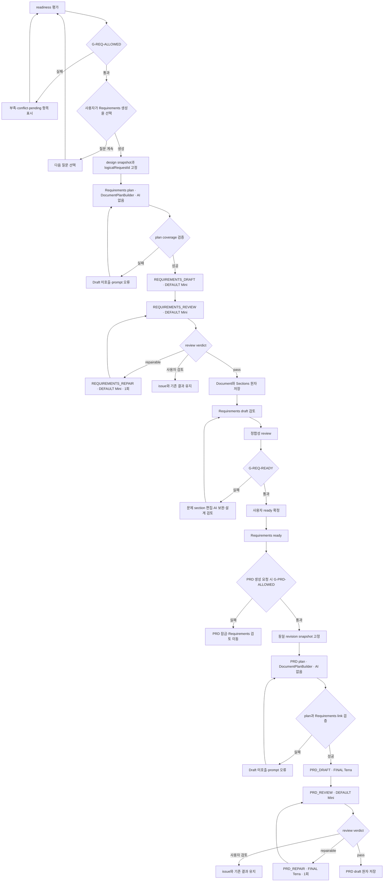
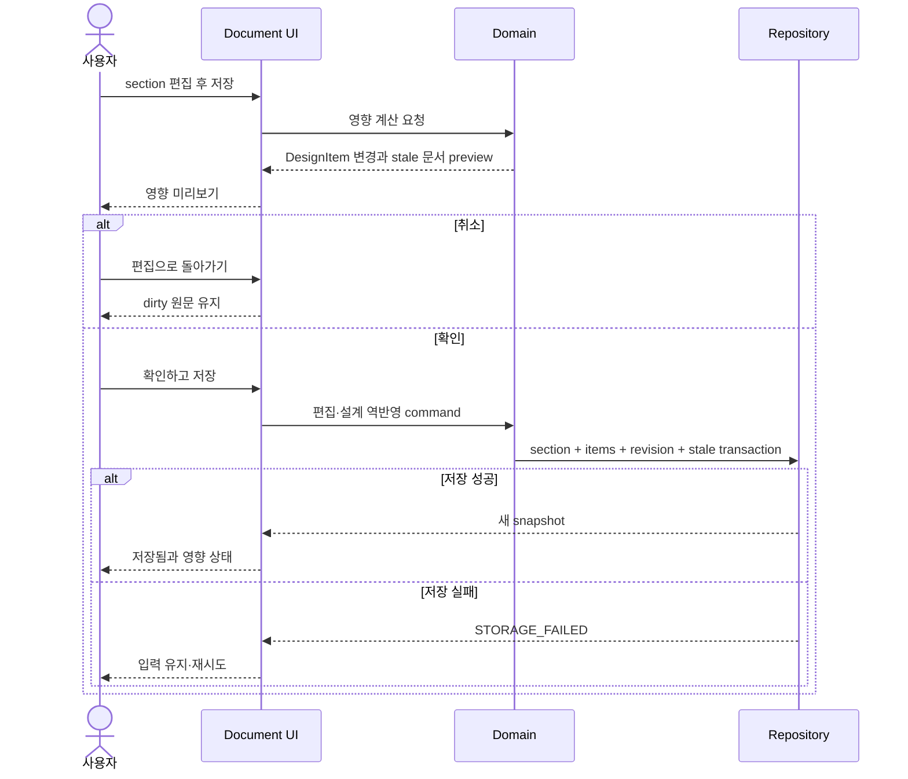

# Requirements와 PRD 생성

## 문서 생성 순서



## Requirements 생성 입력

| 포함 | 제외 |
| --- | --- |
| confirmed DesignItem | pending/rejected proposal |
| confirmed AcceptanceCriterion | Agent 추론만 있는 미승인 값 |
| explicit deferred와 이유 | unrelated 전체 대화 |
| 관련 source excerpt | unsupported/failed 파일 |
| designRevision, project ID | secret과 환경 변수 값 |

job 시작 후 설계가 변경되어 현재 revision이 달라져도 실행 중 snapshot은 바꾸지 않는다. 응답 도착 시 현재 revision과 다르면 문서를 저장할 수는 있지만 즉시 `review_required` 및 section `stale` 판정을 수행한다.

## AI pipeline guard

- Plan은 Markdown을 생성하지 않고 section coverage와 source item mapping만 반환한다.
- Plan 검증 실패 시 Draft 호출 수는 0이다.
- Requirements Draft는 DEFAULT(Mini), PRD Draft만 FINAL(Terra) low reasoning을 사용하고 구조화 section/requirement를 반환한다.
- Review는 DEFAULT(Mini) low로 누락·근거·정합성을 평가하며 직접 수정하지 않는다.
- Repair는 문제 section만 입력으로 받아 한 번 실행하고 Review를 다시 거친다.
- 같은 문서에서 두 번째 자동 repair 또는 다른 고가 모델로의 자동 승격을 허용하지 않는다.
- task별 token 상한과 프로젝트 hard budget을 넘으면 다음 provider 호출 전에 중단한다.

## 생성 transaction

성공 시 한 transaction에서 다음을 저장한다.

1. `GeneratedDocument`
2. 정렬된 `DocumentSection[]`
3. 각 section의 `sourceItemIds`
4. `GenerationJob.succeeded`
5. `ActivityEntry`

하나라도 검증 또는 저장에 실패하면 새 document/version을 활성화하지 않는다.

## `G-REQ-READY` 최소 조건

다음은 제품 결정과 무관하게 필요한 최소 조건이다.

- document status가 draft 또는 review_required다.
- 모든 필수 section이 존재한다.
- 모든 P0 요구사항에 하나 이상의 관찰 가능한 수용 기준이 있다.
- section conflict와 stale이 없다.
- unresolved review issue가 없다.
- document designRevision이 현재 설계 revision과 같다.
- 사용자가 `Requirements 검토 완료` 행동을 수행하고 확인한다.

시스템은 조건을 계산할 뿐 자동으로 ready로 바꾸지 않는다. 모든 조건을 충족하면 `Requirements 검토 완료`를 활성화하고, 확인 화면에서 P0 요구사항 수, 수용 기준 수, 오픈 이슈 수와 기준 revision을 보여준다. MVP는 단일 사용자이므로 별도 역할 권한을 두지 않는다.

## `G-PRD-ALLOWED`

```text
requirements.status = ready
AND requirements.designRevision = currentDesignRevision
AND no requirements section is stale or conflict
AND no PRD generation job is running for the same logical request
```

PRD API와 UI가 같은 guard를 각각 검사한다. 직접 URL이나 API 호출로 UI 잠금을 우회할 수 없다.

## 문서 편집과 역반영



영향 미리보기의 일부 변경 제외 여부는 미결정이므로 현재 process에는 전체 확인 또는 취소만 존재한다.

## 설계 변경 후 문서

- Requirements가 ready인 상태에서 관련 설계가 바뀌면 Requirements를 `review_required`로 전환한다.
- 같은 revision을 전제로 한 PRD 생성과 갱신을 차단한다.
- 기존 PRD는 삭제하지 않고 관련 section만 stale/conflict로 표시한다.
- Requirements가 다시 ready가 된 뒤 PRD 부분 갱신 또는 재생성을 선택한다.

## 금지 결과

- pending proposal이 Requirements 본문에 확정 사실로 포함됨
- Requirements ready 전에 PRD document가 생성됨
- 다른 revision의 Requirements와 PRD가 최신 쌍으로 표시됨
- schema 실패 응답의 일부 section만 저장됨
- 직접 편집한 section을 재생성이 자동 덮어씀
- Plan coverage 실패 뒤 Draft가 호출됨
- review issue 없이 전체 문서를 반복 생성함
- 자동 repair가 두 번 이상 실행되거나 정상 section을 변경함
