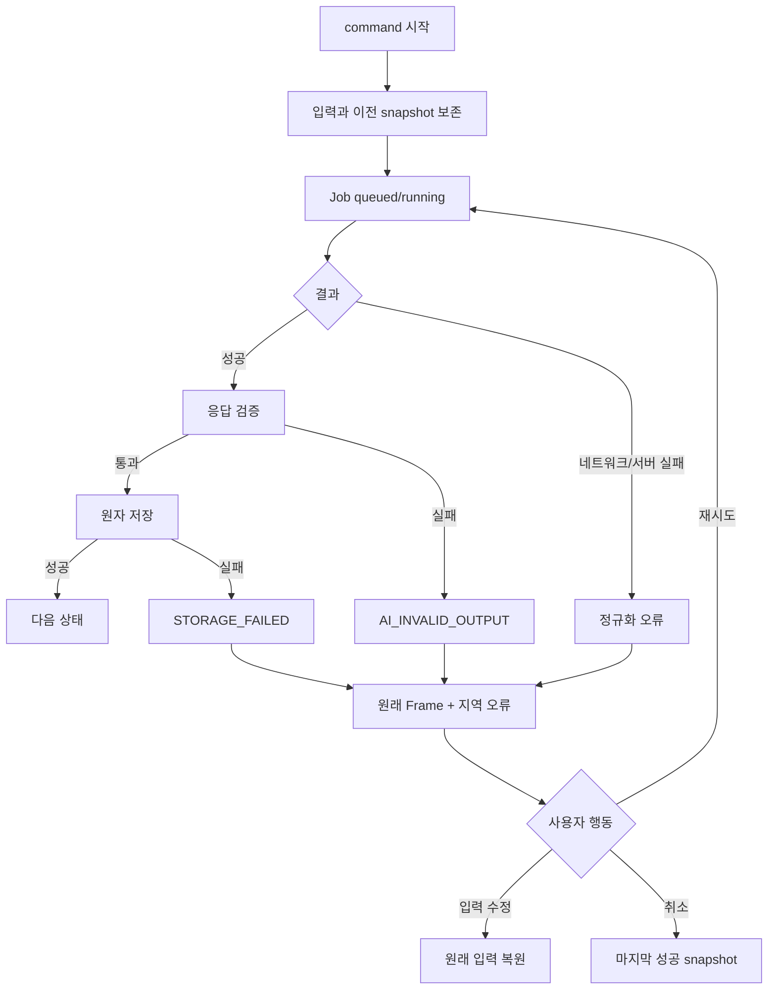
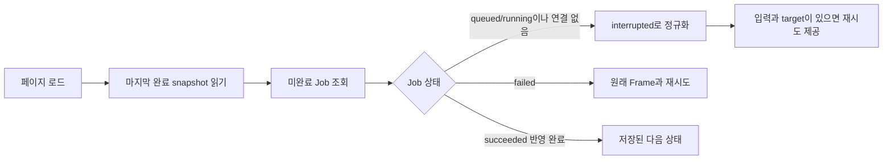

# 실패·중단·복구

## 실패 처리 원칙

실패는 성공 경로를 다른 결과로 대체하지 않는다. 각 오류는 `operation`, `logicalRequestId`, `resumeState`, `errorCode`와 사용자가 다시 실행할 수 있는 command를 가진다.

## 공통 흐름

## 오류별 복구 계약

| 오류 | 바뀌면 안 되는 것 | 유지하는 것 | 재시도 |
| --- | --- | --- | --- |
| `NETWORK_ERROR` | confirmed, document | 사용자 입력, request 의미 | 같은 idempotency key |
| `AI_RATE_LIMITED` | 동일 | 동일 + 대기 안내 | 허용 시점 후 |
| `AI_INVALID_OUTPUT` | proposal/document 미반영 | 입력, 이전 결과 | 새 실행 attempt, 같은 논리 요청 |
| `CONTEXT_TOO_LARGE` | 기존 설계 | 입력과 대상 | 범위 축소 후 새 request |
| `FILE_UNSUPPORTED` | 성공 파일 | 실패 파일 행 | 다른 파일 선택 |
| `STORAGE_FAILED` | 화면 작업 복사본 | dirty changes | 같은 command 재저장 |
| `PROJECT_NOT_FOUND` | 다른 프로젝트 | URL 정보 | 홈/새 프로젝트 |

## idempotency

- `logicalRequestId`: 사용자의 한 번의 의도를 식별한다.
- `attemptId`: 네트워크 재실행을 식별한다.
- 동일 `logicalRequestId + target` 결과는 한 번만 반영한다.
- timeout 후 첫 요청이 늦게 성공하고 재시도도 성공해도 Message, Proposal, Document version은 하나만 활성화한다.
- payload를 사용자가 수정하면 새 `logicalRequestId`를 만든다.

데이터와 API 계약은 `logicalRequestId`와 `attemptId`를 분리한다.

## 중단

| 작업 | 중단 시점 | 결과 |
| --- | --- | --- |
| 첫 입력/답변 분석 | 응답 적용 전 | Job cancelled, 입력과 이전 snapshot 유지 |
| 문서 생성 | document transaction 전 | Job cancelled, 기존 문서 유지 |
| proposal 적용 | transaction이 짧으므로 사용자 중단 없음 | 성공 또는 rollback |
| 파일 추출 | 파일별 중단 | 해당 파일 cancelled/제거, 다른 파일 유지 |
| 저장 | 중단 제공 안 함 | 성공 또는 실패 후 재시도 |

서버 취소가 보장되지 않으면 클라이언트는 응답을 무시할 cancelled request를 기록한다. 늦게 도착한 응답을 적용하지 않는다.

## 새로고침 복구

클라이언트 새로고침만으로 서버 job 성공 여부를 조회할 수 없는 MVP에서는 running job을 성공으로 추정하지 않는다. `interrupted` 오류로 표시하고 다시 실행하게 한다.

## 저장 실패와 이탈

- IndexedDB 실패 후 React 작업 복사본을 자동 rollback하지 않는다.
- 재시도 성공 전에는 `저장됨`을 표시하지 않는다.
- 같은 탭 안 문서 전환은 허용하지만 dirty 상태를 유지한다.
- 탭 닫기/새로고침 시 브라우저 허용 범위의 이탈 경고를 사용한다.
- 브라우저가 종료되면 메모리 작업은 복구를 보장하지 않는다는 한계를 알린다.

## 프로세스 테스트 관찰점

- 오류 전후 aggregate deep comparison
- Job 상태와 errorCode
- retry 후 중복 Message/Proposal/Document 수
- cancelled request의 늦은 응답 무시
- 저장 실패 후 dirty input과 UI Frame 유지
