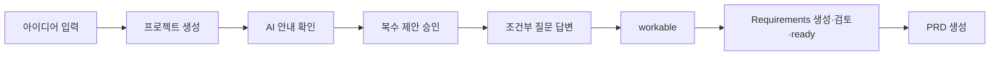

# 프로세스 테스트 명세

## 목표

컴포넌트가 클릭되는지만 확인하지 않고 입력 선택이 올바른 판단, 상태 전이, 저장 결과와 후속 화면을 만드는지 검증한다. 테스트는 실제 OpenAI 응답 대신 결정론적 Agent fixture를 사용한다.

## 테스트 계층

| 계층 | 대상 | 검증 |
| --- | --- | --- |
| 전이 단위 | reducer/domain command | event + guard → state + effects |
| 규칙 조합 | question/readiness/proposal engine | 여러 결정의 연쇄 결과 |
| process integration | app service + fake repository/API | transaction, retry, revision, job |
| browser process | 실제 UI + fixture server | Frame, 사용자 행동, 복구, 접근성 |

## 필수 경로

### `PATH-HAPPY-IDEA`



### 경로 목록

| PATH | 핵심 분기 | 종료 기대 |
| --- | --- | --- |
| `PATH-AUTH-SUCCESS` | 보호 경로, AX valid callback | 세션 발급, returnTo 복귀 |
| `PATH-AUTH-DENIED` | user denied/not allowed | 세션 없음, 로그인 오류 |
| `PATH-AUTH-EXPIRED` | 작업 중 자체 세션 만료 | 프로젝트 비표시, 재로그인 |
| `PATH-AUTH-API-BYPASS` | 비인증 직접 API | 401, 외부 AI 호출 0회 |
| `PATH-AUTH-USER-SWITCH` | 같은 브라우저 A→B | 로컬 프로젝트 교차 노출 없음 |
| `PATH-HAPPY-IDEA` | 표준 선택과 승인 | PRD draft, 동일 revision |
| `PATH-HAPPY-FILE` | 아이디어 없음, 파일 ready | 근거 연결된 Requirements/PRD |
| `PATH-PARTIAL-FILE` | 2개 성공, 1개 실패 | 성공 발췌만 사용, 실패 행 유지 |
| `PATH-CUSTOM-ANSWER` | 직접 입력 | 원문 보존 + proposal 검토 |
| `PATH-RECOMMEND` | 추천 요청 후 수정 승인 | 추천 자동 확정 없음 |
| `PATH-DEFERRED` | 조건부 영역 나중에 결정 | workable, 오픈 이슈 포함 |
| `PATH-HELP` | 잘 모르겠어요 | 설명 후 같은 질문 재표시 |
| `PATH-CONFLICT` | before mismatch | 기존값 유지 후 명시 해결 |
| `PATH-PRD-LOCK` | req draft에서 PRD 요청 | 생성 0회, 잠금 Frame |
| `PATH-DOC-EDIT` | 직접 편집·영향 확인 | revision 증가, 다른 문서 stale |
| `PATH-AI-RETRY` | timeout 뒤 재시도 | 중복 proposal 없음 |
| `PATH-SAVE-RETRY` | IndexedDB 실패 | dirty 유지 후 한 번 저장 |
| `PATH-REFRESH` | 각 주요 상태 새로고침 | 마지막 성공 상태 복구 |
| `PATH-AI-BUDGET` | 일반 프로젝트 전체 | 17~21회 예상, $0.60 hard limit 미초과 |
| `PATH-AI-BLOCKS` | 도움·추천·복수 사실 | task별 허용 block과 proposal |
| `PATH-DOC-PIPELINE` | plan/draft/review/repair | gate와 최대 호출 준수 |

## Given/When/Then 시나리오

### `PT-AUTH-001` 보호 경로와 returnTo

```gherkin
Given 유효한 Blueprint 세션이 없다
When 사용자가 /blueprints/p-1에 접근한다
Then F-AUTH-CHECK 뒤 F-LOGIN이 표시된다
And 프로젝트 내용은 렌더링되지 않는다
When AX verify fixture가 valid로 응답한다
Then HttpOnly 세션이 발급된다
And 사용자는 /blueprints/p-1로 복귀한다
```

### `PT-AUTH-002` 검증 실패와 API 우회

```gherkin
Given AX verify HTTP status는 200이고 result.valid는 false다
When callback을 처리한다
Then 세션은 발급되지 않는다
And F-AUTH-ERROR가 표시된다
When 세션 없이 /api/blueprint/turn을 호출한다
Then 401 AUTH_REQUIRED를 반환한다
And OpenAI 호출 수는 0이다
```

### `PT-AUTH-003` 사용자 전환 격리

```gherkin
Given 사용자 A owner namespace에 프로젝트가 있다
When A가 로그아웃하고 사용자 B가 로그인한다
Then A의 열린 aggregate와 최근 목록은 비워진다
And B의 프로젝트 조회 결과에 A의 프로젝트가 없다
```

### `PT-001` 다음 질문 gate

```gherkin
Given 현재 질문에서 생성된 pending proposal이 2개다
When 사용자가 1개만 승인한다
Then 다음 시스템 질문을 생성하지 않는다
And 남은 proposal 수는 1개다
And 자유 대화 입력은 활성 상태다
```

### `PT-AI-001` 작업별 모델과 응답 block

```gherkin
Given 현재 질문의 stable value와 form mode가 확정됐다
When 사용자가 "잘 모르겠어요"를 선택한다
Then 정적 도움말로 부족한 경우에만 QUESTION_EXPLAIN은 LIGHT low로 한 번 호출된다
And explanation block만 반환한다
And Question ID와 option value는 바뀌지 않는다
When 사용자가 "추천해 주세요"를 선택한다
Then OPTION_RECOMMEND는 DEFAULT low로 한 번 호출된다
And recommendation block과 미확정 proposal을 반환한다
```

### `PT-AI-002` 문서 pipeline과 호출 상한

```gherkin
Given Requirements 생성 가능한 design snapshot이 있다
When plan coverage 검증이 통과한다
Then plan은 코드로 한 번 생성되고 draft와 review API가 각각 한 번 호출된다
And Requirements draft는 DEFAULT, 최종 PRD draft만 FINAL을 사용한다
When review가 repairable issue를 반환한다
Then 문제 section repair와 review가 각각 한 번 추가된다
And 두 번째 자동 repair는 발생하지 않는다
```

### `PT-AI-003` 프로젝트 hard budget

```gherkin
Given 프로젝트 요청 원장이 hard token limit에 도달했다
When 사용자가 추가 AI 보완을 요청한다
Then provider 호출은 발생하지 않는다
And 확정 설계와 기존 문서는 유지된다
And 범위 축소 또는 직접 편집 행동을 제공한다
```

### `PT-002` 명시적 미정

```gherkin
Given 핵심 영역은 모두 확정됐고 조건부 운영 제약 하나만 남았다
When 사용자가 "나중에 결정"을 선택한다
Then 해당 항목은 deferred로 저장된다
And readiness는 workable이다
And Requirements 생성은 허용된다
And 생성 문서의 오픈 이슈에 해당 항목이 포함된다
```

### `PT-003` 충돌

```gherkin
Given proposal의 before는 A이고 현재 confirmed 값은 B다
When 사용자가 proposal 승인을 시도한다
Then DesignItem은 B를 유지한다
And 상태는 conflict_review다
When 사용자가 새 제안을 사용한다
Then 최신 before를 기준으로 값이 변경된다
And revision은 한 번 증가한다
```

### `PT-004` PRD 잠금

```gherkin
Given Requirements 상태가 draft다
When UI 또는 API에서 PRD 생성을 요청한다
Then PRD 생성 Job은 만들어지지 않는다
And 문서는 만들어지지 않는다
And F-PRD-LOCKED가 표시된다
```

### `PT-005` 지연 성공과 retry

```gherkin
Given turn 요청 A가 timeout으로 표시됐다
When 사용자가 A를 재시도하고 두 응답이 모두 도착한다
Then Assistant Message는 한 번만 추가된다
And 동일 target Proposal은 한 세트만 pending이다
And 하나의 성공 Job 결과만 활성 상태다
```

### `PT-006` 문서 편집 영향 취소

```gherkin
Given Requirements section을 편집했고 영향 미리보기가 열렸다
When 사용자가 편집으로 돌아가기를 선택한다
Then DesignItem과 revision은 바뀌지 않는다
And section의 dirty 원문은 유지된다
```

### `PT-007` Requirements 검토 완료

```gherkin
Given 모든 필수 section과 P0 수용 기준이 있고 conflict, stale, review issue가 없다
And document designRevision이 현재 설계 revision과 같다
When 시스템이 ready 가능 상태를 계산한다
Then Requirements 상태는 아직 draft다
When 사용자가 "Requirements 검토 완료"를 확인한다
Then Requirements 상태는 ready다
And 확정 시각과 기준 revision이 기록된다
And PRD 생성이 허용된다
```

## fixture 계약

```ts
interface ProcessFixture {
  id: string;
  initialAggregate: BlueprintAggregate;
  event: ProcessEvent;
  agentResult?: unknown;
  repositoryBehavior?: "success" | "fail_once" | "always_fail";
  expected: {
    processState: string;
    frameId: string;
    revisionDelta: number;
    entityCounts: Record<string, number>;
    changedEntityIds: string[];
    emittedCommands: string[];
    blockedReason?: string;
  };
}
```

fixture에는 전체 대화 원문 대신 테스트용 합성 데이터를 사용한다. 시간, UUID와 Agent 결과를 고정해 반복 실행 결과가 같아야 한다.

## 모델 기반 테스트

상태 머신에서 허용 event를 생성해 무작위 경로를 실행하고 매 단계마다 `INV-001`~`INV-010`을 검사한다.

- 최대 100 step 또는 PRD draft까지 실행
- 동일 seed 재현 가능
- 금지 전이는 aggregate를 변경하지 않아야 함
- 실패 시 seed, event sequence와 최소 재현 경로 출력

## browser process 테스트 증거

각 PATH는 다음을 기록한다.

- 시작 fixture ID
- 사용자 action sequence
- 상태/Frame 변화
- 저장된 entity와 revision 변화
- 네트워크 요청 수와 request ID
- 최종 화면 캡처
- 키보드 경로 수행 여부

## 성공 기준

- 인증과 AI budget/pipeline 경로를 포함한 필수 PATH가 독립적으로 기본 실행에서 통과한다.
- P0 금지 전이 테스트가 모두 존재한다.
- 외부 OpenAI, 실제 시간과 임의 UUID에 의존하지 않는다.
- 기능 테스트가 통과해도 프로세스 불변식 위반이 있으면 전체 실패로 판정한다.
- 새 분기나 상태가 추가되면 PATH 또는 명시적 비적용 근거 없이는 출시할 수 없다.
