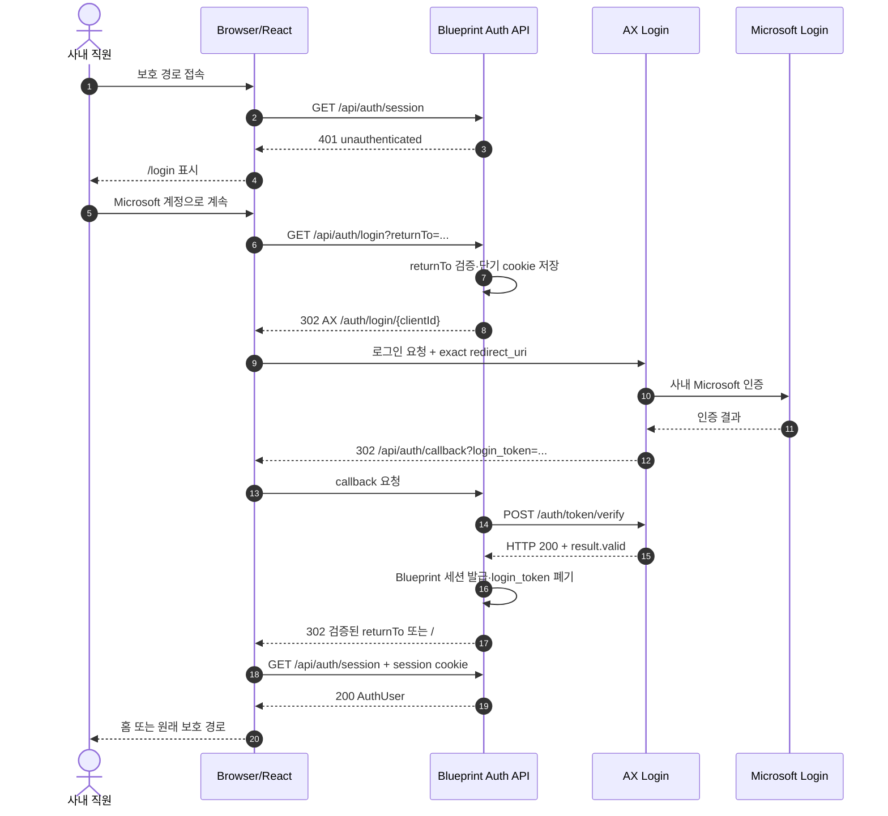

# AX Login 인증 설계

## 목적

SFOOD Agent Blueprint를 사내 직원 전용 서비스로 운영한다. 사용자는 Blueprint 홈에 들어가기 전에 AX Login을 거쳐 사내 Microsoft 계정으로 인증해야 하며, 인증되지 않은 브라우저는 제품 화면과 Blueprint API를 사용할 수 없어야 한다.

이 문서는 AX Auth MCP에서 확인한 계약, Claude의 구현 순서, 애플리케이션 인증 경계, 화면·데이터·오류·테스트 기준을 하나의 구현 계약으로 정의한다.

## 확정 결정

- 인증 공급자는 AX Login이며 실제 사용자는 사내 Microsoft 계정으로 인증한다.
- 로그인은 홈보다 앞선 첫 사용자 흐름이다.
- AX Auth의 `login-redirect-backend` 방식을 사용한다.
- Vercel Serverless API가 AX Auth의 일회용 `login_token`을 서버에서 검증하고 Blueprint 전용 세션을 발급한다.
- 화면 라우트 가드와 모든 `/api/blueprint/*` API 인증을 함께 적용한다.
- 사내 전체 직원이 대상이므로 AX Auth client 등록 시 계정 allowlist를 비워 둔다. 별도 제한이 필요해질 때만 명시적 allowlist를 등록한다.
- 프로젝트 데이터는 서버에 장기 저장하지 않고 IndexedDB에 유지하되, 인증 사용자별 namespace로 분리한다.

## AX Auth MCP 연결과 Claude 작업 순서

프로젝트 루트 `.mcp.json`에는 다음 HTTP MCP가 등록되어 있어야 한다.

```json
{
  "mcpServers": {
    "ax-auth": {
      "type": "http",
      "url": "https://ax-auth.s-food.ai/mcp"
    }
  }
}
```

Claude는 구현을 시작할 때 다음 순서를 지킨다.

1. 프로젝트 루트에서 Claude Code를 다시 시작하거나 MCP 설정을 다시 불러오고 `ax-auth` 연결을 승인한다.
2. AX Auth MCP의 `list_guides`를 **가장 먼저** 호출한다.
3. `get_guide`로 `client-registration`, `login-redirect-backend`, `api-reference`를 읽는다.
4. `get_code_example`의 `node-express-redirect` 예시는 흐름 참고용으로만 읽고 Vercel 함수와 TypeScript 계약에 맞게 변환한다.
5. AX 팀에서 실제 `client_id`를 발급한 뒤 `get_client_config(client_id)`로 등록된 redirect URI, scope와 활성 상태를 구현 환경과 대조한다.
6. AX 오류 코드를 임의 해석하지 않고 `lookup_error`로 확인한다.
7. MCP 응답이 이 문서와 달라졌다면 코드를 추정해서 작성하지 말고 문서를 먼저 갱신한다.

MCP에서 확인된 로그인 관련 도구는 `list_guides`, `get_guide`, `get_code_example`, `lookup_error`, `get_client_config`다. AX client 등록 자체는 MCP가 수행하지 않으므로 AX 담당 팀에 요청한다.

## Client 등록 요청

환경별로 다음 값을 AX 담당 팀에 전달한다.

| 항목 | 기준 |
| --- | --- |
| client name | SFOOD Agent Blueprint와 환경 이름 |
| client ID | AX 담당 팀이 발급 |
| client secret | 서버 환경 변수에만 저장 |
| scope | `LOGIN` 필수 |
| redirect URI | 환경별 `/api/auth/callback` 절대 URL |
| owner | 운영 담당 팀과 연락처 |
| allowed accounts | 사내 전체 직원 대상이므로 등록하지 않음 |

`redirect_uri`는 프로토콜, 호스트, 포트, 경로, 마지막 slash와 대소문자까지 등록값과 정확히 같아야 한다. 로컬, Preview, Production URI를 각각 등록하며 wildcard를 가정하지 않는다.

## 방식 선택 근거

AX Auth는 React SPA용 `verify-relay`도 제공하지만 이 제품은 OpenAI를 호출하는 서버 API를 이미 가진다. 클라이언트에서 로그인 성공 여부만 보관하면 UI는 숨길 수 있어도 `/api/blueprint/*` 직접 호출의 사용자 신원을 신뢰할 수 없다.

따라서 서버가 `client_secret`으로 일회용 토큰을 검증하고 위조할 수 없는 자체 세션을 발급한다. `client_secret`, AX 검증 응답과 세션 서명 키는 브라우저 번들에 포함하지 않는다.

## 전체 인증 흐름



AX 토큰 검증 endpoint는 인증 실패도 HTTP 200일 수 있다. 구현은 `response.ok`이 아니라 응답의 `result.valid`를 기준으로 성공을 판정한다. `login_token`은 180초 유효한 일회용 값이며 성공·실패와 관계없이 로그, URL 보관소, localStorage 또는 IndexedDB에 남기지 않는다.

## 라우트와 API 계약

### 화면 라우트

| 경로 | 인증 | 역할 |
| --- | --- | --- |
| `/login` | 비인증 접근 허용 | 로그인 안내와 단일 로그인 행동 |
| `/` | 필수 | 제품 홈, 새 프로젝트, 최근 프로젝트 |
| `/blueprints/new` | 필수 | 첫 입력과 자료 수집 |
| `/blueprints/:projectId` | 필수 | 통합 작업 공간 |
| `/blueprints/:projectId/:documentType` | 필수 | 문서가 열린 작업 공간 |

인증 상태 확인 전에는 홈이나 프로젝트 내용을 잠깐이라도 렌더링하지 않는다. 인증된 사용자가 `/login`으로 접근하면 검증된 `returnTo` 또는 `/`로 이동한다.

### 인증 API

| Method/Path | 역할 | 성공 | 실패 |
| --- | --- | --- | --- |
| `GET /api/auth/login?returnTo=` | AX Login 시작 | AX로 302 | 안전한 일반 오류 화면 |
| `GET /api/auth/callback` | `login_token` 서버 검증 | 세션 발급 후 302 | `/login?error=...`로 302 |
| `GET /api/auth/session` | 현재 세션 조회 | `200 { authenticated: true, user }` | `401 { authenticated: false }` |
| `POST /api/auth/logout` | 자체 세션 종료 | cookie 삭제 후 204 | 멱등적으로 204 |

### 보호 API

모든 `/api/blueprint/*` 요청은 공통 `requireSession` 검증을 먼저 통과한다.

- 세션 없음·만료·서명 오류: `401 AUTH_REQUIRED`
- 유효한 세션: 요청 context에 `AuthUser`를 주입한 뒤 기존 handler 실행
- unsafe method는 같은 origin인지 확인한다.
- 인증 실패 시 OpenAI 호출, 파일 처리와 로그 원문 기록을 시작하지 않는다.

## 세션 계약

```ts
interface AuthUser {
  email: string;
  clientId: string;
}

interface AuthSession {
  user: AuthUser;
  issuedAt: number;
  expiresAt: number;
  audience: "sfood-agent-blueprint";
}
```

- AX 검증 결과의 `valid === true`이고 응답 client가 설정된 client ID와 일치할 때만 발급한다.
- 세션은 서버 서명된 stateless 값 또는 동등한 위조 방지 구조를 사용한다.
- cookie는 `HttpOnly`, `SameSite=Lax`, `Path=/`를 적용하고 운영 HTTPS에서는 `Secure`를 필수로 한다.
- 운영 cookie는 `__Host-` 접두사를 사용하고 `Domain`을 설정하지 않는다.
- 세션 TTL은 환경 변수로 관리하며 기본 권고는 8시간이다. 만료 연장이 필요하면 별도 결정으로 기록한다.
- 로그아웃 시 세션 cookie와 메모리의 사용자·프로젝트 상태를 즉시 제거한다.
- AX Login 자체의 Microsoft 세션 종료까지 보장한다고 표시하지 않는다. 로그아웃은 Blueprint 세션 종료다.

`returnTo`는 `/`로 시작하는 same-origin 내부 경로만 허용하고 `//`, scheme, 외부 host와 제어 문자를 거절한다. 로그인 시작 시 검증된 값을 5분 이내 만료되는 HttpOnly 임시 cookie에 저장하고 callback에서 읽은 뒤 삭제한다.

## 환경 변수

| 이름 | 노출 | 용도 |
| --- | --- | --- |
| `AX_AUTH_BASE_URL` | 서버 | AX Auth 기준 URL |
| `AX_AUTH_CLIENT_ID` | 서버 | 등록 client ID |
| `AX_AUTH_CLIENT_SECRET` | 서버 비밀 | `/auth/token/verify` 요청 |
| `AX_AUTH_REDIRECT_URI` | 서버 | exact callback URI |
| `AX_SESSION_SECRET` | 서버 비밀 | Blueprint 세션 서명 |
| `AX_SESSION_TTL_SECONDS` | 서버 | 세션 유효 시간, 기본 `28800` |

비밀값에 `VITE_` 접두사를 사용하지 않는다. 실제 값은 `.env.local`과 배포 환경에만 두며 Markdown, fixture, screenshot, 로그와 Git에 기록하지 않는다.

## 클라이언트 구조

```text
src/features/auth/
├─ auth-provider.tsx
├─ auth-api.ts
├─ protected-route.tsx
└─ auth-types.ts
src/pages/
└─ login-page.tsx
api/auth/
├─ login.ts
├─ callback.ts
├─ session.ts
└─ logout.ts
api/_lib/
├─ ax-auth.ts
└─ session.ts
```

`AuthProvider` 상태는 `checking | authenticated | unauthenticated`만 사용한다. 앱 시작과 보호 경로 진입 시 `/api/auth/session`을 조회하고 `checking` 동안 전용 로딩 Frame을 표시한다. React Router는 현재 프로젝트의 `react-router-dom@7.8.2` API를 사용하며 AX MCP의 React Router v6 예제를 그대로 복사하지 않는다.

## 로컬 프로젝트 격리

인증 도입 후 IndexedDB는 사용자별로 논리 분리한다.

- repository key에 `ownerKey`를 포함한다.
- `ownerKey`는 정규화한 이메일과 client ID를 SHA-256 등 일방향 방식으로 변환한 안정적 키다.
- 프로젝트 조회·저장·삭제는 현재 세션의 `ownerKey` 범위만 사용한다.
- 로그아웃과 사용자 전환 시 열린 aggregate, 최근 목록과 UI cache를 비운 뒤 새 namespace를 연다.
- 다른 사용자의 로컬 프로젝트가 화면이나 Agent 요청에 섞이지 않아야 한다.
- 이 분리는 애플리케이션 수준 격리이며 공유 기기의 디스크 암호화를 대신하지 않는다. 브라우저 데이터의 장기 보관 한계를 로그인 화면과 운영 안내에 명시한다.

## 로그인 화면 설계

상세 치수와 상태는 [로그인·세션 화면 청사진](../ui/screens/00-login-and-session.md)을 따른다.

로그인 화면에는 이메일·비밀번호 입력란을 만들지 않는다. 다음 정보만 명확히 제공한다.

1. SFOOD Agent Blueprint 제품명과 한 문장 설명
2. 사내 직원 전용 서비스 안내
3. `Microsoft 계정으로 계속` 단일 primary action
4. 인증 오류 또는 세션 만료 안내
5. 로컬 브라우저에 프로젝트가 저장된다는 짧은 안내

로그인 후 AppBar에는 현재 이메일과 `로그아웃` 행동을 제공한다. 모바일에서는 사용자 메뉴로 접되 키보드와 보조 기술에서 동일하게 접근할 수 있어야 한다.

## 오류 매핑

| AX/앱 오류 | 사용자 메시지 | 행동 |
| --- | --- | --- |
| `USER_NOT_ALLOWED` | 이 계정은 서비스 사용 권한이 없습니다. | 다른 사내 계정으로 다시 로그인 |
| `INVALID_CLIENT`, `CLIENT_DISABLED`, `INVALID_SECRET` | 로그인 설정을 확인할 수 없습니다. | 재시도 대신 관리자 문의 |
| `TOKEN_NOT_FOUND`, `TOKEN_CLIENT_MISMATCH`, `TOKEN_EXPIRED`, `TOKEN_ALREADY_USED` | 로그인 시간이 만료되었거나 이미 처리되었습니다. | 처음부터 다시 로그인 |
| AX/네트워크 장애 | 로그인 서비스에 연결할 수 없습니다. | 입력 없이 다시 시도 |
| 자체 세션 만료 | 보안을 위해 세션이 종료되었습니다. | returnTo를 보존해 다시 로그인 |

공급자 원문, secret, token, stack trace는 화면과 클라이언트 응답에 포함하지 않는다.

## 개발 작업

| ID | 작업 | 성공 판정 |
| --- | --- | --- |
| `AUTH-001` | MCP·client 등록값 검증 | `list_guides` 선행, 실제 config와 환경 URI 일치 |
| `AUTH-002` | AX redirect/callback과 token verify | valid만 세션 발급, token 재사용 실패 |
| `AUTH-003` | 서명 세션과 auth API | 위조·만료 cookie 거절, logout 멱등 |
| `AUTH-004` | React AuthProvider·로그인 화면·route guard | 비인증 홈 노출 없음, 성공 후 returnTo 복귀 |
| `AUTH-005` | Blueprint API 공통 보호 | 모든 직접 비인증 호출 401, OpenAI 호출 0회 |
| `AUTH-006` | 사용자별 IndexedDB namespace | 같은 브라우저의 사용자 A/B 프로젝트 교차 노출 0건 |
| `AUTH-007` | AppBar 사용자 메뉴와 만료 복구 | 이메일·로그아웃 제공, 만료 후 안전한 재인증 |

## 테스트 시나리오

테스트에서는 실제 Microsoft 계정과 실제 AX 토큰을 자동화하지 않는다. AX callback과 verify 응답을 계약 fixture로 대체하고, 배포 환경에서 별도 smoke test를 수행한다.

```gherkin
Scenario: 비인증 사용자의 보호 경로 접근
  Given 유효한 Blueprint 세션이 없다
  When 사용자가 /blueprints/p-1에 접근한다
  Then 프로젝트 내용은 렌더링되지 않는다
  And 로그인 화면이 표시된다
  And 로그인 성공 후 returnTo는 /blueprints/p-1이다

Scenario: AX 로그인 성공
  Given callback에 사용 가능한 login_token이 있다
  When 서버 verify 결과의 valid가 true다
  Then HttpOnly 세션이 발급된다
  And login_token은 저장·로그되지 않는다
  And 사용자는 검증된 returnTo로 이동한다

Scenario: HTTP 200 실패 응답
  Given AX verify HTTP status는 200이다
  And result.valid는 false다
  When callback을 처리한다
  Then 세션을 발급하지 않는다
  And 오류가 매핑된 로그인 화면으로 이동한다

Scenario: API 우회 차단
  Given Blueprint 세션이 없다
  When /api/blueprint/turn을 직접 호출한다
  Then 응답은 401 AUTH_REQUIRED다
  And OpenAI 요청은 발생하지 않는다

Scenario: 사용자 전환
  Given 사용자 A의 로컬 프로젝트가 존재한다
  When A가 로그아웃하고 사용자 B가 로그인한다
  Then B의 최근 프로젝트에 A의 프로젝트가 표시되지 않는다
```

## 완료 게이트

- AX 담당 팀 발급값과 `get_client_config` 결과가 환경 설정과 일치한다.
- 로그인 전 홈·최근 프로젝트·작업 공간이 노출되지 않는다.
- 모든 Blueprint API가 서버에서 세션을 검증한다.
- client secret, session secret과 token이 번들·로그·저장소·URL 잔존 데이터에 없다.
- login success, 사용자 취소/거절, token 만료/재사용, AX 장애, 자체 세션 만료와 logout 테스트가 통과한다.
- 서로 다른 사내 계정 간 로컬 프로젝트 교차 노출이 없다.
- 390×844와 1440×900 로그인 화면의 키보드, focus, 오류와 loading 상태가 시각 QA를 통과한다.
- `npm run build`, 인증 계약 테스트, browser process E2E와 `npm run docs:check:mermaid`가 성공한다.
