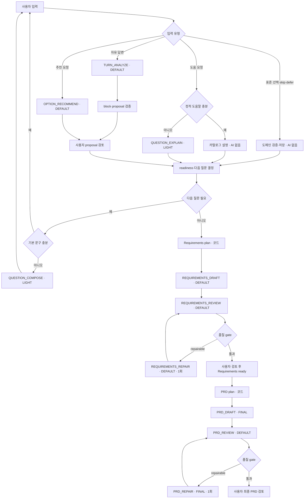

# AI 오케스트레이션과 MVP 모델 정책

## 목적

Blueprint의 AI 품질을 유지하면서 $10 단위의 선불 API 크레딧으로 MVP를 반복 검증할 수 있는 호출 구조를 정의한다. 질문 선택, 표준 문구, 문서 목차와 상태 전이는 코드가 담당하고, AI는 자유 답변 분석·맥락형 도움·문서 작성처럼 생성이 필요한 작업에만 사용한다.

프롬프트와 응답 schema는 [프롬프트·응답 계약](13-prompt-and-response-contracts.md), 프로젝트당 예산은 [AI 호출 예산·평가·운영 명세](14-ai-budget-evaluation-and-operations.md)를 따른다.

## MVP 원칙

1. 월정액 제품의 모델명이 아니라 OpenAI API model ID와 token 단가를 기준으로 선택한다.
2. 일반 질문 문구, 선택지, 다음 질문, readiness, 문서 outline은 결정론적으로 만든다.
3. 짧고 정형적인 보조 작업은 `LIGHT`, 자유 답변과 일반 문서는 `DEFAULT`, 최종 PRD 작성만 `FINAL`을 사용한다.
4. 높은 모델은 자동 승격 수단이 아니다. MVP에서 `FINAL`은 PRD draft와 허용된 1회 repair에만 배정한다.
5. 한 사용자 사건은 가능한 한 한 번 호출하고 여러 표시 block과 proposal을 함께 반환한다.
6. 모든 출력은 strict JSON Schema와 도메인 검증을 통과해야 한다.
7. AI 결과는 사용자 승인 전까지 확정 설계가 아니다.
8. API 실패를 성공처럼 보이게 하는 fallback 문서나 답변을 생성하지 않는다.

## 결정론과 AI의 경계

| 판단 또는 작업 | 담당 | AI 호출 |
| --- | --- | --- |
| 다음 질문 선택·우선순위 | 질문 카탈로그와 규칙 엔진 | 없음 |
| 기본 질문·도움말·선택지 문구 | versioned 질문 카탈로그 | 없음 |
| 특별한 맥락형 질문 표현 | AI | 필요할 때만 `QUESTION_COMPOSE` |
| 표준 선택, skip/defer, proposal 승인 | schema와 도메인 command | 없음 |
| 자유 답변에서 복수 사실 추출 | AI | `TURN_ANALYZE` |
| 정적 도움말 | 질문 카탈로그 | 없음 |
| 프로젝트 맥락형 추가 설명 | AI | 필요할 때만 `QUESTION_EXPLAIN` |
| 사용자 맥락 기반 추천 | AI | `OPTION_RECOMMEND` |
| readiness와 생성 guard | readiness engine | 없음 |
| 오래된 대화 구조화 요약 | AI | threshold 초과 시 `CONTEXT_COMPACT` |
| Requirements/PRD section 계획 | `DocumentPlanBuilder` | 없음 |
| Requirements 작성·검토·repair | AI pipeline | Mini 작업별 호출 |
| 최종 PRD 작성·repair | AI pipeline | Terra 작업별 호출 |
| 문서 revision, stale와 영향 계산 | 도메인 command | 없음 |

`QUESTION_COMPOSE`는 기본 경로가 아니다. catalog 문구로 의미가 충분하지 않고 confirmed context를 반영해야 이해가 쉬워지는 경우에만 호출한다. 같은 자유 답변에서 목표·사용자·기능이 함께 발견되면 `TURN_ANALYZE` 한 번이 여러 atomic proposal을 반환한다.

## 논리 모델 프로필

코드는 물리 model ID를 직접 참조하지 않고 세 프로필만 사용한다.

| 프로필 | MVP 기본 모델 | reasoning | 용도 | MVP 의도 |
| --- | --- | --- | --- | --- |
| `LIGHT` | `gpt-5.6-luna` | `low` | 맥락형 질문/설명, 대화 압축 | 가장 가벼운 보조 처리 |
| `DEFAULT` | `gpt-5-mini` | `low` | 자유 답변 추출, 추천, Requirements, review, 일반 patch | 대부분의 품질 작업 |
| `FINAL` | `gpt-5.6-terra` | `low` | 최종 PRD draft, 필요 시 문제 section repair | 마지막 산출물만 품질 상향 |

2026-09-16 API 가격은 100만 token 기준 Luna 입력/출력 $0.20/$1.20, GPT-5 Mini $0.25/$2.00, Terra $2/$12다. 가격과 availability는 바뀔 수 있으므로 서버 단가표와 배포 전 확인을 기준으로 한다. Sol과 Astra는 MVP 자동 경로에서 사용하지 않는다.

운영 전환 때는 `AiModelRegistry`의 물리 모델 매핑만 eval을 거쳐 교체한다. task, prompt, schema와 비즈니스 규칙은 모델 변경 때문에 바꾸지 않는다.

## 작업별 모델과 token 계약

`maxOutputTokens`는 보이는 출력과 reasoning token을 함께 포함한다. 상한은 목표치가 아니며 응답은 필요한 만큼만 생성한다.

| 작업 | 프로필 | reasoning | 최대 input | `maxOutputTokens` | 호출 조건 |
| --- | --- | --- | ---: | ---: | --- |
| `QUESTION_COMPOSE` | LIGHT | low | 3,000 | 500 | catalog 문구로 부족할 때만 |
| `QUESTION_EXPLAIN` | LIGHT | low | 4,000 | 700 | 정적 도움말로 부족할 때만 |
| `TURN_ANALYZE` | DEFAULT | low | 8,000 | 1,800 | 자유 입력·파일 발췌 |
| `OPTION_RECOMMEND` | DEFAULT | low | 10,000 | 2,000 | 사용자가 추천 요청 |
| `CONTEXT_COMPACT` | LIGHT | low | 12,000 | 1,200 | context threshold 초과 |
| `REQUIREMENTS_DRAFT` | DEFAULT | low | 30,000 | 8,000 | deterministic plan 검증 후 |
| `REQUIREMENTS_REVIEW` | DEFAULT | low | 36,000 | 3,000 | draft 후 |
| `REQUIREMENTS_REPAIR` | DEFAULT | low | 24,000 | 5,000 | repairable issue가 있을 때 1회 |
| `PRD_DRAFT` | FINAL | low | 40,000 | 10,000 | Requirements ready 후 1회 |
| `PRD_REVIEW` | DEFAULT | low | 48,000 | 4,000 | PRD draft 후 |
| `PRD_REPAIR` | FINAL | low | 28,000 | 6,000 | repairable issue가 있을 때 1회 |
| `DOCUMENT_PATCH` | DEFAULT | low | 20,000 | 4,000 | 직접 요청한 부분 보완 |
| `CONSISTENCY_REVIEW` | DEFAULT | low | 32,000 | 4,000 | 문서 간 정합성 점검 |

MVP에서 `medium`, `high` reasoning은 자동 사용하지 않는다. eval에서 비용 대비 개선이 확인된 경우 별도 결정으로만 활성화한다. 일반 문서 patch가 복잡하더라도 `FINAL`로 승격하지 않고 범위를 줄이거나 사용자 검토로 전환한다.

## 사용자 입력에서 최종 PRD까지

## 문서 생성 파이프라인

1. `PLAN`: `DocumentPlanBuilder`가 section, source item ID, requirement coverage를 코드로 만든다. API 호출이 아니다.
2. `DRAFT`: 검증된 plan과 동일 snapshot으로 구조화 문서를 한 번 작성한다.
3. `REVIEW`: 별도 Mini 호출과 결정론적 validator가 누락·근거·정합성을 검사한다.
4. `REPAIR`: review가 자동 수정 가능하다고 판정한 문제 section만 한 번 다시 작성한다.
5. 사용자 검토: review를 통과해도 자동으로 `ready`가 되지 않는다.

Requirements는 Mini만 사용한다. Terra는 Requirements에 쓰지 않으며 최종 PRD 초안과 그 초안의 선택적 repair에만 사용한다.

## 실패와 재시도

| 상황 | 처리 |
| --- | --- |
| schema 실패 | 같은 프로필로 1회 재시도 후 실패 처리 |
| Requirements 품질 실패 | Mini로 문제 section 1회 repair |
| PRD 품질 실패 | Terra로 문제 section 1회 repair |
| repair 후 재실패 | 모델 승격 없이 사용자 검토로 전환 |
| rate limit/timeout | backoff 후 같은 프로필 유지 |
| 예산 부족 | API 호출 전 차단하고 질문 계속·직접 편집 제시 |
| 모델 접근 불가 | 조용한 대체 없이 `AI_MODEL_UNAVAILABLE` |

## Responses API 공통 설정

- `POST /v1/responses`, `store: false`, `truncation: "disabled"`를 사용한다.
- 구조화 작업은 strict JSON Schema를 사용한다.
- profile에서 `reasoning.effort`, `text.verbosity`, `max_output_tokens`를 주입한다.
- `usage.input_tokens`, cached input, output/reasoning token, 지연과 추정 비용을 비식별 원장에 기록한다.
- `safety_identifier`는 인증 `ownerKey`에서 파생한 비식별 안정 ID를 사용한다.
- 사용자 원문·프로젝트명·이메일을 metadata와 cache key에 넣지 않는다.

## 컨텍스트 예산 순서

1. system/developer prompt와 JSON Schema
2. 현재 질문 또는 문서 작업 대상
3. 관련 confirmed 설계와 acceptance criterion
4. 직접 관련된 conflict, deferred와 pending proposal
5. 필요한 source excerpt
6. 구조화 대화 summary
7. 최근 원문 메시지

초과 시 7 → 6 → 5 순서로 줄이되 현재 대상과 관련 confirmed 항목은 삭제하지 않는다. 생략 범위는 `ContextManifest`에 기록한다.

## 모델 설정과 운영 전환

- 환경 매핑은 `AI_MODEL_LIGHT`, `AI_MODEL_DEFAULT`, `AI_MODEL_FINAL`을 사용한다.
- MVP 기본값은 각각 `gpt-5.6-luna`, `gpt-5-mini`, `gpt-5.6-terra`다.
- `FINAL` 호출은 프로젝트당 기본 1회, repair 포함 hard 2회다.
- production 모델 변경은 registry 설정 변경으로 수행하고 golden eval과 비용 비교를 통과해야 한다.
- alias 이동도 배포 변경으로 취급하며 필요하면 승인된 snapshot으로 고정한다.

## 공식 근거

2026-09-16 확인 기준:

- [OpenAI API 모델 선택과 Luna 가격](https://developers.openai.com/api/docs/models)
- [GPT-5 Mini API 사양과 가격](https://developers.openai.com/api/docs/models/gpt-5-mini)
- [GPT-5.6 Terra API 사양과 가격](https://developers.openai.com/api/docs/models/gpt-5.6-terra)
- [Responses API create 계약](https://developers.openai.com/api/reference/cli/resources/responses/methods/create)

구현 시작과 운영 모델 변경 시 availability, 가격과 파라미터 호환성을 다시 확인한다.
