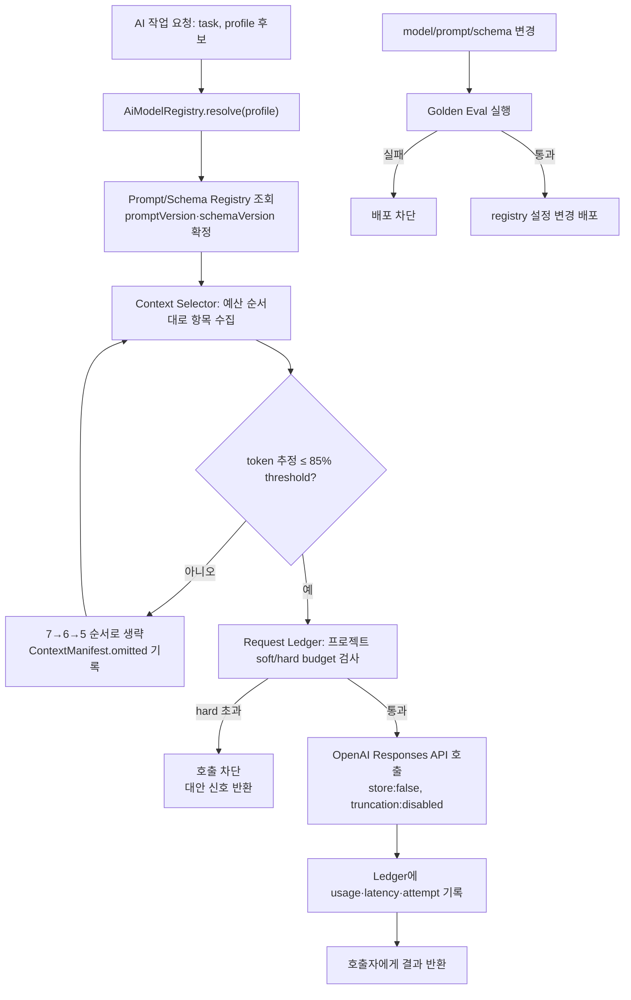

# AI-PR-01 — 모델·prompt·budget 기반

## Overview

`AiModelRegistry`(LIGHT/DEFAULT/FINAL profile), versioned prompt/schema registry, token budgeter/context selector, request ledger, golden eval gate를 구현해 이후 모든 AI 호출(2단계 대화, 4단계 문서 생성)이 사용할 공통 기반을 완성한다.

## Background

`docs/delivery/ai-model-prompt-and-evaluation.md`(AI-001~010)는 대화·문서 두 단계에 걸쳐 쓰이므로, 이 PR은 그중 "호출 전에 확정돼야 하는 계약"(AI-001, AI-002, AI-003, AI-008, AI-009)만 먼저 완성한다. 실제 task 호출(AI-004, AI-005는 `CON-PR-*`, AI-006, AI-007은 `DOC-PR-*`)은 각각의 PR에서 이 registry를 소비한다. 이 PR은 5개 요구사항(model registry, prompt/schema registry, token budgeter, request ledger, golden eval gate)을 한 PR로 묶고 있어 다른 PR 대비 크다 — 구현 중 실제 변경량이 크면 `AI-PR-01-A`(model+prompt registry)와 `AI-PR-01-B`(token budgeter+ledger+golden eval)로 분할하고 이 문서와 `docs/delivery/traceability.md`를 먼저 갱신한다.

## Scope

### 포함

- `AiModelRegistry`: LIGHT=`gpt-5.6-luna`, DEFAULT=`gpt-5-mini`, FINAL=`gpt-5.6-terra` 환경 변수 매핑과 task별 reasoning/token/timeout 설정
- versioned prompt/schema registry(모든 `AiTaskType`의 system/developer template, JSON Schema, `promptVersion`/`schemaVersion`)
- `ContextManifest` 기반 context selector와 token budgeter(85% threshold compaction)
- `AiRequestLedger`(model, reasoning, version, usage, latency, attempt, 오류 기록; soft/hard budget 검사)
- task별 golden fixture와 deterministic grader, release gate

### 제외

- 실제 대화 turn 처리(`TURN_ANALYZE`, `QUESTION_COMPOSE` 등 task 호출 자체)는 `CON-PR-01`~`03`에서 구현
- Requirements/PRD draft-review-repair 실행은 `DOC-PR-01`~`02`에서 구현
- fine-tuning, web search, 모델의 UI component 직접 선택 — 비목표(`docs/delivery/ai-model-prompt-and-evaluation.md` 제외 범위)

## 연결 근거

- 요구사항: `AI-001`, `AI-002`, `AI-003`, `AI-008`, `AI-009`
- Delivery 작업: `docs/delivery/ai-model-prompt-and-evaluation.md` AI-001, AI-002, AI-003, AI-008, AI-009
- 결정: `DEC-025`, `DEC-029`, `DEC-030`, `DEC-031`, `DEC-033`
- 제품 설계: `docs/product/12-ai-orchestration-and-model-policy.md`, `docs/product/13-prompt-and-response-contracts.md`, `docs/product/14-ai-budget-evaluation-and-operations.md`
- 선행 PR: `FND-PR-02`(도메인·Agent 계약 — schema 기반 확정)

## 선행 조건 (Definition of Ready)

- `FND-PR-02`가 사용자 머지 완료돼 도메인 ID, Proposal, DocumentSection, GenerationJob schema가 확정됨
- AX 세션에서 비식별 `ownerKey` 발급 경로가 준비됨(`AUTH-PR-01`~`03` 머지 완료)
- OpenAI project에서 Luna/Mini/Terra 접근 권한과 rate limit을 배포 전 재확인
- 평가 fixture가 실제 직원·프로젝트 원문을 포함하지 않음을 확인

## 작업 단위별 구현 개요

### 1. Model registry (AI-001)

- `AiModelRegistry` 인터페이스: `resolve(profile: "LIGHT"|"DEFAULT"|"FINAL"): { modelId, reasoningEffort, maxOutputTokens, timeoutMs }`
- 환경 변수 `AI_MODEL_LIGHT`, `AI_MODEL_DEFAULT`, `AI_MODEL_FINAL`에서 물리 model ID 로드, 미설정 시 부팅 실패(조용한 fallback 금지)
- task별 registry 항목(`docs/product/12-ai-orchestration-and-model-policy.md` 작업별 모델·token 표)을 코드 상수로 이식

### 2. Prompt/schema registry (AI-002)

- `PromptDefinition<TInput, TOutput>` 타입 구현(`docs/product/13-prompt-and-response-contracts.md` Prompt Registry)
- 각 `AiTaskType`의 `promptId`, `promptVersion`, `schemaId`, `schemaVersion`, `buildInput`, `validateDomain` 등록
- typed 변수만 prompt에 주입하고 source excerpt는 별도 비신뢰 context 구획으로 분리

### 3. Context selector / token budgeter (AI-003)

- 컨텍스트 예산 순서(`docs/product/12` 컨텍스트 예산 순서: system/developer → 대상 질문/문서 → confirmed 설계 → conflict/deferred → source excerpt → summary → 최근 메시지) 구현
- 요청 전 token 추정, 85% threshold 초과 시 7→6→5 순서로 생략, `ContextManifest.omitted`에 생략 사유 기록
- `store: false`, `truncation: "disabled"`를 모든 Responses API 요청에 고정 적용

### 4. Request ledger / budget guard (AI-008)

- `AiRequestLedger` 스키마: model, reasoning, promptVersion/schemaVersion, `usage.input_tokens`/output/reasoning tokens, latency, attempt, 오류 코드
- 프로젝트별 soft($0.35)/hard($0.60) 비용 상한과 FINAL 호출 hard 2회 제한 검사
- hard limit 초과 시 API 호출 전 차단, 화면에는 잔여 가능 여부와 대안(질문 계속, 직접 편집)을 우선 노출하는 신호만 반환(화면 자체는 이 PR 범위 아님)

### 5. Golden eval / release gate (AI-009)

- task별 synthetic fixture와 deterministic assertion(JSON Schema 통과, 참조 ID 존재, 금지 결과 0건) 작성
- 명료성/유용성 지표만 rubric grader + 사람 검토 병행
- 현재/후보 model·prompt를 동일 fixture로 pairwise 비교하는 CI 스크립트

## 프로세스 / 상태 전이

## 데이터/API 영향

- 신규: `AiModelRegistry`, `PromptRegistry`, `ContextManifest`, `AiRequestLedger` 저장/조회 인터페이스(서버 전용, 브라우저에 노출 안 함)
- 기존 임시 구현(`api/_lib/blueprint-openai.js`의 단일 `OPENAI_MODEL`, `api/blueprint/chat.js`의 단일 targetField)을 대체 대상으로 표시하되 이 PR에서 즉시 삭제하지 않음(소비하는 PR이 없을 때까지 전환 중 혼용 금지 원칙 위반하지 않도록 `CON-PR-01` 착수 시점에 제거)
- 외부 API 계약 변경 없음(이 PR은 서버 내부 기반만 구현, 신규 공개 endpoint 없음)

## Acceptance Criteria

### Happy Path

- Given LIGHT/DEFAULT/FINAL 환경 변수가 모두 설정된 상태, when 서버가 부팅되면, then 세 profile 모두 유효한 model/reasoning/token 설정으로 resolve된다.
- Given 표준 fixture 입력이 있을 때, when context selector가 실행되면, then confirmed 설계 항목이 최근 대화 메시지보다 먼저 포함된 ContextManifest가 생성된다.
- Given 일반 프로젝트 fixture 시나리오를 끝까지 실행할 때, when request ledger를 집계하면, then 총 호출 수가 17~21 범위, 예상 비용이 $0.60 이하로 산출된다.
- Given model/prompt 변경이 있을 때, when golden eval을 실행하면, then 모든 task fixture가 schema/참조 ID 통과 및 금지 결과 0건으로 배포 gate를 통과한다.

### Failure Case

- Given 필수 모델 환경 변수가 누락된 상태, when 서버가 부팅되면, then 조용한 fallback 없이 부팅이 실패하고 명확한 오류를 남긴다.
- Given token 추정이 예산을 초과하는 대화 상태, when context selector가 실행되면, then 조용한 잘림 없이 생략 범위가 `ContextManifest.omitted`에 기록되고 현재 대상과 confirmed 항목은 보존된다.
- Given 프로젝트가 hard budget을 초과한 상태, when 새 AI 요청이 들어오면, then provider 호출 없이 즉시 차단되고 대안 신호가 반환된다.
- Given golden eval에서 금지 결과(미승인 확정, 참조 ID 없음)가 발견된 상태, when 배포 파이프라인이 실행되면, then 해당 model/prompt 변경이 배포되지 않는다.

### Boundary

- Given 이력이 정확히 85% threshold인 상태, when context selector가 실행되면, then compaction 여부가 threshold 정의(이상/초과)에 따라 결정론적으로 일관되게 처리된다.
- Given FINAL 호출이 정확히 hard 2회(draft+repair)에 도달한 상태, when 추가 FINAL 요청이 들어오면, then 3번째 호출이 차단된다.

## 예상 변경 파일

- `src/infrastructure/ai/model-registry.ts` (신규)
- `src/infrastructure/ai/prompt-registry.ts` (신규)
- `src/infrastructure/ai/context-selector.ts` (신규)
- `src/infrastructure/ai/request-ledger.ts` (신규)
- `api/_lib/ai-model-registry.js` 또는 서버 공용 모듈(신규, 서버 런타임 위치는 구현 시 확정)
- `docs/product/15-ai-prompt-template-spec.md` 연동 template 로더
- `tests/unit/ai/model-registry.test.ts`, `prompt-registry.test.ts`, `context-selector.test.ts`, `request-ledger.test.ts` (신규)
- `tests/eval/golden/*.fixture.json` (신규)
- `scripts/run-golden-eval.mjs` 또는 유사 CI 스크립트 (신규)

## 테스트 계획

- **model registry**: task/profile 매핑 unit test, 환경 변수 누락 시 부팅 실패 test
- **prompt/schema registry**: 알 수 없는 promptVersion/schemaVersion 응답 거절 test, inline prompt 금지 lint/정적 검사
- **context selector/token budgeter**: 예산 순서 보존 test, 85% threshold 경계 test, `store:false`/`truncation:disabled` 고정 적용 test
- **request ledger**: soft/hard budget 초과 차단 test, FINAL hard 2회 제한 test, 원장에 원문/secret 미포함 검증 test
- **golden eval**: 정상/오류 fixture 세트로 전체 gate 실행, pairwise 비교 스크립트 dry-run

## UI 증거 계획 (해당 시)

이 PR은 서버 내부 기반만 구현하며 신규 화면이 없다. UI 캡처 불필요.

## 코드 리뷰·QA 체크리스트

- 물리 모델명이 코드에 흩어져 있지 않고 registry 경유만 존재하는지 확인
- inline production prompt가 없는지 grep 검증
- budget/ledger에 사용자 원문·secret이 없는지 로그 검증
- golden eval CI 스크립트가 실제로 실패를 감지하는지(의도적 실패 fixture로 확인)
- QA는 UI가 없으므로 API/계약 QA로 대체: ledger·budget 계산 결과를 fixture와 대조

## Done Checklist

- [ ] Requirements implemented
- [ ] Acceptance criteria verified
- [ ] 독립 코드 리뷰 pass
- [ ] 독립 QA pass
- [ ] 화면 변경 시 desktop/mobile 캡처 완료 (해당 없음 — UI 변경 없음)
- [ ] 사용자 PR 머지 확인

## 실행 시 추가 문서

- 이 폴더에 구현 중/후 `test-results.md`, `review-notes.md`, `qa-report.md` 등을 추가로 생성한다(지금은 생성하지 않음).
