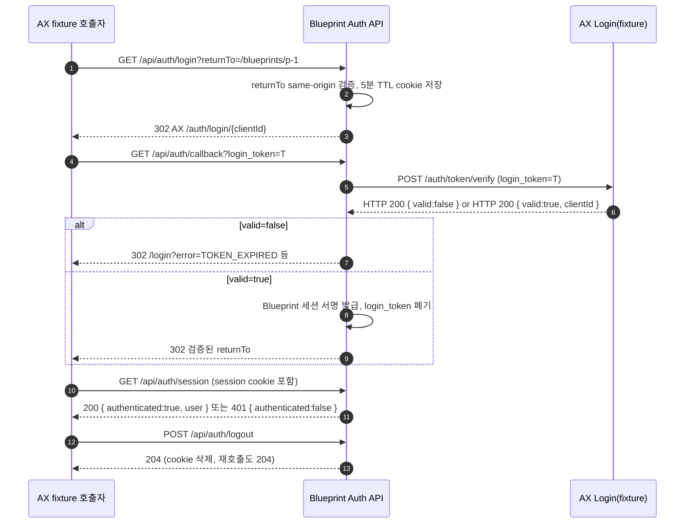

# AUTH-PR-01 — 인증 서버 경계

## Overview

AX Auth와 연동하는 Blueprint 서버 측 인증 경계(`login`, `callback`, `session`, `logout` API와 AX 검증 클라이언트)를 구현한다. 이 PR이 끝나면 AX fixture로 valid 토큰만 Blueprint 세션을 발급하고, 위조·재사용·만료된 토큰은 거절된다. 화면(React AuthProvider, `/login`, route guard)은 다음 PR(`AUTH-PR-02`)의 범위다.

## Background

`docs/product/02-prd.md`의 "출시 단계 · 인증 선행 단계"는 로그인·서버 세션·API 보호·사용자별 저장 격리를 홈보다 먼저 완성하도록 규정한다. `DEC-022`~`DEC-024`(`docs/product/10-decision-log.md`)는 AX Login backend redirect 방식, 서버 검증 후 HttpOnly 세션 발급, allowlist 미사용을 확정했다. 서버가 먼저 검증 가능한 상태여야 `AUTH-PR-02`의 화면·route guard가 실제 세션 계약 위에서 동작할 수 있으므로 서버 경계를 먼저 분리했다.

## Scope

### 포함
- AX Auth MCP `list_guides` → `client-registration`/`login-redirect-backend`/`api-reference` 가이드 확인, `get_client_config`로 실제 client 값 대조 (`AUTH-001`)
- `GET /api/auth/login`, `GET /api/auth/callback`, `GET /api/auth/session`, `POST /api/auth/logout` 구현 (`AUTH-002`)
- AX `/auth/token/verify` 서버 간 호출, `login_token` 1회성 처리 (`AUTH-002`)
- Blueprint 서명 세션 발급·검증 로직, cookie 계약 (`AUTH-003`)

### 제외
- React `AuthProvider`, `/login` 화면, route guard, AppBar 사용자 메뉴 (`AUTH-PR-02`)
- `/api/blueprint/*`에 대한 `requireSession` 실제 적용 (`AUTH-PR-02`의 AUTH-005 범위, 단 이 PR에서 공통 `requireSession` 함수 자체는 만들어 다음 PR이 재사용할 수 있게 한다)
- IndexedDB owner namespace 분리 (`AUTH-PR-03`)

## 연결 근거

- 요구사항 ID: `AUTH-001`, `AUTH-002`, `AUTH-003`
- Delivery 작업 ID: `AUTH-001`, `AUTH-002`, `AUTH-003` (`docs/product/11-ax-login-authentication.md` "개발 작업" 표)
- 결정: `DEC-022`, `DEC-023`, `DEC-024`
- 화면 설계: 없음(서버 전용 PR)
- 선행 PR: 없음 (PR 단위표 1번째)

## 선행 조건 (Definition of Ready)

- AX 담당 팀이 개발 환경 client를 발급하고 redirect URI를 등록했다.
- `AX_AUTH_BASE_URL`, `AX_AUTH_CLIENT_ID`, `AX_AUTH_CLIENT_SECRET`, `AX_AUTH_REDIRECT_URI`, `AX_SESSION_SECRET`, `AX_SESSION_TTL_SECONDS` 값이 로컬 `.env.local`에 준비됐다.
- `list_guides`/`get_client_config` 결과가 이 문서의 내용과 다르면 코드를 쓰기 전에 `docs/product/11-ax-login-authentication.md`를 먼저 갱신했다.

## 작업 단위별 구현 개요

- **AUTH-001**: `ax-auth` MCP `list_guides` → 관련 가이드 3종 조회 → 실제 발급 `client_id`로 `get_client_config` 호출 → 문서의 client 등록 표(계획 문서 상 항목)와 실제 값을 대조하고 불일치가 있으면 문서를 먼저 수정.
- **AUTH-002**: `api/auth/login.ts`가 `returnTo`를 same-origin 내부 경로로 검증해 5분 TTL HttpOnly cookie에 저장하고 AX `/auth/login/{clientId}`로 302. `api/auth/callback.ts`가 `login_token`을 받아 AX `/auth/token/verify`를 서버 간 POST로 호출하고, HTTP status가 아니라 `result.valid`로 성공을 판정. 유효하면 세션 발급 후 저장했던 `returnTo`(cookie)로 302, 무효면 매핑된 오류와 함께 `/login?error=...`로 302.
- **AUTH-003**: `api/_lib/session.ts`가 `AuthSession`(email, clientId, issuedAt, expiresAt, audience)을 서명해 `HttpOnly`/`SameSite=Lax`/`Path=/`(+운영 `Secure`, `__Host-` 접두사) cookie로 발급·검증하는 함수와, 다음 PR이 재사용할 공통 `requireSession(req)` 헬퍼를 제공. `GET /api/auth/session`은 유효 세션이면 `200 { authenticated:true, user }`, 아니면 `401 { authenticated:false }`. `POST /api/auth/logout`은 cookie를 지우고 멱등적으로 204.

## 프로세스 / 상태 전이

## 데이터/API 영향

- 신규 API: `GET /api/auth/login`, `GET /api/auth/callback`, `GET /api/auth/session`, `POST /api/auth/logout`.
- 신규 서버 전용 환경 변수 6종(위 선행 조건 표). 클라이언트 번들에 노출되지 않아야 한다.
- 저장소 스키마 변경 없음(세션은 stateless 서명 값, DB 없음).

## Acceptance Criteria

### Happy Path
Given AX fixture가 `login_token`에 대해 `valid:true`를 반환한다, When `/api/auth/callback`을 호출한다, Then Blueprint 세션 cookie가 발급되고 저장된 `returnTo`로 302 응답이 온다.

### Failure Case
Given AX fixture가 `valid:false`(`TOKEN_EXPIRED` 등)를 반환한다, When `/api/auth/callback`을 호출한다, Then 세션이 발급되지 않고 `/login?error=...`로 302하며 해당 오류가 로그·응답에 원문으로 노출되지 않는다.

### Boundary
Given 이미 사용된 `login_token`으로 `/api/auth/callback`을 재호출한다, When AX fixture가 `TOKEN_ALREADY_USED`를 반환한다, Then 두 번째 요청은 세션을 발급하지 않고 동일한 오류 매핑 경로로 이동한다.

## 예상 변경 파일

- 생성: `api/auth/login.ts`, `api/auth/callback.ts`, `api/auth/session.ts`, `api/auth/logout.ts`, `api/_lib/ax-auth.ts`, `api/_lib/session.ts` (추정 경로 — `docs/product/11-ax-login-authentication.md` "클라이언트 구조" 절 근거)
- 수정: 없음(신규 API 디렉터리)
- 테스트 생성(추정 경로): `tests/contract/auth-callback.spec.ts` 또는 동등 위치 — `FND-PR-03`에서 표준 테스트 디렉터리가 확정되면 그 구조를 따른다.

## 테스트 계획

- 단위: `returnTo` same-origin 검증(허용/거절 케이스), 세션 서명·검증 함수의 위조/만료 판정.
- 계약: AX `valid:true`/`valid:false`(`TOKEN_EXPIRED`, `TOKEN_ALREADY_USED`, `TOKEN_NOT_FOUND`, `TOKEN_CLIENT_MISMATCH`) fixture 각각에 대한 callback 응답, `/api/auth/session` 200/401, `/api/auth/logout` 204(최초/재호출).
- E2E: 이 PR 범위에는 화면이 없으므로 API 레벨 계약 테스트로 대체하고, 화면 포함 E2E는 `AUTH-PR-02`에서 수행한다.

## UI 증거 계획 (해당 시)

해당 없음 — 이 PR은 화면을 포함하지 않는다.

## 코드 리뷰·QA 체크리스트

(`docs/delivery/development-pr-review-qa-workflow.md` 코드 리뷰/QA gate 중 이 PR 해당 항목)

- [ ] 인증·권한 우회, secret 또는 개인정보 노출 여부(`AX_AUTH_CLIENT_SECRET`, `AX_SESSION_SECRET`, `login_token`이 로그·응답·저장소에 없는지)
- [ ] schema 검증 전 상태 반영 여부 없음(AX 응답 `result.valid` 확인 전 세션 미발급)
- [ ] 실패 경로·경계값 테스트(만료/재사용/불일치 client) 누락 여부
- [ ] QA gate "API" 유형: 정상·400·401·409·429·5xx fixture, 중복 요청, 로그 안전성

## Done Checklist

- [ ] Requirements implemented
- [ ] Acceptance criteria verified
- [ ] 독립 코드 리뷰 pass
- [ ] 독립 QA pass
- [ ] 화면 변경 시 desktop/mobile 캡처 완료 (해당 없음)
- [ ] 사용자 PR 머지 확인

## 실행 시 추가 문서

- 이 폴더에 구현 중/후 `test-results.md`, `review-notes.md`, `qa-report.md` 등을 추가로 생성한다(지금은 생성하지 않음).
