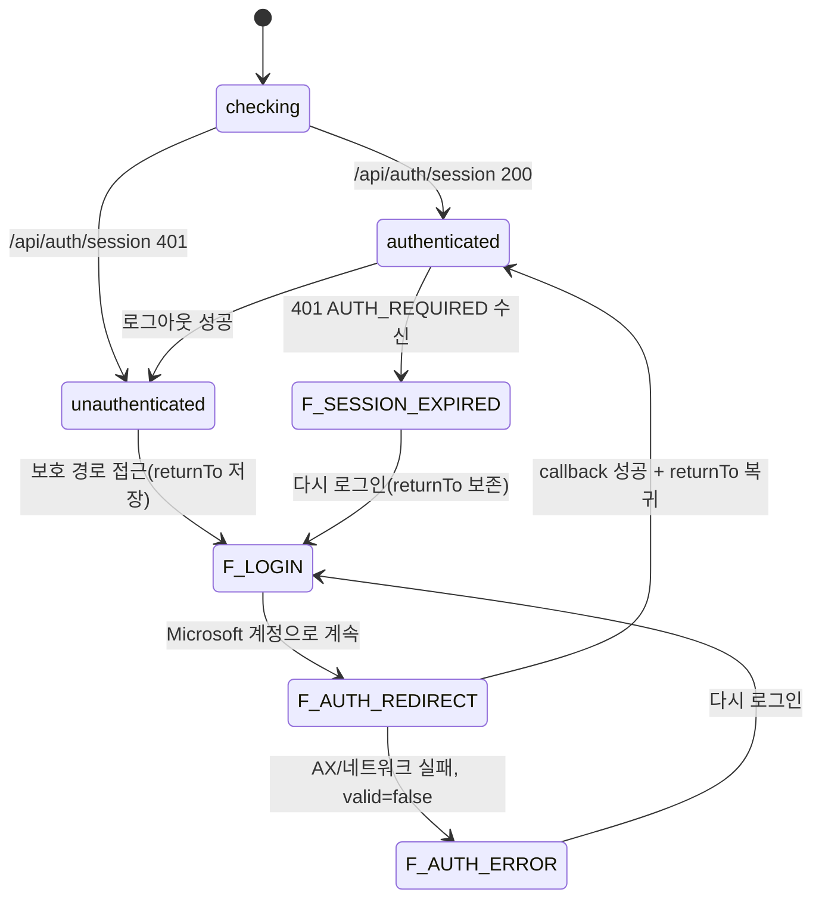

# AUTH-PR-02 — 로그인·보호 라우트

## Overview

`AUTH-PR-01`이 만든 서버 세션 계약 위에, 사용자가 실제로 보는 `/login` 화면, `AuthProvider`, 보호 라우트 가드와 모든 `/api/blueprint/*`의 공통 인증 적용을 구현한다. 이 PR이 끝나면 비인증 사용자는 어떤 보호 화면도 한 프레임도 보지 못하고, `/api/blueprint/*`를 직접 호출해도 401을 받으며, 로그인 성공 시 원래 접근하려던 경로로 복귀한다.

## Background

`docs/product/02-prd.md` 출시 조건은 "AX 로그인 성공 후 원래 보호 경로로 복귀하고 로그아웃 후 로컬 작업 상태가 화면에서 제거된다"를 요구한다. `docs/ui/screens/00-login-and-session.md`가 정의한 5개 Frame(`F-AUTH-CHECK`, `F-LOGIN`, `F-AUTH-REDIRECT`, `F-AUTH-ERROR`, `F-SESSION-EXPIRED`)을 실제 화면으로 만들어야 사용자가 인증 상태를 신뢰할 수 있다. 서버 경계(`AUTH-PR-01`)와 화면 경계를 분리한 이유는 각각 독립적으로 검증 가능한 결과이기 때문이다(서버는 fixture 계약 테스트로, 화면은 브라우저 QA로).

## Scope

### 포함
- React `AuthProvider`(`checking|authenticated|unauthenticated`), `/login` 화면, `ProtectedRoute` (`AUTH-004`)
- 모든 `/api/blueprint/*` handler에 `AUTH-PR-01`의 공통 `requireSession` 적용 (`AUTH-005`)
- AppBar 사용자 메뉴(이메일 표시, 로그아웃), 세션 만료 후 안전한 재인증 (`AUTH-007`)

### 제외
- AX 서버 검증 로직 자체(`AUTH-PR-01`에서 이미 구현됨, 여기서는 소비만 함)
- IndexedDB owner namespace 분리(`AUTH-PR-03`)

## 연결 근거

- 요구사항 ID: `AUTH-004`, `AUTH-005`, `AUTH-007`
- Delivery 작업 ID: `AUTH-004`, `AUTH-005`, `AUTH-007`
- 결정: `DEC-022`, `DEC-023`
- 화면 설계: `docs/ui/screens/00-login-and-session.md` (`UI-AUTH-001`)
- 선행 PR: `AUTH-PR-01` (머지 완료 후 시작)

## 선행 조건 (Definition of Ready)

- `AUTH-PR-01`이 사용자에 의해 머지됨(`/api/auth/*` 4종 API와 `requireSession` 헬퍼 사용 가능).
- `sfood-ds` MCP로 `Alert`, `Button`, `Spinner`, `Typography`, `Container`/`Stack`(또는 `Card`) 컴포넌트와 semantic token을 조회해 대응표를 확정했다.

## 작업 단위별 구현 개요

- **AUTH-004**: `src/features/auth/auth-provider.tsx`가 부팅 시 `GET /api/auth/session`을 호출해 `checking → authenticated|unauthenticated`로 전이. `checking` 동안 전용 로딩 Frame(`F-AUTH-CHECK`)만 렌더링하고 홈/프로젝트 내용을 렌더링하지 않는다. `src/pages/login-page.tsx`가 `F-LOGIN`/`F-AUTH-REDIRECT`/`F-AUTH-ERROR`/`F-SESSION-EXPIRED`를 화면 청사진 그대로 구현. `ProtectedRoute`는 비인증 시 현재 경로를 `returnTo`로 담아 `/login`으로 이동시키고, 인증된 사용자가 `/login`에 오면 검증된 `returnTo` 또는 `/`로 보낸다.
- **AUTH-005**: `/api/blueprint/*` 각 handler 진입점에서 `requireSession`을 통과해야 본 로직을 실행하도록 공통 wrapper 적용. 미인증 요청은 OpenAI 호출이나 파일 처리를 시작하기 전에 401을 반환.
- **AUTH-007**: AppBar에 현재 `user.email`과 `로그아웃` 메뉴, mobile은 접근 가능한 트리거로 동일 기능 제공. `401 AUTH_REQUIRED` 수신 시 진행 중 쓰기 작업을 중단하고 민감 메모리 상태를 비운 뒤 `F-SESSION-EXPIRED`로 유도.

## 프로세스 / 상태 전이

## 데이터/API 영향

- `/api/blueprint/*` 응답 계약에 `401 { code: "AUTH_REQUIRED" }` 공통 실패 형태 추가(기존 각 handler의 성공 응답 스키마는 변경 없음).
- 클라이언트 전역 상태에 `AuthContext` 추가. 로그인 여부 판단에 `localStorage`를 근거로 쓰지 않는다.

## Acceptance Criteria

### Happy Path
Given 비인증 사용자가 `/blueprints/p-1`에 접근한다, When 로그인에 성공한다, Then 프로젝트 내용은 로그인 전 렌더링되지 않고, 로그인 성공 후 `/blueprints/p-1`로 복귀한다.

### Failure Case
Given 비인증 상태다, When `/api/blueprint/turn`을 직접(브라우저 UI 없이) 호출한다, Then `401 AUTH_REQUIRED`를 받고 OpenAI 요청은 발생하지 않는다.

### Boundary
Given 사용 중 세션이 만료됐다, When 사용자가 쓰기 작업(답변 제출 등)을 시도한다, Then 요청이 401을 받고 진행 중 상태가 안전하게 보존된 채 `F-SESSION-EXPIRED`로 전환되며 재로그인 후 원래 경로로 돌아간다.

## 예상 변경 파일

- 생성: `src/features/auth/auth-provider.tsx`, `src/features/auth/auth-api.ts`, `src/features/auth/protected-route.tsx`, `src/features/auth/auth-types.ts`, `src/pages/login-page.tsx` (추정 경로 — `docs/product/11-ax-login-authentication.md` "클라이언트 구조")
- 수정: `src/app/router.tsx`(보호 라우트 wrapping), 기존 `/api/blueprint/*` handler 파일들(`requireSession` 적용), AppBar 컴포넌트(사용자 메뉴 추가, 실제 경로는 `FND-PR-01` 산출물 확인 후 확정)

## 테스트 계획

- 단위: `ProtectedRoute`의 인증 상태별 렌더링 분기, `returnTo` 인코딩/디코딩.
- 계약: `/api/blueprint/*` 각 endpoint의 401 응답 스키마.
- E2E: `docs/product/11-ax-login-authentication.md` "테스트 시나리오"의 5개 Gherkin 시나리오(비인증 보호 경로, AX 로그인 성공, HTTP 200 실패 응답, API 우회 차단, 사용자 전환은 `AUTH-PR-03` 범위와 중복되므로 여기서는 전환 직전까지만).

## UI 증거 계획 (해당 시)

- desktop 1440×900: `F-LOGIN`, `F-AUTH-ERROR`(대표 오류 1종), `F-SESSION-EXPIRED`, 로그인 후 AppBar 사용자 메뉴 열림 상태.
- mobile 390×844: 동일 4개 상태 + mobile AppBar 사용자 메뉴 트리거.
- `F-AUTH-CHECK`, `F-AUTH-REDIRECT`는 짧은 전환 상태이므로 캡처 대신 Agent Browser로 상태 텍스트 노출 여부만 확인.

## 코드 리뷰·QA 체크리스트

- [ ] 인증·권한 우회 여부(클라이언트 전용 가드로 화면만 숨기고 API가 열려 있지 않은지)
- [ ] `@sfood/ui` public export와 semantic token 준수(임의 색상값·중복 UI primitive 없음)
- [ ] 실패 경로 테스트(만료, 우회, 취소) 누락 여부
- [ ] QA gate "UI" 유형: desktop/mobile, keyboard, focus, loading/empty/error

## Done Checklist

- [ ] Requirements implemented
- [ ] Acceptance criteria verified
- [ ] 독립 코드 리뷰 pass
- [ ] 독립 QA pass
- [ ] 화면 변경 시 desktop/mobile 캡처 완료
- [ ] 사용자 PR 머지 확인

## 실행 시 추가 문서

- 이 폴더에 구현 중/후 `test-results.md`, `review-notes.md`, `qa-report.md` 등을 추가로 생성한다(지금은 생성하지 않음).
