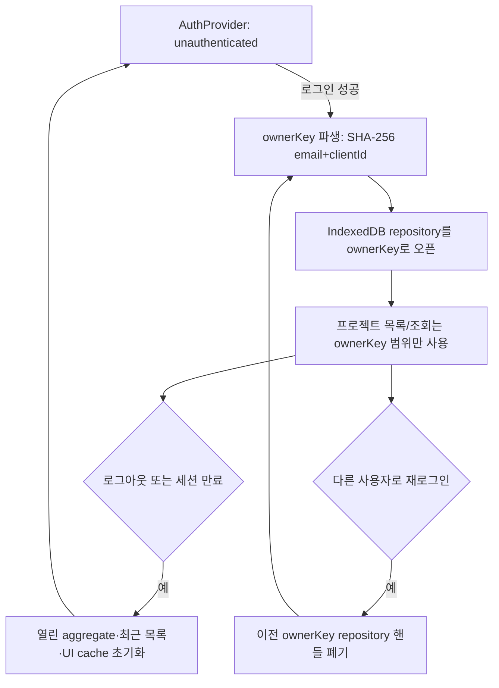

# AUTH-PR-03 — 사용자 저장 격리

## Overview

인증된 사용자별로 IndexedDB 프로젝트 저장소를 논리적으로 분리한다. 이 PR이 끝나면 같은 브라우저에서 사용자 A가 로그아웃하고 사용자 B가 로그인해도 B의 화면과 Agent 요청에 A의 프로젝트가 전혀 노출되지 않는다.

## Background

`docs/product/11-ax-login-authentication.md` "로컬 프로젝트 격리" 절과 `DEC-024`(`docs/product/10-decision-log.md`)는 서버 DB 없이 IndexedDB만 사용하는 구조에서 사용자 전환 시 데이터 교차 노출을 막기 위해 `ownerKey` 기반 namespace 분리를 요구한다. `AUTH-PR-02`가 인증 상태와 로그아웃 흐름을 이미 완성했으므로, 이 PR은 그 위에 저장소 계층의 격리만 추가하는 독립적으로 검증 가능한 마지막 인증 선행 단위다.

## Scope

### 포함
- `ownerKey` 파생(정규화 이메일 + client ID의 SHA-256 단방향 변환) 및 repository key 적용 (`AUTH-006`)
- 로그아웃·사용자 전환 시 열린 aggregate, 최근 목록, UI cache 초기화 후 새 namespace 오픈 (`AUTH-006`)

### 제외
- 프로젝트 최대 20개 제한/정리(PJT-004, `PRJ-PR-02` 범위)
- 저장소 스키마 마이그레이션 프레임워크 자체(`FND-PR-02`/`PRJ-PR-01` 범위, 이 PR은 기존 `ProjectRepository` 인터페이스에 `ownerKey`만 통합)

## 연결 근거

- 요구사항 ID: `AUTH-005`(추적표 매핑, 실제 판정은 `AUTH-006`)
- Delivery 작업 ID: `AUTH-006`
- 결정: `DEC-024`
- 화면 설계: 없음(저장소 계층 PR, 화면 변경 없음 — 기존 최근 프로젝트 목록이 사용자별로 다르게 보이는 것만 결과로 확인)
- 선행 PR: `AUTH-PR-02` (머지 완료 후 시작)

## 선행 조건 (Definition of Ready)

- `AUTH-PR-02`가 머지되어 `AuthUser.email`, `AuthUser.clientId`를 클라이언트에서 조회할 수 있다.
- `ProjectRepository` 인터페이스(`docs/product/06-architecture.md` "저장소 인터페이스")가 최소 골격으로 존재한다(없다면 이 PR에서 최소 형태로 함께 정의).

## 작업 단위별 구현 개요

- **AUTH-006**: `ownerKey = SHA-256(normalize(email) + clientId)`를 계산하는 유틸을 만들고, `ProjectRepository`의 모든 메서드(`list`, `get`, `save`, `delete`, `migrate`)가 `ownerKey`를 필수 첫 인자로 받도록 한다. IndexedDB의 object store 또는 key prefix에 `ownerKey`를 포함해 물리적으로 분리한다. `AuthProvider`가 `unauthenticated → authenticated`로 전이하며 `ownerKey`가 확정된 뒤에만 repository를 연다(그 전에는 어떤 프로젝트 조회도 시도하지 않는다). 로그아웃 또는 사용자 전환 감지 시 열려 있던 aggregate·최근 목록·React Query 등 UI cache를 모두 비우고 새 `ownerKey`로 repository를 재오픈한다.

## 프로세스 / 상태 전이

## 데이터/API 영향

- IndexedDB 스키마: 기존 단일 프로젝트 store에 `ownerKey`를 key 구성요소(또는 별도 object store per owner)로 추가. 기존 리빌드 이전 데이터는 `DEC-017`에 따라 마이그레이션하지 않는다.
- 서버 API 영향 없음(순수 클라이언트 저장소 계층 변경).

## Acceptance Criteria

### Happy Path
Given 사용자 A가 로그인해 프로젝트 3개를 만든다, When A가 로그아웃하고 사용자 B로 로그인한다, Then B의 최근 프로젝트 목록은 비어 있거나 B 자신의 프로젝트만 표시되고 A의 프로젝트 ID로 직접 접근해도 404 또는 권한 없음으로 처리된다.

### Failure Case
Given 사용자 B가 로그인 중이다, When B가 A 소유 프로젝트의 URL(`/blueprints/:projectId`)을 직접 입력한다, Then 프로젝트를 찾을 수 없음 안내가 표시되고 A의 데이터가 어떤 형태로도 노출되지 않는다.

### Boundary
Given 사용자 A가 로그아웃 직후 즉시 사용자 B로 재로그인한다(빠른 전환), When 전환이 완료된다, Then 이전 `ownerKey`의 repository 핸들이나 in-memory cache가 남아 B 화면에 A 데이터가 순간적으로라도 표시되지 않는다.

## 예상 변경 파일

- 수정: `src/infrastructure/storage/` 하위 IndexedDB repository 구현 파일, `src/features/auth/auth-provider.tsx`(repository open/close 연동) — 정확한 파일명은 `AUTH-PR-02`/`FND-PR-02` 산출물 확인 후 확정(추정 경로, `docs/product/06-architecture.md` "권장 소스 구조" 근거)
- 생성: `src/infrastructure/storage/owner-key.ts`(추정 경로)

## 테스트 계획

- 단위: `ownerKey` 파생 함수의 결정성(같은 입력 → 같은 키)과 비가역성(원본 이메일 복원 불가 확인은 설계 검토 수준).
- 계약: `ProjectRepository`가 다른 `ownerKey`로 호출됐을 때 서로의 데이터를 반환하지 않는지 검증하는 저장소 테스트.
- E2E: `docs/product/11-ax-login-authentication.md` "테스트 시나리오"의 "사용자 전환" 시나리오(A 로그인 → 프로젝트 생성 → 로그아웃 → B 로그인 → A 프로젝트 미노출).

## UI 증거 계획 (해당 시)

- 화면 변경은 없지만, "사용자 A/B 전환 후 최근 프로젝트 목록"을 desktop 1440×900에서 1장 캡처해 교차 노출이 없음을 시각적으로도 남긴다(엄격한 UI PR 캡처 gate 대상은 아니나 QA 증거로 첨부).

## 코드 리뷰·QA 체크리스트

- [ ] 사용자 데이터 유실 또는 비원자적 저장 여부(namespace 전환 중 다른 사용자 데이터 노출/손상 없는지)
- [ ] 관련 없는 파일 변경이나 숨은 범위 확장 없음(PJT-004 프로젝트 개수 제한 로직을 이 PR에서 함께 구현하지 않았는지)
- [ ] QA gate "저장" 유형: 생성·업데이트·마이그레이션·손상·실패 복구·사용자 격리

## Done Checklist

- [ ] Requirements implemented
- [ ] Acceptance criteria verified
- [ ] 독립 코드 리뷰 pass
- [ ] 독립 QA pass
- [ ] 화면 변경 시 desktop/mobile 캡처 완료 (참고용 캡처 1장, 필수 UI PR 캡처 gate 대상 아님)
- [ ] 사용자 PR 머지 확인

## 실행 시 추가 문서

- 이 폴더에 구현 중/후 `test-results.md`, `review-notes.md`, `qa-report.md` 등을 추가로 생성한다(지금은 생성하지 않음).
