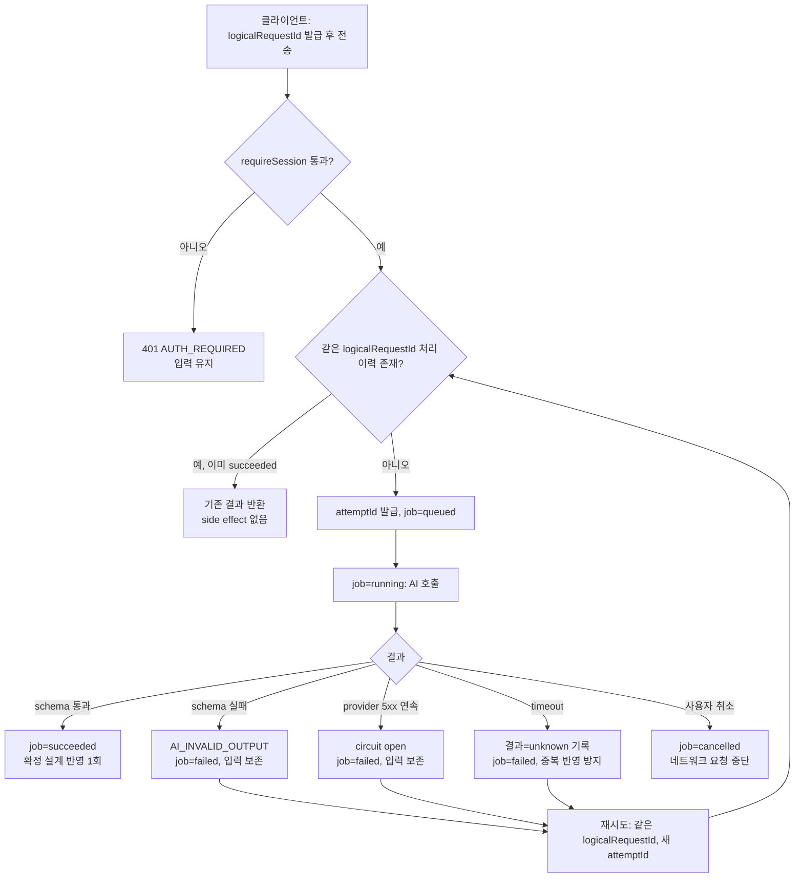

# CON-PR-01 — turn 수명주기

## Overview

`POST /api/blueprint/turn` 요청·응답 수명주기를 구현해 사용자 답변/자유 입력이 인증된 세션에서만 처리되고, 실행 중 중복 전송이 걸러지며, 실패 시 입력을 잃지 않고 재시도할 수 있게 한다.

## Background

`docs/delivery/development-pr-review-qa-workflow.md` PR 단위표는 이 PR을 "입력 보존, 인증, 중복 방지와 실패 재시도"라는 하나의 결과 문장으로 묶고 있지만, 실제로는 서로 독립적으로 검증 가능한 4개 계약(① 인증 경계, ② 요청 수명주기 상태 전이, ③ `logicalRequestId`/`attemptId` 기반 중복 방지, ④ 오류별 입력 보존과 재시도)이다. 리뷰어가 범위를 좁혀 판단할 수 있도록 이 문서의 Acceptance Criteria를 4개 계약별로 분리해 기술한다.

## Scope

### 포함

- `POST /api/blueprint/turn` 요청 스키마 검증과 `requireSession` 적용
- CON-202 요청 상태 머신(`idle → queued → running → succeeded/failed/cancelled`)
- `logicalRequestId`(사용자 의도 단위) / `attemptId`(실행 시도 단위) 발급과 중복 반영 차단
- CON-206 오류별(네트워크, rate limit, schema 실패, 취소) 화면 계약과 입력 보존
- AI-010(retry·circuit breaker) 서버 측 적용

### 제외

- 질문 카탈로그·선택 폼 UI(`CON-PR-02`)
- DisplayBlock 렌더링·진행 상태 표시(`CON-PR-03`)
- AI 모델 registry/token budgeter 자체 구현(`AI-PR-01`에서 선행, 이 PR은 소비만 함)

## 연결 근거

- 요구사항: `CONV-005`, `NFR-004`, `NFR-005`
- Delivery 작업: `docs/delivery/02-conversation-and-forms.md` CON-202, CON-206
- AI 실행 계약: `docs/delivery/ai-model-prompt-and-evaluation.md` AI-010
- 결정: `DEC-007`, `DEC-023`, `DEC-029`
- 화면 설계: `docs/ui/02-conversation-and-forms.md` `UI-CONV-004`, `docs/ui/screens/02-intake-and-discovery.md` I06
- 선행 PR: `AI-PR-01`(model/prompt registry, request ledger), `AUTH-PR-01`~`03`(세션 검증)

## 선행 조건 (Definition of Ready)

- `AI-PR-01`이 사용자 머지 완료돼 model registry/prompt registry/request ledger 사용 가능
- `AUTH-PR-01`~`03` 머지 완료돼 `requireSession` 미들웨어 사용 가능
- 도메인 GenerationJob 상태 enum이 `FND-PR-02`에서 확정됨

## 작업 단위별 구현 개요

### ① 인증 경계

- `POST /api/blueprint/turn`에 공통 `requireSession`을 적용해 비인증 요청을 401로 거절
- 세션에서 파생된 `ownerKey`만 request ledger와 project 조회에 사용(요청 본문의 임의 사용자 식별자 무시)

### ② 요청 수명주기 상태 전이

- `idle → queued → running → {succeeded|failed|cancelled}` 상태를 `GenerationJob`으로 관리
- 성공 전에는 프로젝트 확정 설계를 변경하지 않음(schema 검증 통과 후에만 커밋)
- 취소 요청 시 네트워크 요청과 job을 `cancelled`로 즉시 종료

### ③ 중복 방지

- 사용자 의도마다 `logicalRequestId` 발급(클라이언트 생성), 실행 시도마다 서버가 `attemptId` 발급
- 서버는 이미 처리된 `logicalRequestId`의 재요청을 감지하면 새 side effect 없이 기존 결과를 반환
- circuit breaker(AI-010): provider 5xx 연속 실패 시 circuit open, timeout 결과는 `unknown`으로 기록하고 중복 반영 방지

### ④ 오류별 입력 보존과 재시도

- `docs/delivery/02-conversation-and-forms.md` CON-206 오류 표(네트워크 실패/rate limit/schema 실패/취소)를 서버 오류 코드 → 클라이언트 처리 지침으로 구현
- 모든 오류 경로에서 fallback 제안/문서를 생성하지 않고 원래 입력과 기존 확정 설계를 유지

## 프로세스 / 상태 전이

## 데이터/API 영향

- `POST /api/blueprint/turn` 요청에 `logicalRequestId`, `attemptId` 필드 추가(스키마는 `FND-PR-02`에서 정의된 것을 그대로 사용, 이 PR은 서버 처리 로직만 구현)
- `GenerationJob` 상태 저장(서버 in-memory 또는 요청 단위 — 브라우저 IndexedDB에 job 상태를 영속 저장하지 않음, 새로고침 시 job은 재시작)
- 응답 오류 코드: `AUTH_REQUIRED`, `AI_INVALID_OUTPUT`, `NETWORK_ERROR`, `AI_RATE_LIMITED`(`docs/product/06-architecture.md` 오류 모델과 일치)

## Acceptance Criteria

### Happy Path — ① 인증

- Given 유효한 Blueprint 세션 쿠키가 있을 때, when `/api/blueprint/turn`을 호출하면, then 요청이 정상 처리된다.

### Failure Case — ① 인증

- Given 세션이 없거나 만료된 상태, when `/api/blueprint/turn`을 직접 호출하면, then 401 `AUTH_REQUIRED`가 반환되고 어떤 side effect도 발생하지 않는다.

### Happy Path — ② 수명주기

- Given 정상 입력이 제출된 상태, when turn이 처리되면, then `queued→running→succeeded` 전이를 거쳐 확정 설계가 정확히 한 번 갱신된다.

### Failure Case — ② 수명주기

- Given 처리 중 사용자가 취소한 상태, when 취소 요청이 도착하면, then job이 `cancelled`로 종료되고 확정 설계는 변경되지 않는다.

### Happy Path — ③ 중복 방지

- Given 동일 `logicalRequestId`로 두 번 요청이 도착한 상태(네트워크 재시도 등), when 첫 요청이 이미 `succeeded`인 경우, then 두 번째 요청은 새 AI 호출 없이 같은 결과를 반환한다.

### Failure Case — ③ 중복 방지

- Given provider가 5xx를 연속 반환하는 상태, when circuit이 open되면, then 추가 provider 호출 없이 즉시 실패 처리되고 입력은 보존된다.

### Happy Path — ④ 입력 보존/재시도

- Given schema 검증에 실패한 응답을 받은 상태, when 클라이언트가 같은 입력으로 재시도하면, then 원래 입력이 그대로 유지된 채 새 `attemptId`로 재요청되고 성공 시 결과가 한 번만 반영된다.

### Failure Case — ④ 입력 보존/재시도

- Given 네트워크 실패가 발생한 상태, when 오류가 반환되면, then 작성 중이던 입력, 현재 질문, 확정 설계가 모두 화면에 그대로 남고 fallback 제안이 생성되지 않는다.

### Boundary

- Given timeout이 정확히 설정된 한도에 도달한 상태, when 결과가 반환되면, then 결과가 `unknown`으로 기록되고 이후 같은 `logicalRequestId` 재시도가 중복 반영을 일으키지 않는다.

## 예상 변경 파일

- `api/blueprint/turn.js` (신규 또는 기존 `api/blueprint/chat.js` 대체)
- `api/_lib/require-session.js` (기존 재사용)
- `src/features/conversation/turn-lifecycle.ts` (신규)
- `src/features/conversation/duplicate-guard.ts` (신규 — `logicalRequestId` 추적)
- `src/domain/blueprint/generation-job.ts` (신규 — 상태 머신)
- `tests/contract/turn-api.test.ts` (신규)
- `tests/unit/conversation/duplicate-guard.test.ts` (신규)

## 테스트 계획

- 계약 테스트: 인증 없는 직접 API 호출 401, 정상 요청 200 + schema 검증
- 상태 전이 단위 테스트: `idle→queued→running→{succeeded|failed|cancelled}` 전 전이 경로
- 중복 방지 테스트: 동일 `logicalRequestId` 재전송 시 side effect 0회
- circuit breaker 테스트: 연속 5xx N회 후 open, 이후 호출 즉시 실패
- 오류 재현 테스트: 네트워크 실패/rate limit/schema 실패/취소 각각의 입력 보존 확인
- E2E: 네트워크 실패 → 재시도 → 중복 없이 성공(`docs/delivery/02-conversation-and-forms.md` 필수 테스트 7,8)

## UI 증거 계획 (해당 시)

이 PR 자체는 API 계약이 중심이지만 CON-206 오류 배너(`Alert danger` + 다시 시도)가 최소 노출되므로 desktop 1440×900, mobile 390×844에서 네트워크 실패/재시도 상태 캡처 1세트 필요.

## 코드 리뷰·QA 체크리스트

- `requireSession`이 모든 경로에 적용됐는지, same-origin 검증 여부
- `logicalRequestId`/`attemptId` 발급 위치와 저장소가 명세와 일치하는지
- 오류 코드가 `docs/product/06-architecture.md` 오류 모델과 이름이 일치하는지
- 로그에 사용자 원문/토큰이 없는지
- QA: 실제 네트워크 차단(devtools offline) 후 재시도 시나리오 수동 확인

## Done Checklist

- [ ] Requirements implemented
- [ ] Acceptance criteria verified
- [ ] 독립 코드 리뷰 pass
- [ ] 독립 QA pass
- [ ] 화면 변경 시 desktop/mobile 캡처 완료
- [ ] 사용자 PR 머지 확인

## 실행 시 추가 문서

- 이 폴더에 구현 중/후 `test-results.md`, `review-notes.md`, `qa-report.md` 등을 추가로 생성한다(지금은 생성하지 않음).
