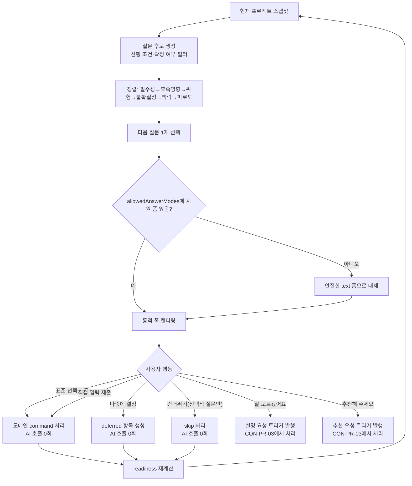

# CON-PR-02 — 질문·선택 폼

## Overview

12개 설계 영역의 질문 카탈로그와 선택 엔진, 7종 answer mode 동적 폼을 구현해 표준 선택·skip·defer가 AI 호출 없이 처리되고 조건에 맞는 질문만 이어지게 한다.

## Background

`CON-PR-01`이 turn 요청 수명주기를 완성한 뒤, 이 PR은 그 위에서 실제로 "무엇을 물어볼지"와 "어떻게 답을 받을지"를 구현한다. `docs/product/12-ai-orchestration-and-model-policy.md`의 결정론과 AI 경계 원칙(DEC-026)에 따라 질문 선택·표준 폼 처리는 코드가 담당하고 AI는 호출하지 않는다.

## Scope

### 포함

- CON-203 질문 카탈로그(12개 설계 영역, 선행 조건, 필수성, 허용 폼, 대상 item type)와 선택 엔진(정렬 규칙, 동점 처리)
- CON-204 7종 answer mode(`single`, `multiple`, `text`, `number`, `range`, `rank`, `confirm`) 폼과 공통 행동(직접 입력, 잘 모르겠어요, 추천해 주세요, 나중에 결정, 건너뛰기)
- AI-005 중 표준 선택/skip/defer 분기(AI 호출 없음 경로)

### 제외

- `잘 모르겠어요`→설명, `추천해 주세요`→추천 생성의 실제 AI 호출과 block 렌더링(`CON-PR-03`)
- turn 요청 자체의 인증/재시도/중복 방지(`CON-PR-01`에서 선행 완료)
- 제안 승인·설계 반영(`DSG-PR-01`~`03`)

## 연결 근거

- 요구사항: `CONV-001`, `FORM-001`~`FORM-004`
- Delivery 작업: `docs/delivery/02-conversation-and-forms.md` CON-203, CON-204
- AI 실행 계약: `docs/delivery/ai-model-prompt-and-evaluation.md` AI-005(표준 분기만)
- 결정: `DEC-006`, `DEC-026`
- 화면 설계: `docs/ui/02-conversation-and-forms.md` `UI-FORM-001`, 입력 유형별 구성 표; `docs/ui/screens/02-intake-and-discovery.md` D04~D09
- 선행 PR: `CON-PR-01`(turn 수명주기)

## 선행 조건 (Definition of Ready)

- `CON-PR-01` 사용자 머지 완료
- `FND-PR-01`에서 `@sfood/ui` 폼 컴포넌트(Radio, Checkbox/MultiSelect, Input, Textarea, NumberInput) 사용 가능 확인 완료
- 질문 카탈로그 12개 영역의 콘텐츠(문구, 옵션)가 `FND-PR-01`/`02`에서 데이터로 확정됨

## 작업 단위별 구현 개요

### 질문 카탈로그와 선택 엔진 (CON-203)

- 12개 설계 영역별 후보 목록: `{ id, targetItemType, prerequisites, required, allowedAnswerModes }`
- 정렬 기준: 필수성 → 후속 영향 → 위험 → 불확실성 → 직전 맥락 → 피로도, 동점 시 문제/사용자/목표를 기능/기술보다 우선
- 이미 confirmed된 의미는 후보에서 제외, 로그인 불필요/데이터 불필요 시 관련 후속 질문 비활성화

### 동적 선택 폼 (CON-204)

- answer mode별 컴포넌트 매핑표 구현(`docs/ui/02-conversation-and-forms.md` 입력 유형별 구성 표 그대로 적용)
- 공통 행동: 직접 입력 병행, `잘 모르겠어요`(설명 요청 트리거만 발행, 실제 설명 렌더링은 `CON-PR-03`), `추천해 주세요`(추천 요청 트리거만 발행), `나중에 결정`(deferred 항목 생성), 선택적 질문의 `건너뛰기`
- 지원하지 않는 answer mode는 안전한 text 폼으로 대체(fallback이 아니라 명시적 안전 처리)

### 표준 분기 (AI-005 일부)

- 표준 선택/skip/defer 제출 시 AI 호출 없이 도메인 command로 직접 처리
- 제출 즉시 반영하지 않고 사용자가 별도 제출 행동을 완료해야 반영(선택만으로 자동 제출 금지)

## 프로세스 / 상태 전이

## 데이터/API 영향

- 질문 카탈로그는 정적 데이터(코드/설정 파일)로 관리, 별도 API 없음
- 표준 선택/skip/defer는 기존 `POST /api/blueprint/turn`을 AI 분석 없이 도메인 command 경로로만 호출(요청 body에 `mode: "standard"` 등 구분 필드 추가는 구현 시 `FND-PR-02` schema와 조율)
- 새 도메인 상태: `DeferredAnswer`, `SkippedQuestion` 표시(설계 항목 자체는 생성하지 않고 질문 상태만 기록)

## Acceptance Criteria

### Happy Path

- Given 로그인 방식이 필요 없는 것으로 이미 확정된 상태, when 다음 질문을 계산하면, then 로그인 방식 질문이 후보에서 제외된다.
- Given 사용자가 `single` mode 질문에서 옵션을 선택하고 제출 버튼을 누르면, when 처리되면, then AI 호출 없이 도메인 command로 확정 답이 저장된다.
- Given `나중에 결정`을 선택하면, when 제출되면, then `deferred` 항목이 생성되고 다음 질문으로 진행 가능하다.

### Failure Case

- Given 알려지지 않은 answer mode가 카탈로그에 있는 상태, when 폼을 렌더링하면, then 오류 없이 안전한 text 폼으로 대체된다.
- Given 필수 항목을 선택하지 않은 상태, when 제출을 시도하면, then 제출이 차단되고 해당 필드에 오류가 연결된다.

### Boundary

- Given 이미 확정된 의미와 동일한 질문 후보가 남아있는 극단 케이스, when 후보를 재계산하면, then 해당 후보가 제외되어 반복 질문이 발생하지 않는다.
- Given 선택 옵션을 클릭만 하고 제출 버튼을 누르지 않은 상태, when 다른 화면으로 이동하면, then 자동 제출되지 않고 선택 상태만 유지된다.

## 예상 변경 파일

- `src/domain/blueprint/question-catalog.ts` (신규)
- `src/domain/blueprint/question-engine.ts` (신규 — `getCandidates`, `selectNext`, `evaluateReadiness`)
- `src/components/blueprint/question-card.tsx` (신규)
- `src/components/blueprint/answer-forms/*.tsx` (신규 — 7종 answer mode별 컴포넌트)
- `src/features/questions/submit-standard-answer.ts` (신규)
- `tests/unit/domain/question-engine.test.ts` (신규)
- `tests/component/answer-forms.test.tsx` (신규)

## 테스트 계획

- 질문 선택 규칙 단위 테스트: 필수성/후속영향/위험/불확실성/피로도 정렬, 동점 처리
- 조건부 활성화 테스트: 로그인 불필요 시 로그인 질문 비활성, 데이터 불필요 시 DB 질문 비활성
- 7종 answer mode 컴포넌트 테스트: default/selected/error/disabled 상태 각각
- 표준 선택/skip/defer AI 호출 0회 확인(request ledger 카운트 검증)
- 키보드만으로 입력·순위 변경·제출 완료 E2E

## UI 증거 계획 (해당 시)

- desktop 1440×900, mobile 390×844에서 7종 answer mode 각각의 default/selected/error 상태 캡처
- 조건부 질문 비활성 화면 캡처 1세트
- 파일명 예: `CON-PR-02-question-card-1440x900-single-selected.png`

## 코드 리뷰·QA 체크리스트

- 질문 카탈로그 데이터와 선택 엔진 로직이 분리돼 있는지(하드코딩된 순서 없는지)
- 표준 선택 제출 시 실제로 AI 호출이 발생하지 않는지 request ledger로 확인
- `@sfood/ui` 컴포넌트만 사용했는지, 임의 색상값 없는지
- QA: 데스크톱/모바일 키보드 내비게이션 수동 확인, screen reader 이름/오류 연결 확인

## Done Checklist

- [ ] Requirements implemented
- [ ] Acceptance criteria verified
- [ ] 독립 코드 리뷰 pass
- [ ] 독립 QA pass
- [ ] 화면 변경 시 desktop/mobile 캡처 완료
- [ ] 사용자 PR 머지 확인

## 실행 시 추가 문서

- 이 폴더에 구현 중/후 `test-results.md`, `review-notes.md`, `qa-report.md` 등을 추가로 생성한다(지금은 생성하지 않음).
