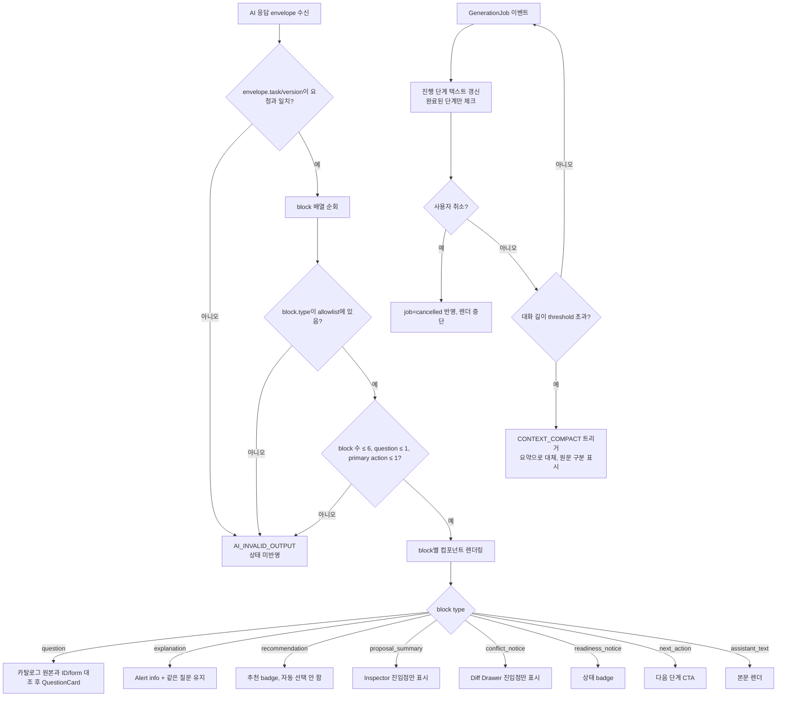

# CON-PR-03 — 메시지·AI block

## Overview

허용된 8종 `DisplayBlock`(assistant_text, question, explanation, recommendation, proposal_summary, conflict_notice, readiness_notice, next_action)의 allowlisted renderer와 `GenerationJob` 기반 진행 상태·취소·context compaction을 구현해, 자유 답변 하나에서 여러 block과 제안을 안전하게 표시한다.

## Background

`CON-PR-01`(수명주기)과 `CON-PR-02`(질문·폼)가 완성된 뒤, 이 PR은 AI가 실제로 반환하는 다형 응답(block + proposal)을 화면에 안전하게 조립하는 마지막 조각이다. 모델이 임의 HTML/component를 반환하지 못하게 하는 계약(`docs/product/13-prompt-and-response-contracts.md`)이 핵심이므로, 렌더러는 모델 출력의 `type` 필드를 그대로 신뢰하지 않고 allowlist로 검증한다.

## Scope

### 포함

- CON-205 메시지 종류별 렌더링(사용자/Agent/질문/작업 상태/오류)과 오래된 대화의 구조화 요약 표시
- AI-004 8종 DisplayBlock schema 구현과 allowlisted renderer
- `GenerationJob` 기반 진행 상태 표시, 취소, `CONTEXT_COMPACT` 트리거

### 제외

- 질문 카탈로그/선택 폼 자체(`CON-PR-02`에서 이미 완료)
- turn 요청 인증/재시도(`CON-PR-01`에서 이미 완료)
- 제안 승인·거절 UI(Inspector, Diff Drawer)는 `DSG-PR-01`~`03`에서 구현 — 이 PR은 `proposal_summary`, `conflict_notice` block이 그 화면으로 진입하는 지점까지만 담당

## 연결 근거

- 요구사항: `CONV-003`, `CONV-004`
- Delivery 작업: `docs/delivery/02-conversation-and-forms.md` CON-205
- AI 실행 계약: `docs/delivery/ai-model-prompt-and-evaluation.md` AI-004
- 결정: `DEC-027`
- 화면 설계: `docs/ui/02-conversation-and-forms.md` `UI-CONV-002`, `UI-CONV-005`, 상황별 AI 응답 block 표; `docs/ui/screens/02-intake-and-discovery.md` I06, 도움·추천 block 변형
- 선행 PR: `CON-PR-02`(질문·선택 폼), `AI-PR-01`(prompt/schema registry)

## 선행 조건 (Definition of Ready)

- `CON-PR-02` 사용자 머지 완료(질문 트리거·표준 제출 경로 존재)
- `AI-PR-01`에서 `DisplayBlock` JSON Schema가 registry에 등록 완료
- `@sfood/ui`의 Alert, Badge, Popover 등 block 렌더링에 필요한 컴포넌트 확인 완료(`FND-PR-01`)

## 작업 단위별 구현 개요

### DisplayBlock allowlisted renderer (AI-004)

- 8종 block의 TypeScript discriminated union과 zod/JSON Schema 검증기 구현
- 알 수 없는 `type` 값은 렌더링하지 않고 `AI_INVALID_OUTPUT`으로 처리(텍스트로 추정 표시 금지)
- 한 응답 최대 6개 block, `question` block 최대 1개, primary action 최대 1개 제약을 렌더러 레벨에서도 재검증(서버 검증에만 의존하지 않음)
- `question` block은 카탈로그가 선택한 ID/form type을 변경하지 못하도록 클라이언트에서 원본 대조

### 메시지·진행 상태 (CON-205)

- 사용자/Agent/질문/작업 상태/오류를 의미별 컴포넌트로 렌더링(Agent 메시지는 카드 없는 본문 흐름, 사용자 메시지는 우측 정렬 표면)
- `GenerationJob` 단계(예: "답변 분석 중 → 관련 사용자 후보 확인 → 기능 후보 정리 중")를 실제 완료된 단계만 체크 표시, 가짜 퍼센트 금지
- `CONTEXT_COMPACT` threshold 초과 시 오래된 메시지를 구조화 요약으로 대체하되 원문/요약을 시각적으로 구분
- 진행 중 작업의 취소 버튼과 `cancelled` 상태 반영(`CON-PR-01`의 job 상태 머신 소비)

## 프로세스 / 상태 전이

## 데이터/API 영향

- `AiResponseEnvelope.payload.blocks: DisplayBlock[]`를 클라이언트가 소비(서버 스키마는 `AI-PR-01`에서 정의, 이 PR은 클라이언트 검증·렌더링만 구현)
- 대화 메시지 저장 구조에 `summaryIds`/원문 구분 플래그 추가(IndexedDB 프로젝트 aggregate 내)
- 신규 API 없음 — 기존 `POST /api/blueprint/turn` 응답을 소비

## Acceptance Criteria

### Happy Path

- Given 자유 답변 하나에서 서버가 4개 block과 2개 proposal을 반환하면, when 렌더러가 처리하면, then 6개 이하 제약을 만족하는 모든 block이 올바른 컴포넌트로 표시된다.
- Given 작업이 정상 진행 중일 때, when GenerationJob 단계가 갱신되면, then 실제 완료된 단계만 체크 표시로 바뀐다.
- Given 대화가 threshold를 초과하면, when CONTEXT_COMPACT가 트리거되면, then 오래된 메시지가 요약으로 대체되고 원문/요약이 시각적으로 구분된다.

### Failure Case

- Given 서버가 allowlist 밖의 block type을 반환하면, when 렌더러가 처리하면, then 해당 block이 일반 텍스트로 추정 표시되지 않고 `AI_INVALID_OUTPUT`으로 처리되며 상태가 변경되지 않는다.
- Given 응답에 `question` block이 2개 이상 포함되면, when 렌더러가 검증하면, then 전체 응답이 거절 처리된다.
- Given 사용자가 진행 중 작업을 취소하면, when 취소가 반영되면, then job이 `cancelled`로 종료되고 부분 렌더링이 남지 않는다.

### Boundary

- Given 응답이 정확히 6개 block을 반환하면, when 렌더러가 검증하면, then 정상 렌더링된다(7개면 거절).
- Given `question` block의 ID/form type이 카탈로그 원본과 다르면, when 렌더러가 대조하면, then 카탈로그 값이 우선하고 모델 값은 무시되거나 응답이 거절된다(구현 시 결정, ADR로 기록).

## 예상 변경 파일

- `src/components/blueprint/display-blocks/*.tsx` (신규 — 8종 block별 컴포넌트)
- `src/features/conversation/block-renderer.ts` (신규 — allowlist 검증·조립)
- `src/features/conversation/generation-job-view.ts` (신규 — 진행 상태 텍스트 매핑)
- `src/features/conversation/context-compaction-view.ts` (신규)
- `tests/unit/conversation/block-renderer.test.ts` (신규)
- `tests/component/display-blocks.test.tsx` (신규)

## 테스트 계획

- block schema fixture 기반 렌더링 테스트: 8종 각각 정상 렌더, 알 수 없는 type 거절
- 제약 테스트: 6개 초과 block, question 2개 이상, primary action 2개 이상 각각 거절
- GenerationJob 단계 텍스트 테스트: 완료 전/후 상태 반영, 가짜 퍼센트 없음 검증
- compaction 테스트: threshold 초과 시 confirmed/deferred/rejected 보존 확인(`docs/delivery/ai-model-prompt-and-evaluation.md` 테스트 시나리오 5)
- 취소 테스트: 취소 후 부분 렌더링 잔존 없음

## UI 증거 계획 (해당 시)

- desktop 1440×900, mobile 390×844에서 8종 block 조합 캡처(단일 block, 복수 block 조합 각 1세트)
- 진행 상태 표시와 취소 화면 캡처
- 파일명 예: `CON-PR-03-display-blocks-1440x900-multi-block.png`

## 코드 리뷰·QA 체크리스트

- allowlist 검증이 서버 응답을 그대로 신뢰하지 않고 클라이언트에서도 재검증하는지
- block 수/question 수/primary action 수 제약이 실제 코드에 강제돼 있는지
- 진행률 텍스트가 실제 `GenerationJob` 이벤트에서만 파생되는지(하드코딩된 퍼센트 없는지)
- QA: 실제 fixture로 6개 초과 응답을 주입해 거절 동작 수동 확인, 모바일에서 취소 버튼 접근성 확인

## Done Checklist

- [ ] Requirements implemented
- [ ] Acceptance criteria verified
- [ ] 독립 코드 리뷰 pass
- [ ] 독립 QA pass
- [ ] 화면 변경 시 desktop/mobile 캡처 완료
- [ ] 사용자 PR 머지 확인

## 실행 시 추가 문서

- 이 폴더에 구현 중/후 `test-results.md`, `review-notes.md`, `qa-report.md` 등을 추가로 생성한다(지금은 생성하지 않음).
