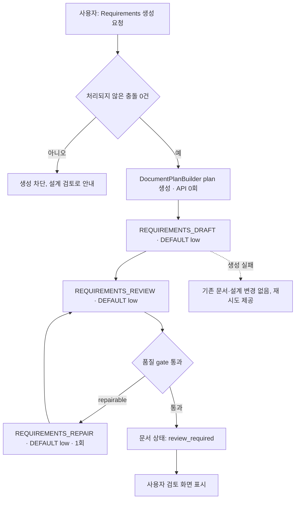

# DOC-PR-01 — Requirements 생성

## Overview

확정 설계 스냅샷에서 요구사항명세서(Requirements)를 생성한다. 결정론적 plan → Mini(DEFAULT) draft → Mini review 파이프라인을 구현하고, 생성된 문서를 문서 작업 공간에서 목차·본문·상태로 표시한다. 이 PR은 4단계의 첫 번째 PR로, PRD 생성(`DOC-PR-02`)의 선행 조건이다.

## Background

`docs/product/02-prd.md`의 여정 A/B 6단계("문서 준비도가 충족되면 요구사항명세서를 생성하고 검토한다")와 `DEC-015`(요구사항명세서 ready 확정 후 PRD 생성), `DEC-028`(plan→draft→review→선택적 repair), `DEC-032`(결정론적 plan은 API 호출 없음)를 구현 가능한 화면·API 계약으로 옮긴다. 3단계(`DSG-PR-01~03`)에서 누적된 확정 설계가 입력이며, AI가 요구사항 구조 자체를 결정하지 않고 코드가 만든 plan을 따르게 하는 것이 핵심 제약이다.

## Scope

### 포함

- `GeneratedDocument`/`DocumentSection` 도메인과 저장(`DOC-401`)
- `DocumentPlanBuilder` 결정론적 plan(API 0회)
- Requirements DEFAULT(Mini) low draft, DEFAULT(Mini) low review, 선택적 동일 profile repair 1회(`DOC-402`)
- `POST /api/blueprint/documents/generate`(`documentType: "requirements"`)
- 문서 상태 전이(`not_created → generating → draft → review_required`)와 화면 표시

### 제외

- Requirements `ready` 확정 행동과 PRD 생성 잠금 해제(`DOC-PR-02`)
- 섹션 직접 편집과 영향 미리보기(`DOC-PR-04`)
- 부분 AI 보완과 정합성 검토(`DOC-PR-03`)

## 연결 근거

- 요구사항: `DOC-001`, `DOC-002`
- Delivery 작업: `DOC-401`, `DOC-402`
- AI 작업: `AI-006`(context 순서, token/hard budget)
- 결정: `DEC-002`, `DEC-015`, `DEC-028`, `DEC-032`
- 화면 설계: [문서 작업 공간](../../ui/04-document-workspace.md) `UI-DOC-001`~`UI-DOC-003`, [문서 청사진 F-REQ-DRAFT](../../ui/screens/05-documents-and-guide.md)
- 선행 PR: `DSG-PR-03`(순서 16, 영역별 상태와 document-ready gate)

## 선행 조건 (Definition of Ready)

- `DSG-PR-03`이 사용자에 의해 머지됨(설계 영역별 준비도가 `작업 가능` 이상)
- `FND-PR-02`(도메인·Agent 계약)가 머지되어 `AiTaskType`, `PromptDefinition`, `ContextManifest` 타입이 존재함
- 처리되지 않은 설계 충돌 0건인 fixture 프로젝트 준비됨

## 작업 단위별 구현 개요

**DOC-401 공통 문서 프레임**
- `GeneratedDocument { documentType, status, version, designRevision, sections[] }`, `DocumentSection { id, heading, body, sourceItemIds[], syncStatus }` 저장
- 문서 탭 헤더에 상태(`draft/ready/stale/conflict`), revision, 저장 시각 표시
- 본문 읽기 폭 제한(`--bp-document-line`), 목차 스크롤 동기화

**DOC-402 요구사항명세서 생성**
- `DocumentPlanBuilder`가 confirmed/deferred design item, acceptance criterion, generation request ID로 section plan을 코드로 생성(API 호출 없음)
- plan을 `REQUIREMENTS_DRAFT`(DEFAULT, low, maxInput 30000/maxOutput 8000)에 전달해 초안 생성
- `REQUIREMENTS_REVIEW`(DEFAULT, low, maxInput 36000/maxOutput 3000)로 누락·근거·정합성 검토
- repairable 문제가 있으면 `REQUIREMENTS_REPAIR`(DEFAULT, low, 1회)로 문제 section만 재작성 후 재검토
- 제안·기각 항목은 확정 사실로 포함하지 않고, 수용 기준 없는 핵심 요구사항은 검토 항목으로 표시

## 프로세스 / 상태 전이

## 데이터/API 영향

- 신규: `GeneratedDocument`, `DocumentSection`을 IndexedDB에 프로젝트 aggregate 하위로 저장
- 신규: `POST /api/blueprint/documents/generate` — 요청에 `documentType: "requirements"`, `designRevision` 포함, 서버가 같은 revision인지 검증
- 응답은 `AiResponseEnvelope` 규격(`task`, `promptVersion`, `schemaVersion`, `designRevision`, `payload`, `referencedItemIds`, `warnings`)을 따름

## Acceptance Criteria

### Happy Path
Given 처리되지 않은 충돌이 없고 핵심 기능에 acceptance criterion이 있는 확정 설계가 있을 때, when 사용자가 Requirements 생성을 요청하면, then plan→draft→review 파이프라인이 실행되고 `review_required` 상태의 Requirements 문서가 표시된다.

### Failure Case
Given `REQUIREMENTS_DRAFT` 호출이 실패했을 때, when 사용자가 생성을 재요청하면, then 기존 문서와 확정 설계는 변경되지 않고 동일 `logicalRequestId` 기반 재시도가 제공된다.

### Boundary
Given review에서 repairable 문제가 발견됐을 때, when repair가 1회 실행된 뒤에도 문제가 남으면, then 모델을 승격하지 않고 해당 항목을 검토 목록으로 표시해 사용자 검토로 넘긴다.

## 예상 변경 파일

- `src/domain/blueprint/document.ts`(GeneratedDocument/DocumentSection 타입)
- `src/features/documents/documentPlanBuilder.ts`
- `src/features/documents/requirementsGeneration.ts`
- `api/blueprint/documents/generate.js`
- `src/components/blueprint/document-panel.tsx`
- `tests/domain/documentPlanBuilder.test.ts`, `tests/contract/documents-generate.test.ts`

## 테스트 계획

1. plan 생성이 API를 호출하지 않는지(unit)
2. 미정 항목 포함 상태로 requirements 생성 가능(contract)
3. 충돌·핵심 누락 시 생성 차단(contract)
4. 제안·기각 항목이 문서에 포함되지 않음(contract)
5. plan 실패 시 draft 호출 없음, repair는 문서당 1회만 실행(unit)
6. 데스크톱/모바일에서 생성 중·완료 상태 표시(component)

## UI 증거 계획

- desktop 1440×900: 미생성/생성 중/draft(검토 항목 있음) 3개 상태
- mobile 390×844: 동일 3개 상태, 목차 Drawer 동작 포함
- Playwright + Agent Browser로 각 상태의 DOM과 상호작용 별도 검증

## 코드 리뷰·QA 체크리스트

- [ ] plan이 결정론적이며 API 호출이 없는지 코드로 확인
- [ ] Requirements에 Terra(FINAL)가 사용되지 않는지 확인(Mini만 사용)
- [ ] repair가 문서당 1회로 제한되는지 확인
- [ ] 제안/기각 항목이 최종 문서에 누출되지 않는지 확인
- [ ] `AiResponseEnvelope` schema/version 불일치 시 전체 응답 거절 확인

## Done Checklist

- [ ] Requirements implemented
- [ ] Acceptance criteria verified
- [ ] 독립 코드 리뷰 pass
- [ ] 독립 QA pass
- [ ] 화면 변경 시 desktop/mobile 캡처 완료
- [ ] 사용자 PR 머지 확인

## 실행 시 추가 문서

- 이 폴더에 구현 중/후 `test-results.md`, `review-notes.md`, `qa-report.md` 등을 추가로 생성한다(지금은 생성하지 않음).
