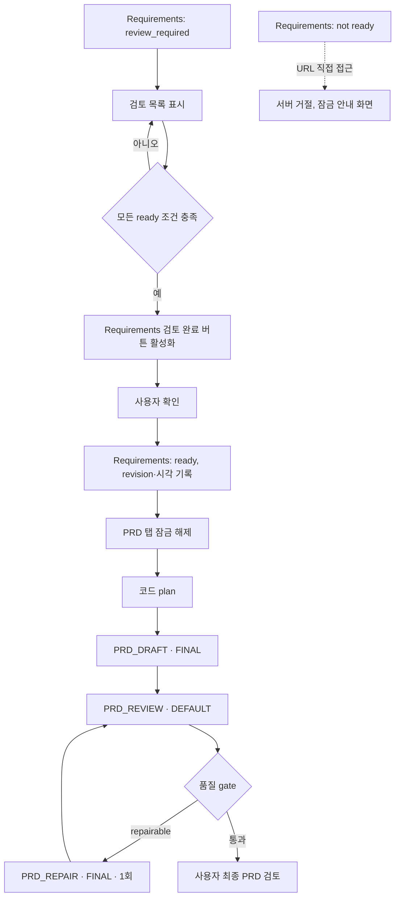

# DOC-PR-02 — Requirements ready·PRD 생성

## Overview

Requirements를 사용자가 명시적으로 `ready` 확정하는 행동과, `ready` 상태에서만 PRD 탭·API 잠금을 해제해 같은 설계 revision으로 PRD를 생성하는 기능을 구현한다. PRD 파이프라인은 코드 plan → Terra(FINAL) draft → Mini(DEFAULT) review → 선택적 repair 순서를 따른다.

## Background

`DEC-015`(Requirements ready 후 PRD 생성), `DEC-021`(시스템이 ready 가능 조건을 계산하지만 사용자가 `Requirements 검토 완료`를 명시적으로 확인해야 ready), `DEC-031`(Terra는 PRD draft와 1회 repair에만 사용)을 구현한다. `DOC-PR-01`에서 만든 `review_required` 상태 Requirements가 입력이며, AI review 성공만으로는 ready가 되지 않는다는 제약이 핵심이다.

## Scope

### 포함

- Requirements 검토 목록(누락/충돌/미정/수용기준 부족/stale) 화면과 `Requirements 검토 완료` 확인 행동(`DOC-403`)
- PRD 탭·API 잠금과 잠금 해제 조건, 잠금 안내 화면(`DOC-404`)
- PRD 생성: 코드 plan → `PRD_DRAFT`(FINAL) → `PRD_REVIEW`(DEFAULT) → 선택적 `PRD_REPAIR`(FINAL, 1회)

### 제외

- Requirements 최초 생성(`DOC-PR-01`에서 완료)
- 섹션 직접 편집과 영향 미리보기(`DOC-PR-04`)
- 문서 간 정합성 검토(`DOC-PR-03`)

## 연결 근거

- 요구사항: `DOC-003`
- Delivery 작업: `DOC-403`, `DOC-404`
- AI 작업: `AI-007`(plan/draft/review/repair 상한)
- 결정: `DEC-015`, `DEC-021`, `DEC-028`, `DEC-031`
- 화면 설계: [문서 작업 공간](../../ui/04-document-workspace.md) `UI-DOC-006`, [문서 청사진 F-PRD-LOCKED, F-PRD-DRAFT](../../ui/screens/05-documents-and-guide.md)
- 선행 PR: `DOC-PR-01`(순서 17, `review_required` Requirements)

## 선행 조건 (Definition of Ready)

- `DOC-PR-01`이 사용자에 의해 머지됨
- Requirements 문서가 `review_required` 상태인 fixture 프로젝트(정상/충돌 있음/수용기준 부족 각각) 준비됨

## 작업 단위별 구현 개요

**DOC-403 요구사항 검토와 `ready`**
- 검토 목록: 누락, 충돌, 미정, 수용 기준 부족, stale 섹션
- 모든 조건 충족 시에만 `Requirements 검토 완료` 행동 활성화, 명시적 미정은 차단하지 않고 오픈 이슈로 유지
- 사용자 확인 시 P0 요구사항/수용기준/오픈이슈/기준 revision을 함께 검증 후 `ready`로 저장, 확정 시각과 revision 기록

**DOC-404 PRD 잠금과 생성**
- `requirements.status !== "ready"`면 PRD 탭·`documents/generate(prd)` API 모두 거부(URL 직접 접근 포함, 서버가 최종 검증)
- 잠금 화면에 부족 항목 개수와 `Requirements 검토로 이동` 단일 행동 표시
- PRD 생성은 `ready` Requirements와 동일 `designRevision`에서 시작: 코드 plan → `PRD_DRAFT`(FINAL, low, maxInput 40000/maxOutput 10000) → `PRD_REVIEW`(DEFAULT, low) → 필요 시 `PRD_REPAIR`(FINAL, 1회)
- PRD의 목표·사용자·범위가 Requirements와 다르면 `ready`로 표시하지 않음

## 프로세스 / 상태 전이

## 데이터/API 영향

- `POST /api/blueprint/documents/generate`(`documentType: "prd"`)에 선행 조건 서버 검증 추가(`requirements.status === "ready"` && 동일 `designRevision`)
- Requirements 문서에 `readyAt`, `readyDesignRevision` 필드 추가
- PRD 목표/사용자/범위 필드에 Requirements 대응 필드와의 자동 비교 검증 추가

## Acceptance Criteria

### Happy Path
Given Requirements의 모든 ready 조건이 충족됐을 때, when 사용자가 `Requirements 검토 완료`를 확인하면, then Requirements가 `ready`로 저장되고 PRD 탭 잠금이 해제되어 같은 revision으로 PRD 생성이 시작된다.

### Failure Case
Given Requirements가 `ready`가 아닐 때, when 사용자가 PRD URL에 직접 접근하거나 PRD 생성 API를 직접 호출하면, then 서버가 요청을 거절하고 화면은 부족 항목을 안내하는 잠금 화면을 표시한다.

### Boundary
Given 시스템이 계산한 ready 조건이 모두 충족됐을 때, when 사용자가 아직 `Requirements 검토 완료`를 확인하지 않았다면, then 자동으로 `ready`로 전환되지 않는다.

## 예상 변경 파일

- `src/domain/blueprint/document.ts`(readyAt, readyDesignRevision 필드)
- `src/features/documents/requirementsReadyGate.ts`
- `src/features/documents/prdGeneration.ts`
- `api/blueprint/documents/generate.js`(prd 분기 및 선행 조건 검증)
- `src/components/blueprint/review-panel.tsx`(PRD 잠금 안내)
- `tests/contract/documents-generate-prd.test.ts`, `tests/domain/requirementsReadyGate.test.ts`

## 테스트 계획

1. 조건 미충족 시 `Requirements 검토 완료` 비활성화(component)
2. 조건 충족해도 확인 전 자동 ready 전환 없음(unit)
3. `ready` 아닌 상태에서 PRD 탭/URL/API 모두 차단(contract+E2E)
4. 같은 revision에서 PRD 생성 성공(contract)
5. 목표·사용자·범위 불일치 시 ready 미표시(unit)
6. Terra 호출이 PRD draft/repair에만 사용됨(contract)

## UI 증거 계획

- desktop 1440×900: 검토 목록(조건 미충족), 검토 완료 확인, PRD 잠금 안내, PRD 생성 완료 4개 상태
- mobile 390×844: 동일 4개 상태
- Playwright + Agent Browser로 PRD URL 직접 접근 시 잠금 화면 검증

## 코드 리뷰·QA 체크리스트

- [ ] ready 전환이 사용자 명시적 확인 없이 발생하지 않는지 확인
- [ ] PRD 생성 API가 서버 측에서 ready 선행 조건을 재검증하는지 확인(클라이언트 우회 방지)
- [ ] Terra가 Requirements 경로에 사용되지 않는지 확인
- [ ] repair가 PRD당 1회로 제한되는지 확인

## Done Checklist

- [ ] Requirements implemented
- [ ] Acceptance criteria verified
- [ ] 독립 코드 리뷰 pass
- [ ] 독립 QA pass
- [ ] 화면 변경 시 desktop/mobile 캡처 완료
- [ ] 사용자 PR 머지 확인

## 실행 시 추가 문서

- 이 폴더에 구현 중/후 `test-results.md`, `review-notes.md`, `qa-report.md` 등을 추가로 생성한다(지금은 생성하지 않음).
