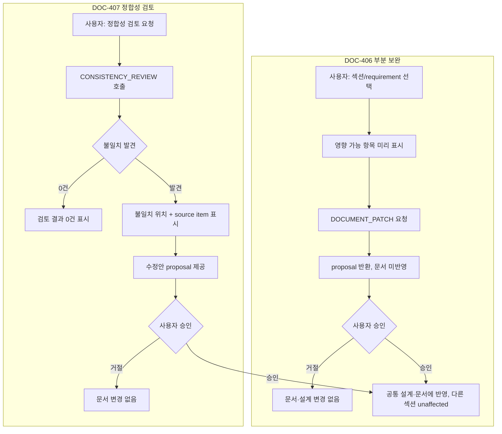

# DOC-PR-03 — 부분 보완·정합성 검토

## Overview

문서의 선택 섹션만 AI로 보완(patch)하는 기능과, Requirements/PRD 간 목표·사용자·범위 불일치·근거 없는 확정 표현을 찾아 표시하는 정합성 검토 기능을 구현한다. 두 기능 모두 결과를 proposal로만 반환하고 문서에 자동 반영하지 않는다.

## Background

`DEC-004`(문서 직접 편집은 사용자 확정 변경으로만 반영), 성공 지표의 "PRD와 요구사항명세서의 목표·사용자·범위 불일치가 자동 검토에서 0건"(`docs/product/02-prd.md`)을 구현한다. `DOC-PR-01/02`에서 생성된 문서가 이미 존재하는 상태에서, 사용자가 선택한 범위만 안전하게 다시 작성하고 전체 문서 재생성 없이 문제를 찾아낼 수 있어야 한다.

## Scope

### 포함

- 선택 섹션/requirement 대상 부분 patch 요청과 proposal 반환(`DOC-406`)
- `POST /api/blueprint/documents/patch`
- `POST /api/blueprint/review` 정합성 검토(목표/사용자/범위 불일치, 요구사항 없는 핵심 기능, 수용 기준 없는 P0, stale/conflict 섹션, 확정되지 않은 사실 표현)(`DOC-407`)

### 제외

- 문서 최초 생성(`DOC-PR-01`, `DOC-PR-02`)
- 사용자 직접 편집과 영향 미리보기(`DOC-PR-04`)

## 연결 근거

- 요구사항: `DOC-005`, `DOC-006`
- Delivery 작업: `DOC-406`, `DOC-407`
- 결정: `DEC-004`
- 화면 설계: [문서 작업 공간](../../ui/04-document-workspace.md) `UI-DOC-004`
- 선행 PR: `DOC-PR-02`(순서 18)

## 선행 조건 (Definition of Ready)

- `DOC-PR-02`가 사용자에 의해 머지됨
- Requirements와 PRD가 모두 존재하는 fixture 프로젝트, 그중 하나는 의도적으로 목표/사용자 불일치를 포함

## 작업 단위별 구현 개요

**DOC-406 부분 AI 보완**
- 사용자가 특정 섹션 또는 requirement ID를 선택해 patch 요청(`DOCUMENT_PATCH`, DEFAULT, low, maxInput 20000/maxOutput 4000)
- 요청 전 대상 범위와 영향 가능 항목을 화면에 표시
- 결과는 문서에 즉시 쓰지 않고 proposal로 반환, 사용자 승인 시에만 공통 설계와 문서에 반영
- 선택하지 않은 섹션의 markdown과 version은 변경되지 않음, 사용자 편집 내용을 자동으로 덮어쓰지 않음

**DOC-407 정합성 검토**
- `CONSISTENCY_REVIEW`(DEFAULT, low, maxInput 32000/maxOutput 4000)로 Requirements/PRD를 함께 검토
- 검토 항목: 목표/사용자/범위 불일치, 요구사항 없는 핵심 기능, 수용 기준 없는 P0, stale/conflict 섹션, 확정되지 않은 사실 표현
- 불일치 위치와 source item을 함께 표시, 수정안은 proposal로만 제공(자동 적용 없음)
- "검토 결과 0건"과 "검토 미실행"을 화면에서 구분 표시

## 프로세스 / 상태 전이

## 데이터/API 영향

- 신규: `POST /api/blueprint/documents/patch` — body: `{ documentId, targetSectionIds[] | targetRequirementIds[], instruction? }`, 응답: `ProposalPayload[]`
- 신규: `POST /api/blueprint/review` — body: `{ requirementsDocumentId, prdDocumentId }`, 응답: 불일치 목록(`{ type, location, sourceItemIds[], proposal? }[]`)
- 두 API 모두 기존 문서 version을 변경하지 않고 별도 proposal 저장소에 기록

## Acceptance Criteria

### Happy Path
Given 사용자가 특정 requirement 하나만 선택했을 때, when patch를 요청하고 결과를 승인하면, then 해당 requirement만 갱신되고 다른 섹션의 markdown·version은 그대로 유지된다.

### Failure Case
Given 사용자가 patch 결과를 거절했을 때, when 승인하지 않고 화면을 벗어나면, then 공통 설계와 문서 모두 변경되지 않는다.

### Boundary
Given Requirements와 PRD의 목표 서술이 실제로 다를 때, when 정합성 검토를 실행하면, then 불일치가 정확히 1건 이상 발견되고 해당 위치의 source item이 함께 표시된다. 불일치가 없는 fixture에서는 "검토 결과 0건"과 "검토 미실행"이 서로 다른 화면으로 구분된다.

## 예상 변경 파일

- `src/features/documents/documentPatch.ts`
- `src/features/documents/consistencyReview.ts`
- `api/blueprint/documents/patch.js`
- `api/blueprint/review.js`
- `src/components/blueprint/review-panel.tsx`(정합성 검토 결과 표시)
- `tests/contract/documents-patch.test.ts`, `tests/contract/review.test.ts`

## 테스트 계획

1. 선택 섹션만 patch 대상이 됨, 나머지 markdown/version 불변(contract)
2. 사용자 편집을 자동으로 덮어쓰지 않음(unit)
3. 승인한 patch만 반영됨, 거절 시 무변화(component)
4. 목표/사용자/범위 불일치 검출(fixture 기반 contract)
5. 검토 결과 0건과 검토 미실행 구분 표시(component)
6. 수정안이 자동 적용되지 않고 proposal로만 존재(unit)

## UI 증거 계획

- desktop 1440×900: 부분 보완 요청/proposal 검토/정합성 검토 결과(불일치 있음)/결과 0건 4개 상태
- mobile 390×844: 동일 4개 상태

## 코드 리뷰·QA 체크리스트

- [ ] patch 결과가 문서에 직접 쓰이지 않고 proposal 경유로만 반영되는지 확인
- [ ] 정합성 검토 수정안이 자동 적용되지 않는지 확인
- [ ] 선택 범위 밖 섹션의 version 불변 여부 확인(diff로 검증)

## Done Checklist

- [ ] Requirements implemented
- [ ] Acceptance criteria verified
- [ ] 독립 코드 리뷰 pass
- [ ] 독립 QA pass
- [ ] 화면 변경 시 desktop/mobile 캡처 완료
- [ ] 사용자 PR 머지 확인

## 실행 시 추가 문서

- 이 폴더에 구현 중/후 `test-results.md`, `review-notes.md`, `qa-report.md` 등을 추가로 생성한다(지금은 생성하지 않음).
