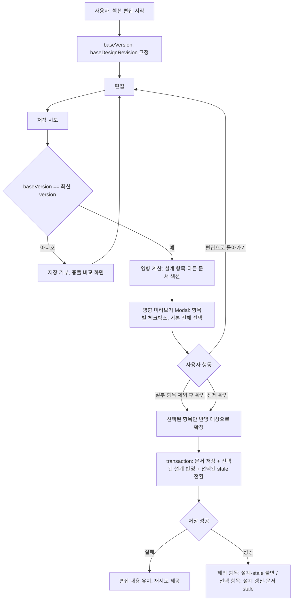

# DOC-PR-04 — 직접 편집 영향

## Overview

사용자가 문서 섹션을 직접 편집해 저장할 때, 저장 전 영향받는 공통 설계 항목과 다른 문서의 stale 전환을 미리 보여주고, 사용자가 영향받는 항목을 **항목별로 선택 제외**할 수 있게 한다(`DEC-040`). 확인 후에는 편집 내용, 공통 설계 반영, 문서 version을 하나의 transaction으로 저장한다.

## Background

이 PR은 원래 "영향 미리보기의 부분 제외 허용 여부"가 결정되기 전까지 `blocked` 상태였다. `docs/product/10-decision-log.md`의 `DEC-040`(2026-09-16)으로 "사용자는 영향받는 항목 중 일부를 선택적으로 제외하고 저장할 수 있다"가 확정되면서 `planned`로 전환됐다. `DEC-004`(직접 편집은 사용자 확정 변경으로 공통 설계에 자동 반영), `DEC-012`(저장 전 영향 미리보기)와 함께 구현한다.

## Scope

### 포함

- 섹션 편집 시작 시 기준 version·design revision 고정(`DOC-405`)
- 저장 전 영향받는 source item, 다른 문서, stale 전환 계산 및 미리보기 표시
- 영향받는 항목 개별 선택 제외 UI와 로직(`DEC-040`)
- 제외하지 않은 항목만 하나의 transaction으로 공통 설계·문서 version에 반영
- 오래된 편집본(다른 사용자/탭이 먼저 저장) 충돌 비교와 저장 실패 시 편집 내용 보존

### 제외

- 부분 AI 보완(`DOC-PR-03`, 이미 완료)
- 문서 최초 생성(`DOC-PR-01`, `DOC-PR-02`, 이미 완료)

## 연결 근거

- 요구사항: `DOC-004`
- Delivery 작업: `DOC-405`
- 결정: `DEC-004`, `DEC-012`, `DEC-040`
- 화면 설계: [문서 작업 공간](../../ui/04-document-workspace.md) `UI-DOC-004`, `UI-DOC-005`, [문서 청사진 F-DOC-IMPACT](../../ui/screens/05-documents-and-guide.md)
- 선행 PR: `DOC-PR-03`(순서 19)

## 선행 조건 (Definition of Ready)

- `DOC-PR-03`이 사용자에 의해 머지됨
- `docs/ui/screens/05-documents-and-guide.md`의 F-DOC-IMPACT Modal 문구가 `DEC-040`(항목별 제외 UI)을 반영하도록 별도로 갱신되어 있어야 함 — **미확인 시 차단**: 이 문서(F-DOC-IMPACT 71행, `docs/ui/04-document-workspace.md` 71행)는 아직 "일부 영향 제외 여부는 결정 전"이라는 이전 문구를 그대로 갖고 있다. 착수 전 UI 문서를 `DEC-040` 기준으로 먼저 갱신한다.

## 작업 단위별 구현 개요

**DOC-405 직접 편집과 영향 미리보기**
- 편집 시작 시 `baseVersion`, `baseDesignRevision`을 고정해 세션 동안 비교 기준으로 사용
- 저장 시도 시 변경된 `sourceItemIds`, 영향받는 공통 설계 항목(before/after), 영향받는 다른 문서 섹션(stale 전환 대상)을 계산
- 영향 미리보기 Modal에 각 영향 항목을 체크박스로 표시하고 기본값은 전체 선택
- 사용자가 일부 항목의 체크를 해제하면 해당 항목은 공통 설계에 반영하지 않고, 그 항목을 참조하는 문서 섹션도 stale로 전환하지 않음
- "확인하고 저장" 시 (편집된 markdown, 선택된 공통 설계 변경, 선택된 stale 전환)을 하나의 transaction으로 저장
- `baseVersion`이 최신이 아니면 저장하지 않고 최신 내용과의 충돌 비교를 제공
- 저장 실패 시 편집 내용을 입력 상태로 유지(자동 되돌리지 않음)

## 프로세스 / 상태 전이

## 데이터/API 영향

- `POST /api/blueprint/documents/patch` 또는 신규 `PATCH /api/blueprint/documents/:id/sections/:sectionId`에 `excludedImpactIds: string[]` 필드 추가
- 저장 transaction: `documentVersion++`, 선택된 설계 항목만 `designRevision++` 대상에 포함, 제외 항목은 두 revision 모두 불변
- 서버가 `excludedImpactIds`에 없는 항목만 stale 전환 계산에 사용하고 결과를 응답에 포함

## Acceptance Criteria

### Happy Path
Given 사용자가 섹션을 편집하고 영향받는 항목 3개 중 1개의 체크를 해제했을 때, when "확인하고 저장"을 누르면, then 나머지 2개 항목만 공통 설계에 반영되고 해당 항목을 참조하는 문서 섹션만 stale로 전환되며, 제외한 1개 항목과 그 참조 섹션은 이전 상태를 유지한다.

### Failure Case
Given 저장 도중 네트워크 오류가 발생했을 때, when 저장이 실패하면, then 편집 내용은 입력 상태로 유지되고 공통 설계·다른 문서는 변경되지 않으며 재시도가 제공된다.

### Boundary
Given 다른 세션이 같은 섹션을 먼저 저장해 `baseVersion`이 오래됐을 때, when 사용자가 저장을 시도하면, then 저장이 거부되고 최신 내용과의 충돌 비교가 표시되며 사용자의 편집 원문은 유지된다.

## 예상 변경 파일

- `src/features/documents/impactPreview.ts`(영향 계산 + 선택 제외 로직)
- `src/features/documents/documentEditTransaction.ts`
- `api/blueprint/documents/patch.js`(또는 신규 section PATCH 핸들러)
- `src/components/blueprint/document-panel.tsx`(편집 모드)
- `docs/ui/screens/05-documents-and-guide.md`, `docs/ui/04-document-workspace.md`(F-DOC-IMPACT 문구를 `DEC-040` 기준으로 갱신 — 이 PR의 선행 작업으로 포함)
- `tests/domain/impactPreview.test.ts`, `tests/e2e/document-edit-impact.spec.ts`

## 테스트 계획

1. 미리보기 확인 전 공통 설계 미변경(unit)
2. 항목별 제외 시 제외 항목은 설계·stale 모두 불변, 나머지는 반영(unit — DEC-040 핵심 시나리오)
3. 오래된 편집본 저장 거부와 충돌 비교(contract)
4. 저장 실패 시 편집 내용 보존(component)
5. 전체 선택(제외 없음) 시 기존 동작과 동일(회귀)
6. 데스크톱/모바일 영향 미리보기 Modal 상호작용(E2E)

## UI 증거 계획

- desktop 1440×900: 편집 모드, 영향 미리보기(전체 선택), 영향 미리보기(일부 제외), 저장 실패 4개 상태
- mobile 390×844: 동일 4개 상태
- Playwright + Agent Browser로 체크박스 해제 → 저장 → 제외 항목 미반영을 실제 상호작용으로 검증

## 코드 리뷰·QA 체크리스트

- [ ] 제외된 항목이 실제로 공통 설계·stale 계산에서 빠지는지 서버 응답으로 확인(클라이언트 상태만으로 판단 금지)
- [ ] transaction이 원자적인지(부분 실패 시 일부만 반영되는 경우가 없는지) 확인
- [ ] `docs/ui/*` 문서가 이번 PR에서 `DEC-040` 기준으로 실제로 갱신됐는지 확인

## Done Checklist

- [ ] Requirements implemented
- [ ] Acceptance criteria verified
- [ ] 독립 코드 리뷰 pass
- [ ] 독립 QA pass
- [ ] 화면 변경 시 desktop/mobile 캡처 완료
- [ ] 사용자 PR 머지 확인

## 실행 시 추가 문서

- 이 폴더에 구현 중/후 `test-results.md`, `review-notes.md`, `qa-report.md` 등을 추가로 생성한다(지금은 생성하지 않음).
