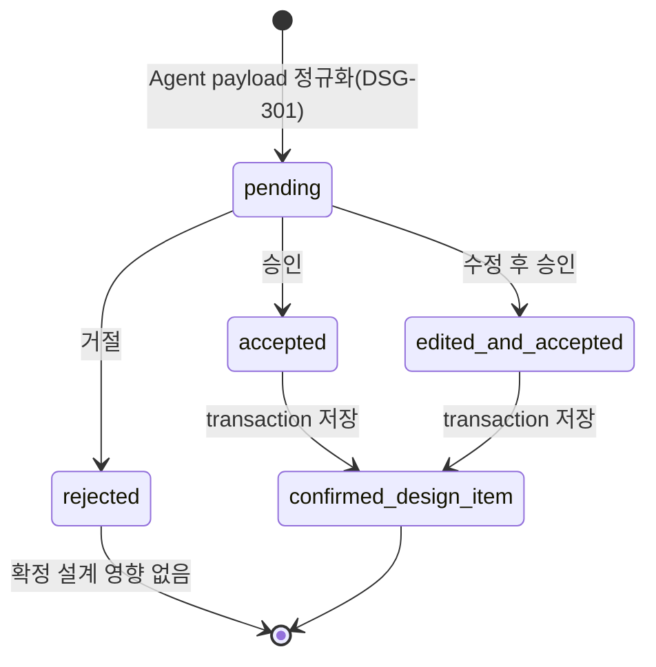
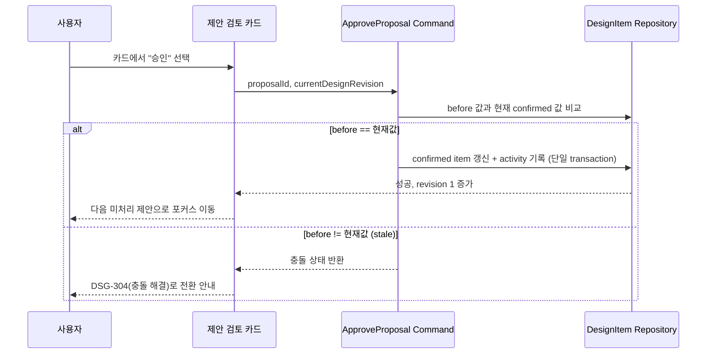

# DSG-PR-01 — 제안 검토·확정

## Overview

한 사용자 답변이나 첨부 자료에서 추출된 여러 ChangeProposal을 사용자가 카드 단위로 개별 검토하고, 승인·수정 후 승인·거절할 수 있게 한다. 승인된 값만 확정 설계(DesignItem)에 반영하고, 승인 전 제안값이 확정값처럼 보이지 않게 한다.

## Background

2단계(`CON-PR-*`)에서 `TURN_ANALYZE`가 여러 atomic proposal을 반환하도록 이미 완성되지만, 사용자가 그 제안들을 실제로 승인/거절/수정하는 검토 UI와 저장 로직은 아직 없다. `docs/product/02-prd.md`의 여정 A/B/C는 "사용자가 추출된 항목을 승인하거나 수정한다"를 핵심 경험으로 명시하므로, 이 PR 없이는 대화가 끝나도 설계가 전혀 누적되지 않는다.

## Scope

### 포함

- ChangeProposal 정규화(DSG-301): target/operation 단일화, 중복 제거, 근거 없는 추론 표시
- 제안 검토 카드 UI(DSG-302): 변경 전/후 비교, 근거, 영향, 거절/수정 후 승인/승인 행동
- 승인·수정 저장 로직(DSG-303): 승인 시 현재 값 재비교, 수정값만 confirmed 저장, 삭제는 `archivedAt`으로 소프트 삭제, 상태 변경과 activity를 단일 transaction으로 처리

### 제외

- 충돌 감지·해결 UI(DSG-304), 의존 항목 재검토(DSG-305) — `DSG-PR-02`
- 설계 보드 전체 화면과 readiness 계산(DSG-306) — `DSG-PR-03`
- 일괄 처리(DSG-307) — `DSG-PR-02`

## 연결 근거

- 요구사항: `PROP-001`, `PROP-002`
- Delivery 작업: `DSG-301`, `DSG-302`, `DSG-303` (`docs/delivery/03-proposals-and-design.md:28-73`)
- 결정: `DEC-002`(미정 허용), `DEC-004`(문서 편집 자동 반영과의 경계), `DEC-006`(현재 질문 관련 제안 처리 후 다음 질문)
- 화면 설계: `docs/ui/03-design-board-and-inspector.md` (`UI-PROP-001`), `docs/ui/screens/03-proposal-and-conflict.md` (F-PROPOSAL, P01~P11)
- 선행 PR: `CON-PR-03`(메시지·AI block, 제안 요약 block과 proposal payload 수신)

## 선행 조건 (Definition of Ready)

- `CON-PR-03`이 사용자 머지 완료 상태(`docs/delivery/development-pr-review-qa-workflow.md`)
- `ProposalPayload`, `DesignItem` 타입 계약이 `FND-PR-02`에서 확정됨
- 미결정 차단 항목 없음(이 PR 범위 내 blocked 요구사항 없음)

## 작업 단위별 구현 개요

| 작업 | 내용 |
| --- | --- |
| DSG-301 | Agent 응답의 `proposals: ProposalPayload[]`를 받아 target/operation 단일 제안으로 분리·검증하는 정규화 계층 구현. `requestId`+target 조합 중복 제거. |
| DSG-302 | `docs/ui/03-design-board-and-inspector.md`의 Inspector `proposed` footer(거절 ghost / 수정 후 승인 secondary / 승인 primary)와 `docs/ui/screens/03-proposal-and-conflict.md`의 F-PROPOSAL 레이아웃(P01~P11)을 구현. 단일 제안은 Inspector, 다중/충돌은 전체 높이 Drawer/Modal. |
| DSG-303 | 승인 command: before 재비교 → confirmed 저장. 수정 후 승인 command: 수정값만 저장. 거절 command: proposal을 `rejected`로 표시하고 confirmed 설계에 영향 없음. 삭제 승인은 `archivedAt` 기록 후 소프트 삭제. 저장은 상태 변경 + activity 기록을 하나의 repository transaction으로 처리. |

## 프로세스 / 상태 전이

## 데이터/API 영향

- 신규 저장 엔터티: `ChangeProposal`(status: pending/accepted/edited_and_accepted/rejected/superseded), `DesignItem`(archivedAt 포함)
- `POST /api/blueprint/turn` 응답의 `proposals`를 읽기 전용 입력으로 사용(신규 API 엔드포인트 추가 없음, 기존 계약 재사용)
- 승인/거절/수정은 클라이언트 도메인 command + IndexedDB repository 저장이며 서버 API 호출 없음(AI 호출과 분리)

## Acceptance Criteria

### Happy Path

Given 한 자유 답변에서 사용자·기능·제약 3개의 proposal이 반환된 상태, when 사용자가 각각을 개별 카드에서 승인하면, then confirmed 설계에 3개 항목이 모두 반영되고 각 승인마다 revision이 정확히 1씩 증가한다.

### Failure Case

Given 제안 승인 저장 중 repository transaction이 실패한 상태, when 사용자가 승인을 재시도하면, then proposal은 `pending`으로 유지되고 confirmed 설계와 이전 상태가 변경되지 않으며 오류 안내가 표시된다.

### Boundary

Given 같은 proposal에 대해 승인 command가 중복 실행된 상태(더블 클릭 등), when 두 번째 요청이 처리되면, then confirmed item의 revision은 한 번만 증가한다(`DSG-303` 성공 조건).

## 예상 변경 파일

- `src/domain/blueprint/proposal.ts` (신규): ChangeProposal 상태 모델과 정규화 규칙
- `src/features/proposals/normalize-proposals.ts` (신규): DSG-301 정규화 로직
- `src/features/proposals/approve-proposal.command.ts`, `reject-proposal.command.ts`, `edit-and-approve-proposal.command.ts` (신규)
- `src/components/blueprint/review-panel.tsx` (수정): 제안 카드 목록과 Inspector 승인 footer
- `src/infrastructure/storage/design-item-repository.ts` (수정): confirmed 저장 transaction

## 테스트 계획

- 단위: 정규화(중복 제거, target/operation 분리), 승인/거절/수정 command의 상태 전이
- 계약: `ProposalPayload` 스키마 검증(존재하지 않는 대상 update/delete 거절)
- 컴포넌트: 제안 카드 키보드 조작, 승인 후 다음 미처리 제안 포커스 이동
- 통합: transaction 실패 시 rollback, 중복 승인 시 revision 1회 증가

## UI 증거 계획 (해당 시)

- desktop 1440×900: F-PROPOSAL 3-column 레이아웃(대화/설계/Inspector), 카드 승인 전/후
- mobile 390×844: `검토 N` 모드 목록 → WorkspaceDrawer 진입 → 승인 후 다음 항목 교체
- 상태: 제안 카드(pending), 수정 후 승인 편집 상태, 승인 완료, 저장 실패 오류

## 코드 리뷰·QA 체크리스트

- [ ] `@sfood/ui` public export만 사용, 임의 색상값 없음
- [ ] 승인 전 제안값이 확정값 화면에 노출되지 않음
- [ ] 저장 실패 시 proposal/confirmed item 상태 보존 확인
- [ ] 키보드만으로 카드 선택 → 승인/거절/수정 전체 흐름 가능

## Done Checklist

- [ ] Requirements implemented
- [ ] Acceptance criteria verified
- [ ] 독립 코드 리뷰 pass
- [ ] 독립 QA pass
- [ ] 화면 변경 시 desktop/mobile 캡처 완료
- [ ] 사용자 PR 머지 확인

## 실행 시 추가 문서

- 이 폴더에 구현 중/후 `test-results.md`, `review-notes.md`, `qa-report.md` 등을 추가로 생성한다(지금은 생성하지 않음).
