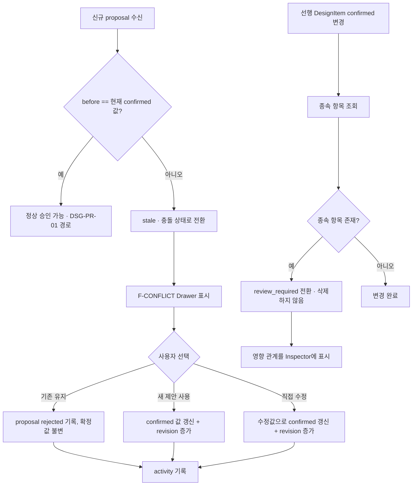
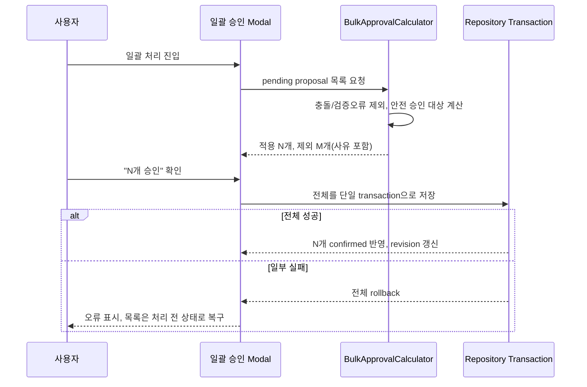

# DSG-PR-02 — 충돌·의존·일괄 처리

## Overview

기존 확정값과 새 제안값이 충돌할 때 사용자가 명시적으로 해결하게 하고, 선행 결정이 바뀌어 영향받는 종속 항목을 삭제 대신 `review_required`로 전환하며, 충돌 없는 제안을 안전하게 일괄 승인할 수 있게 한다.

## Background

`DSG-PR-01`은 단일 제안의 승인/거절만 다룬다. 그러나 대화가 이어지면 이미 확정된 값과 다른 새 제안(stale proposal)이 나오거나, 선행 결정 변경으로 여러 하위 항목이 한꺼번에 영향받는 상황이 반드시 발생한다. `docs/product/02-prd.md` 여정 C("Agent가 변경 내용과 영향받는 항목을 제안하고 사용자가 개별 또는 일괄 처리")와 PRD 성공 지표("반복 질문 비율 5% 이하")를 만족하려면 충돌을 조용히 덮어쓰지 않고, 영향받는 항목을 삭제하지 않으면서 사용자가 한 번에 여러 안전한 제안을 처리할 수 있어야 한다.

## Scope

### 포함

- 충돌 해결(DSG-304): before/현재값 불일치 감지, 기존 유지/새 값 선택/수정 적용 UI와 command
- 의존 항목 재검토(DSG-305): 선행 결정 변경 시 종속 항목 `review_required` 전환, 영향 관계 표시
- 일괄 처리(DSG-307): 충돌/오류 없는 제안만 대상 계산, 실행 전 적용·제외 수 표시, atomic 저장

### 제외

- 단일 제안 승인/거절/수정 UI 자체 — `DSG-PR-01`에서 이미 완성
- 설계 보드 전체 화면과 readiness 계산 — `DSG-PR-03`

## 연결 근거

- 요구사항: `PROP-003`, `PROP-004`
- Delivery 작업: `DSG-304`, `DSG-305`, `DSG-307` (`docs/delivery/03-proposals-and-design.md:75-106,136-146`)
- 결정: `DEC-002`(미정 허용, 충돌은 차단), `DEC-012`(영향 미리보기 원칙과 동일 계열)
- 화면 설계: `docs/ui/03-design-board-and-inspector.md`(Inspector conflict/review_required footer), `docs/ui/screens/03-proposal-and-conflict.md`(F-CONFLICT, 일괄 승인 Modal)
- 선행 PR: `DSG-PR-01`(제안 검토·확정 — ChangeProposal 상태 모델과 승인 command)

## 선행 조건 (Definition of Ready)

- `DSG-PR-01`이 사용자 머지 완료 상태
- ChangeProposal의 `pending`/`accepted`/`rejected` 상태 전이가 계약 테스트로 확정됨
- 미결정 차단 항목 없음

## 작업 단위별 구현 개요

| 작업 | 내용 |
| --- | --- |
| DSG-304 | proposal.before와 현재 confirmed 값을 비교해 불일치 시 충돌로 판정. F-CONFLICT Drawer(기존값/근거, 새 제안/근거, 영향받는 항목, 기존 유지/새 값 선택/직접 수정 라디오, 선택 전 `선택 적용` disabled)와 해결 command 구현. 해결 전 기존 확정값 불변. |
| DSG-305 | 선행 DesignItem 변경 시 그 항목을 참조하는 종속 항목을 조회해 `review_required`로 전환(삭제 금지). 어떤 선행 변경 때문에 재검토가 필요한지 영향 관계를 Inspector에 표시. |
| DSG-307 | pending proposal 중 충돌/검증 오류가 없는 항목만 필터링해 "안전하게 승인 가능한 N개" 계산. 일괄 승인 Modal(적용/제외 수, 제외 사유, 되돌릴 수 있는 범위)과 atomic 저장(부분 실패 시 전체 rollback) 구현. |

## 프로세스 / 상태 전이

## 데이터/API 영향

- 신규 엔터티/필드 없음. `DSG-PR-01`의 `ChangeProposal`, `DesignItem`에 `review_required` 상태 전이만 추가로 사용(이미 `docs/delivery/03-proposals-and-design.md:15-24` 상태 모델에 정의됨).
- 서버 API 신규 호출 없음. 충돌 판정·의존성 조회·일괄 계산은 클라이언트 도메인 로직.

## Acceptance Criteria

### Happy Path

Given 확정된 로그인 방식이 "이메일 링크"이고 새 제안이 "Google OAuth"인 상태, when 사용자가 F-CONFLICT에서 "새 제안 사용"을 선택하면, then confirmed 값이 Google OAuth로 갱신되고 revision이 증가하며 선택 이유가 activity에 기록된다.

### Failure Case

Given 일괄 승인 대상 3개 중 1개가 저장 도중 실패하는 상태, when transaction이 실패하면, then 3개 모두 이전 pending 상태로 유지되고 confirmed 설계는 변경되지 않는다(부분 성공 표시 없음).

### Boundary

Given "인증 불필요"로 선행 결정이 변경된 상태, when 기존 로그인 방식 항목이 그 결정에 종속돼 있으면, then 해당 항목은 삭제되지 않고 `review_required`로 표시되며 어떤 선행 변경 때문인지 사용자가 확인할 수 있다.

## 예상 변경 파일

- `src/features/proposals/resolve-conflict.command.ts` (신규)
- `src/features/proposals/reevaluate-dependents.command.ts` (신규, DSG-305)
- `src/features/proposals/bulk-approve-proposals.command.ts` (신규, DSG-307)
- `src/components/blueprint/conflict-drawer.tsx` (신규): F-CONFLICT 레이아웃
- `src/components/blueprint/bulk-approval-modal.tsx` (신규)
- `src/domain/blueprint/design-item-dependency.ts` (신규): 의존 관계 그래프와 review_required 전환 규칙

## 테스트 계획

- 단위: stale 판정(before vs 현재값), 의존 그래프 review_required 전환, 일괄 대상 계산(충돌/오류 제외)
- 계약: 충돌 해결 3가지 선택(기존 유지/새 값/직접 수정) 각각의 저장 결과
- 통합: 일괄 처리 부분 실패 시 전체 rollback, 선행 변경 후 삭제되지 않고 재검토 표시되는지
- 컴포넌트: F-CONFLICT 라디오 선택 전 "선택 적용" disabled, 모바일 세로 스택 레이아웃

## UI 증거 계획 (해당 시)

- desktop 1440×900: F-CONFLICT Drawer(DiffView embedded), 일괄 승인 Modal
- mobile 390×844: 충돌 항목별 현재값→새값 세로 스택, 일괄 처리 Modal
- 상태: 충돌 발견, 해결 선택 전/후, review_required 배지, 일괄 처리 성공/실패

## 코드 리뷰·QA 체크리스트

- [ ] 해결 전 기존 확정값이 어떤 경로로도 변경되지 않음
- [ ] 종속 항목이 review_required로만 전환되고 삭제되지 않음
- [ ] 일괄 처리 부분 실패 시 전체 rollback, 부분 성공 상태 노출 없음
- [ ] `@sfood/ui` DiffView/Modal public export 사용, 임의 컴포넌트 없음

## Done Checklist

- [ ] Requirements implemented
- [ ] Acceptance criteria verified
- [ ] 독립 코드 리뷰 pass
- [ ] 독립 QA pass
- [ ] 화면 변경 시 desktop/mobile 캡처 완료
- [ ] 사용자 PR 머지 확인

## 실행 시 추가 문서

- 이 폴더에 구현 중/후 `test-results.md`, `review-notes.md`, `qa-report.md` 등을 추가로 생성한다(지금은 생성하지 않음).
