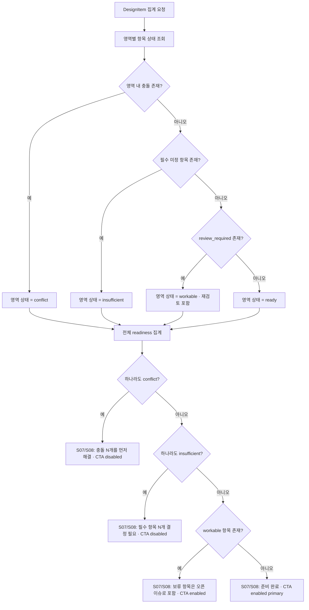
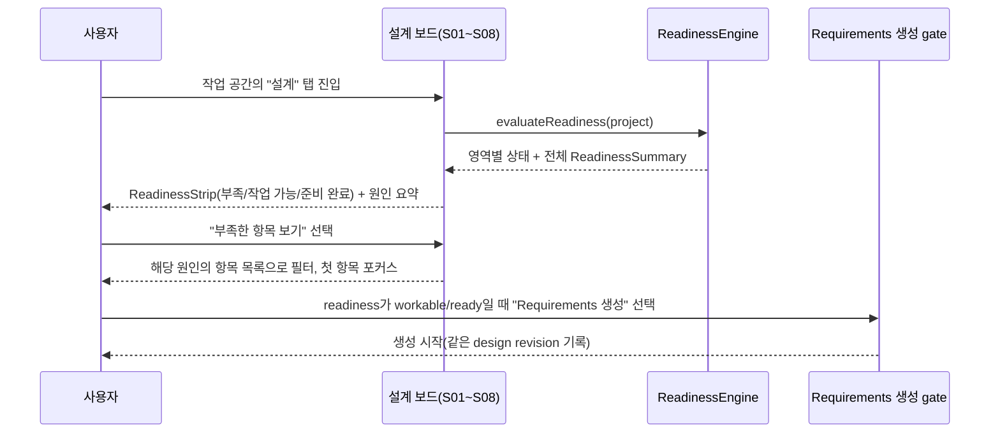

# DSG-PR-03 — 설계 보드와 readiness

## Overview

10개 설계 영역(제품 정의~성공 기준과 위험)의 확정/제안/미정/재검토/충돌 상태를 한 화면에서 보여주고, 숫자 점수 없이 `부족`/`작업 가능`/`준비 완료`라는 영역 상태 기반 readiness를 계산해 Requirements 생성 gate로 연결한다.

## Background

`DSG-PR-01`, `DSG-PR-02`가 개별 제안 승인/충돌 해결/일괄 처리를 완성해도, 사용자가 지금까지 무엇이 확정됐고 무엇이 부족한지 한눈에 볼 화면이 없으면 대화만으로 전체 그림을 파악할 수 없다. `docs/product/02-prd.md`의 "문서 준비도" 절은 답변 개수가 아니라 필수 결정의 상태로 readiness를 판단하도록 규정하며, 이 게이트가 없으면 4단계(Requirements 생성)가 시작될 수 없다.

## Scope

### 포함

- 설계 보드 화면(DSG-306): `docs/ui/screens/04-design-and-readiness.md`의 F-DESIGN-WORKABLE 레이아웃(영역별 section, ReadinessStrip, Inspector)
- 영역별 readiness 계산: insufficient/workable/ready/conflict 4상태와 원인 요약(`필수 미정 N · 재검토 N · 보류 N`)
- Requirements 생성 gate: readiness 상태에 따른 CTA 활성/비활성

### 제외

- 제안 승인/거절/충돌 해결 로직 자체 — `DSG-PR-01`, `DSG-PR-02`에서 완성됨(이 PR은 그 결과를 화면에 집계·표시만 함)
- 실제 Requirements 문서 생성 — `DOC-PR-01`

## 연결 근거

- 요구사항: `DES-001`, `DES-002`, `DES-003`
- Delivery 작업: `DSG-306` (`docs/delivery/03-proposals-and-design.md:108-134`)
- 결정: `DEC-002`(미정이 있어도 생성 가능), `DEC-003`(숫자 점수 없는 준비도 상태)
- 화면 설계: `docs/ui/03-design-board-and-inspector.md`(`UI-DES-001`, `UI-DES-002`, `UI-INS-001`), `docs/ui/screens/04-design-and-readiness.md`(F-DESIGN-WORKABLE)
- 선행 PR: `DSG-PR-02`(충돌·의존·일괄 처리 — review_required/conflict 상태가 존재해야 readiness가 정확히 집계됨)

## 선행 조건 (Definition of Ready)

- `DSG-PR-02`가 사용자 머지 완료 상태
- DesignItem의 5개 상태(확정/제안/미정/재검토/충돌)가 모두 도메인 계층에서 산출 가능
- 미결정 차단 항목 없음

## 작업 단위별 구현 개요

| 작업 | 내용 |
| --- | --- |
| DSG-306 (보드) | `RegionHeader`/`ReadinessStrip`/`SectionNav`/`DesignItemList` 구성. 10개 영역을 `docs/ui/screens/04-design-and-readiness.md` 순서대로 렌더링하며 확정 항목이 없는 섹션도 삭제하지 않고 빈 이유와 "대화에서 결정" 행동을 표시. |
| DSG-306 (readiness 엔진) | `evaluateReadiness(project): ReadinessSummary`를 도메인 계층에 구현. 영역별 필수 항목 대비 확정 수, review_required 수, 명시적 보류 수를 계산해 insufficient/workable/ready/conflict를 산출. 숫자 퍼센트 대신 상태 텍스트만 반환. |
| DSG-306 (gate) | readiness 상태에 따라 Requirements 생성 CTA(S08)를 disabled/enabled/enabled primary로 전환하고, conflict가 하나라도 있으면 생성 자체를 차단. |

## 프로세스 / 상태 전이

## 데이터/API 영향

- 신규 API 없음. `ReadinessSummary` 타입은 클라이언트 도메인 계산 결과이며 서버로 전송하지 않는다.
- Requirements 생성 요청(`POST /api/blueprint/documents/generate`)에는 이 readiness가 `ready`/`workable`인 design revision을 포함해 서버가 재검증한다(`DOC-PR-01` 범위).

## Acceptance Criteria

### Happy Path

Given 8개 영역이 확정, 2개 영역이 명시적 보류(미정)로 표시된 상태, when 사용자가 설계 보드를 열면, then 전체 상태는 `workable`로 표시되고 "명시적으로 미룬 항목은 오픈 이슈로 포함됩니다" 문구와 함께 Requirements 생성 CTA가 활성화된다.

### Failure Case

Given 한 영역에 해결되지 않은 충돌이 1건 있는 상태, when 사용자가 Requirements 생성을 시도하면, then CTA는 disabled 상태이며 "충돌 1개를 먼저 해결해야 합니다" 문구와 충돌 검토로 이동하는 행동만 제공된다.

### Boundary

Given 한 영역에 확정된 항목이 하나도 없는 상태(첫 대화 시작 직후), when 사용자가 그 영역 section을 보면, then section이 목록에서 사라지지 않고 제목·빈 이유·"대화에서 결정" 행동이 표시된다.

## 예상 변경 파일

- `src/domain/blueprint/readiness-engine.ts` (신규): `evaluateReadiness`
- `src/components/blueprint/design-board.tsx` (신규): RegionHeader/ReadinessStrip/SectionNav/DesignItemList
- `src/components/blueprint/inspector-panel.tsx` (신규 또는 `DSG-PR-01`의 Inspector 확장)
- `src/features/documents/requirements-generation-gate.ts` (신규): readiness 상태 → CTA 활성 규칙

## 테스트 계획

- 단위: `evaluateReadiness`의 4개 상태(insufficient/workable/ready/conflict) 분기와 원인 요약 문구 생성
- 컴포넌트: 10개 section 렌더링(빈 섹션 유지), ReadinessStrip 원인 선택 시 필터+포커스 이동
- 통합: conflict 존재 시 CTA disabled 및 생성 API 미호출, ready 상태에서 생성 시 design revision 포함
- 접근성: 키보드로 영역 이동, 상태를 색상 없이 텍스트/아이콘만으로 구분(흑백 캡처 확인)

## UI 증거 계획 (해당 시)

- desktop 1440×900: F-DESIGN-WORKABLE 3-column, ReadinessStrip 각 상태(부족/작업 가능/준비 완료)
- mobile 390×844: S01~S08만 표시, section 접힘/펼침 유지, Inspector Drawer 진입/복귀
- 상태: insufficient, workable, ready, conflict 4가지 모두 캡처

## 코드 리뷰·QA 체크리스트

- [ ] 숫자 퍼센트/원형 차트가 어디에도 없음
- [ ] 빈 영역이 목록에서 삭제되지 않음
- [ ] conflict 존재 시 Requirements 생성 API가 호출되지 않음
- [ ] 상태 구분이 색상에만 의존하지 않음(아이콘+텍스트 동반)

## Done Checklist

- [ ] Requirements implemented
- [ ] Acceptance criteria verified
- [ ] 독립 코드 리뷰 pass
- [ ] 독립 QA pass
- [ ] 화면 변경 시 desktop/mobile 캡처 완료
- [ ] 사용자 PR 머지 확인

## 실행 시 추가 문서

- 이 폴더에 구현 중/후 `test-results.md`, `review-notes.md`, `qa-report.md` 등을 추가로 생성한다(지금은 생성하지 않음).
