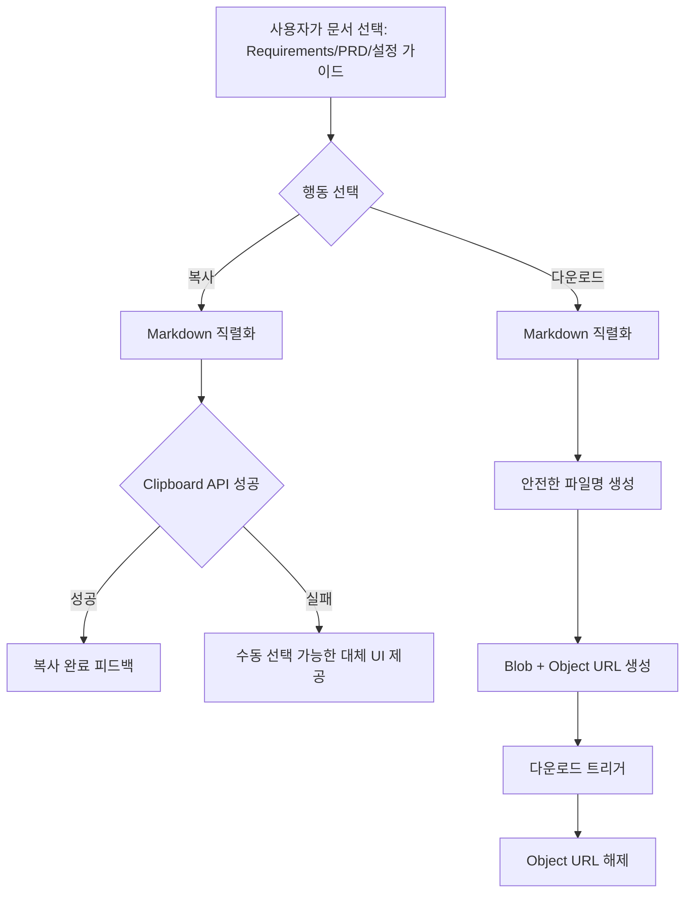

# EXP-PR-01 — 문서 복사·다운로드

## Overview

사용자가 요구사항명세서, PRD, 설정 가이드를 각각 안전하게 Markdown으로 복사하거나 다운로드할 수 있게 한다. 전체 묶음이나 ZIP은 제공하지 않는다.

## Background

`DEC-008`(전체 묶음 미제공, 문서별 개별 다운로드)이 이미 확정돼 있다. 세 문서(요구사항명세서, PRD, 설정 가이드) 생성 PR(`DOC-PR-02`, `GDE-PR-01`)이 끝나야 실제 내보낼 대상이 존재하므로, 이 PR은 문서 생성 파이프라인이 아니라 순수 export 계층만 담당한다.

## Scope

### 포함

- 현재 선택 문서의 전체 Markdown 복사
- 문서별 개별 다운로드(파일명에 정제된 프로젝트명 + 문서 유형 포함)
- Object URL 다운로드 후 해제
- 복사 실패 시 수동 선택 가능한 대체 행동

### 제외

- ZIP/전체 묶음 내보내기(DEC-008로 금지)
- 문서 생성 자체(`DOC-PR-01`~`04`, `GDE-PR-01`)

## 연결 근거

- 요구사항: `EXP-001`
- Delivery 작업: `EXP-505` (`docs/delivery/05-sources-guides-export.md`)
- 결정: `DEC-008`
- 화면 설계: `docs/ui/screens/05-documents-and-guide.md` F-REQ-DRAFT/F-GUIDE-DRAFT의 `[복사][Markdown 다운로드]` 액션
- 선행 PR: `DOC-PR-02`(요구사항명세서·PRD 생성), `GDE-PR-01`(설정 가이드 생성)

## 선행 조건 (Definition of Ready)

- `DOC-PR-02`가 머지되어 요구사항명세서/PRD `GeneratedDocument`가 존재함
- `GDE-PR-01`이 머지되어 설정 가이드 문서가 존재함(설정 가이드가 아직 없으면 해당 문서 유형만 비활성화하고 나머지 두 문서는 독립적으로 동작해야 함)

## 작업 단위별 구현 개요

1. **Markdown 직렬화**: `DocumentSection[]`을 화면 제어 요소(버튼, modal, 상태 배지) 없이 순수 Markdown 문자열로 직렬화한다.
2. **복사**: Clipboard API로 전체 문서를 복사하고, 실패 시(권한 거부 등) 수동 선택 가능한 텍스트 영역 등 대체 UI를 제공한다.
3. **다운로드**: 안전한 파일명(경로 문자·제어 문자 제거, 정제된 프로젝트명 + 문서 유형)으로 Blob을 만들고 Object URL을 생성해 다운로드 트리거 후 즉시 해제한다.
4. **왕복 무결성 확인**: 코드 fence, 목록, 표, 한글이 다시 열었을 때 원래 형태로 유지되는지 확인한다.

## 프로세스 / 상태 전이

## 데이터/API 영향

- 없음(순수 클라이언트 export, 서버 API·저장 스키마 변경 없음)

## Acceptance Criteria

### Happy Path

Given `ready` 상태의 PRD가 있을 때, when 사용자가 "Markdown 다운로드"를 선택하면, then `<정제된 프로젝트명>-prd.md` 형식 파일이 다운로드되고 코드 fence·표·한글이 다시 열었을 때 그대로 유지된다.

### Failure Case

Given 브라우저가 Clipboard API 권한을 거부한 환경에서, when 사용자가 "복사"를 선택하면, then 에러가 조용히 무시되지 않고 수동으로 선택해 복사할 수 있는 대체 UI가 나타난다.

### Boundary

Given 프로젝트명에 `/`, `..`, 제어 문자가 포함된 경우, when 사용자가 다운로드하면, then 생성된 파일명에서 해당 문자가 제거되거나 치환돼 파일 시스템에 안전하게 저장된다.

## 예상 변경 파일

- `src/features/export/markdown-serializer.ts` (신규)
- `src/features/export/download-document.ts` (신규, 안전한 파일명 생성 포함)
- `src/features/export/copy-document.ts` (신규, Clipboard 실패 fallback 포함)
- `src/components/blueprint/document-panel.tsx` (복사/다운로드 액션 연결)

## 테스트 계획

- 단위: 파일명 정제(경로/제어 문자 제거), Markdown 직렬화에 화면 제어 요소 미포함 확인
- 컴포넌트: 복사 실패 시 대체 UI 노출
- E2E: 세 문서 각각 복사·다운로드, 다운로드된 파일 재오픈 시 형식 유지 확인

## UI 증거 계획

- desktop 1440×900, mobile 390×844
- 복사 성공/실패 상태, 다운로드 트리거 상태 캡처

## 코드 리뷰·QA 체크리스트

- [ ] ZIP/전체 묶음 UI가 노출되지 않는지
- [ ] Object URL이 다운로드 후 확실히 해제되는지(메모리 누수 방지)
- [ ] 파일명에 경로/제어 문자 주입 가능성이 없는지

## Done Checklist

- [ ] Requirements implemented
- [ ] Acceptance criteria verified
- [ ] 독립 코드 리뷰 pass
- [ ] 독립 QA pass
- [ ] 화면 변경 시 desktop/mobile 캡처 완료
- [ ] 사용자 PR 머지 확인

## 실행 시 추가 문서

- 이 폴더에 구현 중/후 `test-results.md`, `review-notes.md`, `qa-report.md`를 추가로 생성한다(지금은 생성하지 않음).
