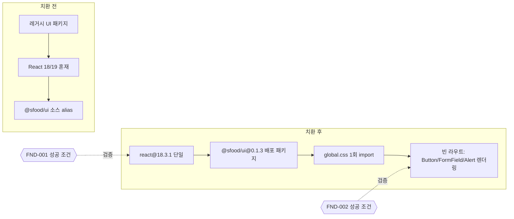

# FND-PR-01 — 런타임·디자인 시스템 단일화

## Overview

애플리케이션의 React 런타임과 UI 패키지를 단일 기준(`react@18.3.1`, `react-dom@18.3.1`, `@sfood/ui@0.1.3`)으로 고정하고, 빈 라우트에서 디자인 시스템 기본 컴포넌트(Button, FormField, Alert)가 전역 스타일과 함께 정상 렌더링되는 상태를 만든다. 이 PR은 화면 기능을 추가하지 않고 이후 모든 화면 작업이 딛고 설 실행 가능한 기반만 완성한다.

## Background

리빌드 이전 코드에는 다른 디자인 시스템 의존성과 `@sfood/ui`를 이웃 저장소 소스로 직접 참조하는 Vite alias가 남아 있었다(`docs/product/09-design-system-integration.md` React 전환 규칙). React 버전이 다른 UI 패키지가 섞이면 peer dependency 충돌과 중복 React 인스턴스가 발생해 이후 모든 화면 작업이 불안정해진다. 이 문제를 가장 먼저, 별도 PR로 고정하지 않으면 후속 PR마다 같은 원인의 렌더링 오류를 반복해서 디버깅하게 된다.

## Scope

### 포함

- `react`, `react-dom`, 관련 타입 패키지를 `18.3.1` 계열로 고정
- 다른 디자인 시스템의 의존성·import 제거
- `@sfood/ui` 소스 alias 및 로컬 호환 CSS 제거
- 배포된 `@sfood/ui@0.1.3`과 `@sfood/ui/global.css` 설치 및 앱 진입점 1회 import
- Tailwind 소비 방식 단일화(3 preset 또는 4 Vite plugin 중 하나만 유지)
- `sfood-ds` MCP 조회 결과를 근거로 한 화면별 컴포넌트 대응표·보강 목록 초안 작성(`FND-002`)
- 빈 라우트에 기본 Button/FormField/Alert를 렌더링하는 임시 앱 셸

### 제외

- 실제 프로젝트 생성/저장 로직
- 실제 OpenAI 호출
- 완성된 홈·대화·문서 화면 디자인
- 도메인 타입, Agent 계약 (→ `FND-PR-02`)
- 테스트 디렉터리 구조와 CI script 등록 (→ `FND-PR-03`)

## 연결 근거

- 요구사항: 모든 P0 계약의 기반, `NFR-001`
- Delivery 작업: `FND-001`, `FND-002` (`docs/delivery/00-foundation-and-contracts.md`)
- 결정: `DEC-003`(숫자 점수 없는 준비도 — 화면 표시 원칙에 영향)
- 화면 설계: [디자인 시스템 통합 명세](../../product/09-design-system-integration.md)
- 선행 PR: `AUTH-PR-03`(사용자 저장 격리) — 사용자가 머지 확인한 이후 착수

## 선행 조건 (Definition of Ready)

- `AUTH-PR-03`이 사용자에 의해 `merged` 상태로 전환됨
- `sfood-ds` MCP(`https://sfood-design-system.vercel.app/api/mcp`)가 `.mcp.json`에서 연결되고 `tools/list`에 6개 도구가 노출됨을 확인
- 현재 저장소의 `package.json`에 React 18 외 다른 React 버전이나 다른 UI 패키지 의존성이 있는지 `npm ls react react-dom` 사전 조사 완료

## 작업 단위별 구현 개요

### FND-001 런타임 고정

1. `package.json`의 `react`, `react-dom`, `@types/react`, `@types/react-dom`을 `18.3.1`/`18.3.x`로 고정
2. `@sfood/ui@0.1.3`을 `dependencies`에 고정 설치
3. `vite.config.ts`에서 `@sfood/ui`를 이웃 저장소 소스로 연결하는 alias가 있으면 제거
4. 앱 진입점(`src/main.tsx`)에서 `@sfood/ui/global.css`를 정확히 한 번 import
5. 로컬 호환 CSS(`src/styles/kamijeong-ui.css` 등 리빌드 이전 잔존 파일)를 제거
6. `npm ls react react-dom @sfood/ui`로 단일 React 계열만 존재하는지 확인

### FND-002 디자인 시스템 계약

1. `mcp__sfood-ds__get_setup_guide`로 설치 버전, peer dependency, 전역 CSS 사용법 재확인
2. `mcp__sfood-ds__list_components` / `search_components`로 `docs/product/09-design-system-integration.md`의 "Blueprint 컴포넌트 대응" 표에 나온 각 영역(앱 구조, 문서 전환, 보조 탐색, 모바일 상세, 단일/복수 선택, 직접 답변, 참고 자료, 상태 표시, 검토 카드, 승인 흐름, 문서 레이아웃) 컴포넌트를 조회
3. 각 채택 후보에 `get_component`를 호출해 import 경로, props, 상태, 키보드 동작을 확인하고 작업 기록에 남김
4. 없는 컴포넌트는 앱에 임시로 만들지 않고 디자인 시스템 보강 후보 목록(이 폴더의 `design-system-gaps.md`, 구현 시 생성)에 등록

## 프로세스 / 상태 전이

이 PR은 도메인 상태 전이가 없다. 대신 "런타임 치환" 자체가 하나의 상태 전이이므로 치환 전/후 의존성 구조를 표시한다.

## 데이터/API 영향

없음. 이 PR은 런타임/빌드 설정과 화면 셸만 변경하며 도메인 데이터나 API 계약을 만들지 않는다.

## Acceptance Criteria

### Happy Path

Given 저장소를 새로 clone하고 `npm install`을 실행했을 때, when `npm ls react react-dom @sfood/ui`를 실행하면, then React 18 계열 하나만 출력되고 버전 충돌 경고가 없다.

Given 개발 서버(`npm run dev`)를 실행했을 때, when `/`에 접속하면, then 임시 앱 셸에서 `@sfood/ui`의 Button, FormField, Alert가 전역 스타일과 함께 오류 없이 렌더링된다.

### Failure Case

Given 다른 디자인 시스템의 컴포넌트를 import하는 코드가 남아있을 때, when `npm run build`를 실행하면, then 빌드가 실패하거나(타입 오류) 코드 리뷰에서 해당 import가 거부된다(이 PR에서 제거 대상이므로 존재 자체가 회귀).

Given `sfood-ds` MCP가 일시적으로 응답하지 않을 때, when FND-002 조회를 진행 중이면, then 이미 확인된 계약으로 구현을 계속하고 새 컴포넌트 API를 추정해 추가하지 않는다.

### Boundary

Given 320px 너비 화면일 때, when 임시 앱 셸을 렌더링하면, then 수평 overflow가 발생하지 않는다.

Given 키보드로만 탐색할 때, when Button/FormField에 포커스를 이동하면, then 포커스 링이 시각적으로 보인다.

## 예상 변경 파일

- `package.json`, `package-lock.json`
- `vite.config.ts`
- `src/main.tsx`
- `src/app/router.tsx` (임시 앱 셸 라우트)
- `src/styles/*` (레거시 CSS 제거)
- `tailwind.config.js`, `postcss.config.js` (소비 방식 단일화 시)

## 테스트 계획

- `npm ls react react-dom @sfood/ui` 결과 캡처(단일 계열 확인)
- `npm run build` 성공 로그
- 빈 라우트 렌더링 스모크 확인(수동 또는 `tests/e2e/smoke.spec.ts` 확장)
- 320px, 1440px 두 뷰포트에서 overflow 없음 확인

## UI 증거 계획

- desktop `1440x900`: 임시 앱 셸 + 기본 컴포넌트 렌더링
- mobile `390x844`: 동일 화면의 반응형 확인
- 파일명 예: `FND-PR-01-app-shell-1440x900-normal.png`, `FND-PR-01-app-shell-390x844-normal.png`

## 코드 리뷰·QA 체크리스트

- 다른 디자인 시스템 import가 남아있지 않은가
- `@sfood/ui` 소스 alias, 호환 CSS가 완전히 제거됐는가
- MCP 조회 없이 추정한 컴포넌트 API가 없는가
- 원시 색상/px 값이 아니라 semantic token을 사용했는가
- 디자인 시스템 보강 후보가 문서로 남았는가(누락 시 후속 작업 추적 불가)

## Done Checklist

- [ ] Requirements implemented
- [ ] Acceptance criteria verified
- [ ] 독립 코드 리뷰 pass
- [ ] 독립 QA pass
- [ ] 화면 변경 시 desktop/mobile 캡처 완료
- [ ] 사용자 PR 머지 확인

## 실행 시 추가 문서

- 이 폴더에 구현 중/후 `test-results.md`, `review-notes.md`, `qa-report.md`, `design-system-gaps.md`를 추가로 생성한다(지금은 생성하지 않음).
