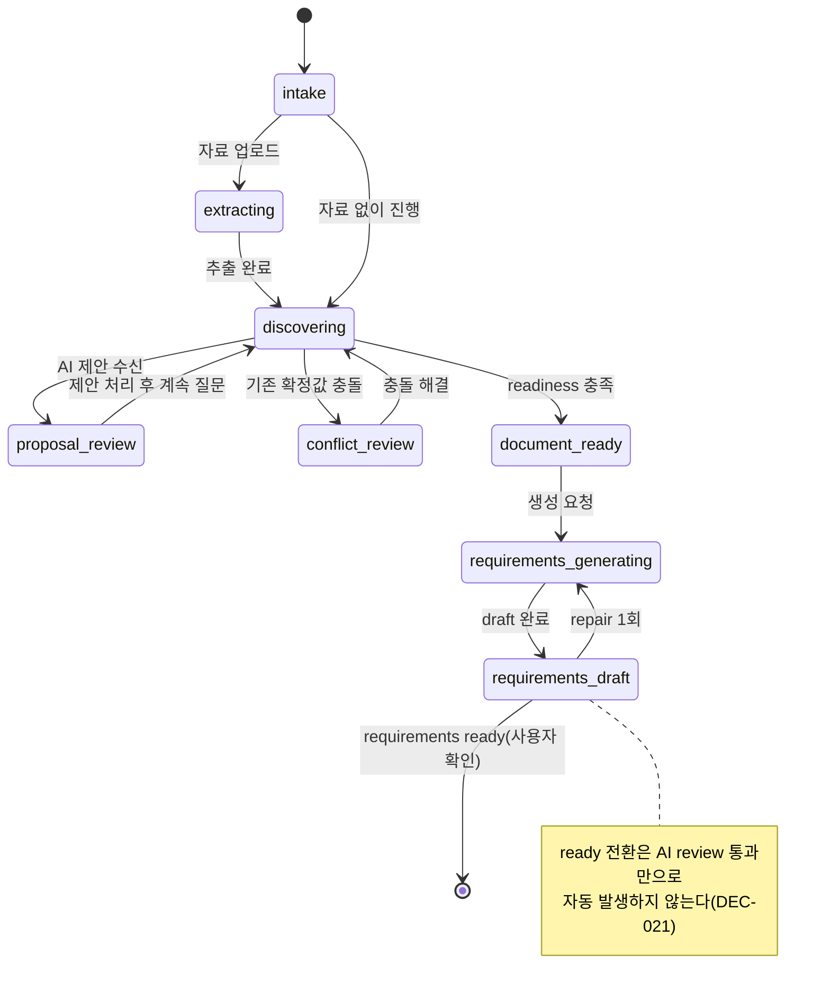

# FND-PR-02 — 도메인·Agent 계약 확정

## Overview

도메인 타입·상태 enum(`BlueprintProject`, `DesignItem`, `ChangeProposal`, `GeneratedDocument` 등)과 Agent turn/document API의 strict JSON Schema, model registry, DisplayBlock/ContextManifest/AiRequestLedger 타입을 코드 계약으로 확정한다. 이 PR의 결과물은 화면이 아니라 "타입과 스키마가 요구사항·데이터 명세와 동일하다"는 검증 가능한 계약 테스트다.

## Background

`docs/product/05-data-spec.md`와 `docs/product/13-prompt-and-response-contracts.md`가 상태 이름과 스키마를 이미 문서로 정의했지만, 코드가 이를 그대로 옮기지 않으면 이후 PR마다 서로 다른 상태 문자열이나 필드명을 쓰는 회귀가 반복된다. 특히 Agent 응답은 모델이 반환한 payload를 도메인 엔터티로 신뢰하지 않고 항상 스키마·참조 검증을 통과해야 하므로, 검증 로직 자체가 이 PR의 핵심 산출물이다.

## Scope

### 포함

- `BlueprintProject`, `ConversationThread`, `ConversationMessage`, `QuestionAnswer`, `SourceDocument`, `DesignItem`, `EvidenceRef`, `AcceptanceCriterion`, `ChangeProposal`, `GeneratedDocument`, `DocumentSection`, `GenerationJob`, `AiRequestLedgerEntry`, `ContextManifest`, `ReadinessSummary`, `ActivityEntry` TypeScript 타입
- 상태 전이 검증 함수(UI·저장 구현에 비의존)
- `turn`, `documents/generate`, `documents/patch`, `review` API의 strict JSON Schema
- `AiTaskType`, `LIGHT/DEFAULT/FINAL` model registry, task별 token 상한 정의
- 허용 `DisplayBlock` 8종 타입과 렌더링 검증용 판별 로직(실제 UI 렌더러는 이후 PR)
- 정상/부분 응답/빈 제안/잘못된 응답 fixture와 계약 테스트

### 제외

- 실제 저장소(IndexedDB) 구현 (→ `PRJ-PR-*`)
- 실제 OpenAI 호출 (→ `AI-PR-01` 이후)
- DisplayBlock의 실제 UI 렌더러 (→ `CON-PR-03`)
- CI test script 등록 (→ `FND-PR-03`, 이 PR은 계약 테스트 코드만 작성하고 로컬 실행 가능해야 하지만 CI 파이프라인 자체는 다음 PR 몫)

## 연결 근거

- 요구사항: `AI-001`~`AI-010`의 타입 기반, `NFR-004`, `NFR-005`, `NFR-006`
- Delivery 작업: `FND-003`, `FND-004` (`docs/delivery/00-foundation-and-contracts.md`)
- 결정: `DEC-003`(숫자 점수 없는 준비도), `DEC-007`(fallback 금지), `DEC-025`~`DEC-030`(model profile, 결정론/AI 경계, plan-draft-review-repair, budget/ledger, golden eval)
- 데이터 계약: [데이터 명세](../../product/05-data-spec.md)
- AI 계약: [AI 오케스트레이션과 모델 정책](../../product/12-ai-orchestration-and-model-policy.md), [프롬프트·응답 계약](../../product/13-prompt-and-response-contracts.md)
- 선행 PR: `FND-PR-01`

## 선행 조건 (Definition of Ready)

- `FND-PR-01`이 사용자에 의해 `merged` 상태로 전환됨
- `docs/product/05-data-spec.md`, `docs/product/13-prompt-and-response-contracts.md`의 타입·필드명에 미해결 불일치가 없음(있으면 이 PR 착수 전 문서를 먼저 갱신)

## 작업 단위별 구현 개요

### FND-003 도메인 타입과 상태

1. `src/domain/blueprint/`에 위 인터페이스·유니온 타입을 데이터 명세와 동일한 필드명으로 작성
2. 상태 전이 함수(`canTransition(from, to)` 형태)를 순수 함수로 작성해 React, fetch, IndexedDB에 의존하지 않게 함
3. 5개 필수 fixture 작성: 빈 프로젝트, 문서 생성 가능한 프로젝트, 미정이 있지만 생성 가능한 프로젝트, 처리되지 않은 제안이 있는 프로젝트, 충돌로 생성 불가능한 프로젝트
4. 허용되지 않은 상태 전이(예: `intake` → `prd_draft` 직접 전이)를 거절하는 테스트 작성
5. `ReadinessSummary`에 숫자 score 필드가 없음을 타입 레벨에서 보장(리터럴 유니온 `"insufficient" | "workable" | "ready"`만 허용)
6. 프로젝트당 `ConversationThread` 1개 제약을 도메인 command 레벨에서 검증하는 테스트 작성

### FND-004 Agent 계약

1. `src/infrastructure/ai/schemas/`에 `TURN_ANALYZE`, `documents/generate`, `documents/patch`, `CONSISTENCY_REVIEW`의 JSON Schema를 `additionalProperties: false`로 작성
2. `AiTaskType` 전체 13종과 `promptId`/`promptVersion`/`schemaId`/`schemaVersion`/`modelProfile` 필드를 가진 `PromptDefinition<TInput, TOutput>` registry 골격 작성(`docs/product/13-prompt-and-response-contracts.md:31-40` 참고)
3. `AiModelRegistry`에 `LIGHT`/`DEFAULT`/`FINAL` profile과 `docs/product/12-ai-orchestration-and-model-policy.md`의 작업별 `maxInput`/`maxOutputTokens`/`reasoning` 표를 그대로 값으로 이식
4. `DisplayBlock` 8종 유니온 타입(`assistant_text`, `question`, `explanation`, `recommendation`, `proposal_summary`, `conflict_notice`, `readiness_notice`, `next_action`)과 응답당 최대 6개 block, `question` block 최대 1개 제약을 검증하는 함수 작성
5. `ContextManifest`, `AiRequestLedgerEntry` 타입을 데이터 명세와 동일하게 작성
6. 정상/부분 응답/빈 제안/잘못된 응답(추가 필드, 알 수 없는 enum, 존재하지 않는 참조 ID, 6개 초과 block) fixture와 이를 거절하는 검증 테스트 작성
7. plan 실패 시 draft 미호출, repair 1회 제한, hard budget 초과 시 차단하는 fixture와 테스트 작성

## 프로세스 / 상태 전이

`BlueprintProcessState`는 코드가 결정하는 상태이며 이 PR에서 "허용된 전이만" 계약으로 고정한다(`docs/product/05-data-spec.md:74-86`).

이 PR이 확정하는 것은 다이어그램의 화살표 = "허용된 전이 집합"이며, 그 외 전이는 `canTransition()`이 거절해야 한다. `prd_generating`/`prd_draft`는 `requirements` `ready` 이후에만 진입 가능(별도 PR인 `DOC-PR-02`에서 실제 구현, 이 PR은 타입과 가드 계약만 고정).

## 데이터/API 영향

- 신규 타입 정의(스토리지 구현 없음, 저장 계약은 `PRJ-PR-*`에서 실제 구현)
- `turn`, `documents/generate`, `documents/patch`, `review` 4개 API의 요청/응답 schema 확정(엔드포인트 자체 구현은 각 담당 PR: `CON-PR-01`, `DOC-PR-01/02`, `DOC-PR-03`)

## Acceptance Criteria

### Happy Path

Given 5개 필수 fixture 중 "문서 생성 가능한 프로젝트" fixture가 주어졌을 때, when readiness 계산 함수를 호출하면, then `state: "ready"`이고 `pendingProposalCount`/`conflictCount`가 모두 0이다.

Given 정상 `TURN_ANALYZE` 응답 fixture가 주어졌을 때, when schema 검증을 실행하면, then 통과하고 `proposals` 배열의 각 항목이 하나의 대상·하나의 의도만 가진다.

### Failure Case

Given `additionalProperties`에 없는 필드를 포함한 응답이 주어졌을 때, when schema 검증을 실행하면, then 거절되고 도메인 상태가 변경되지 않는다.

Given `ContextManifest`에 없는 `referencedItemIds`를 포함한 응답이 주어졌을 때, when 참조 검증을 실행하면, then 전체 응답이 거절된다.

Given 허용되지 않은 상태 전이(예: `intake` → `requirements_draft`)를 시도했을 때, when `canTransition()`을 호출하면, then `false`를 반환하고 예외적으로 상태를 바꾸지 않는다.

### Boundary

Given 한 응답에 정확히 6개 block이 포함된 fixture가 주어졌을 때, when block 개수 검증을 실행하면, then 통과한다(6개는 허용 상한).

Given 한 응답에 7개 block이 포함된 fixture가 주어졌을 때, when block 개수 검증을 실행하면, then 거절된다.

Given 한 응답에 `question` block이 2개 포함된 fixture가 주어졌을 때, when 검증을 실행하면, then 거절된다.

## 예상 변경 파일

- `src/domain/blueprint/*.ts` (타입, 상태 전이 함수)
- `src/infrastructure/ai/schemas/*.ts` (JSON Schema)
- `src/infrastructure/ai/model-registry.ts`
- `src/infrastructure/ai/display-block.ts`
- `src/infrastructure/ai/context-manifest.ts`
- `tests/domain/*.test.ts`, `tests/contract/*.test.ts` (디렉터리는 `FND-PR-03`에서 정식 구성되므로 이 PR에서는 임시 위치에 작성 후 다음 PR에서 이동 가능)

## 테스트 계획

- 도메인 상태 전이 단위 테스트(허용/거절 양쪽)
- Agent 요청/응답 schema 계약 테스트(정상/부분/빈/오류 fixture)
- block 개수 상한(6) 경계 테스트(6/7개)
- proposal 개수 상한(8) 경계 테스트(8/9개)
- budget/repair 1회 제한 fixture 테스트

## UI 증거 계획

해당 없음 — 이 PR은 화면을 변경하지 않는다.

## 코드 리뷰·QA 체크리스트

- 타입·필드명이 `docs/product/05-data-spec.md`, `docs/product/13-prompt-and-response-contracts.md`와 문자 그대로 일치하는가
- 상태 전이 함수가 UI/저장 구현에 의존하지 않는가(순수 함수 여부)
- 모델 출력이 도메인 엔터티로 직접 반영되지 않고 proposal payload로만 다뤄지는가
- 오류 fixture에 공급자 원문·비밀값이 없는가
- block 6개, proposal 8개 상한이 정확히 구현됐는가(Task A.4에서 발견된 표기 오차 재발 여부 확인)

## Done Checklist

- [ ] Requirements implemented
- [ ] Acceptance criteria verified
- [ ] 독립 코드 리뷰 pass
- [ ] 독립 QA pass
- [ ] 화면 변경 시 desktop/mobile 캡처 완료 (해당 없음 — 화면 변경 없음)
- [ ] 사용자 PR 머지 확인

## 실행 시 추가 문서

- 이 폴더에 구현 중/후 `test-results.md`, `review-notes.md`, `qa-report.md`를 추가로 생성한다(지금은 생성하지 않음).
