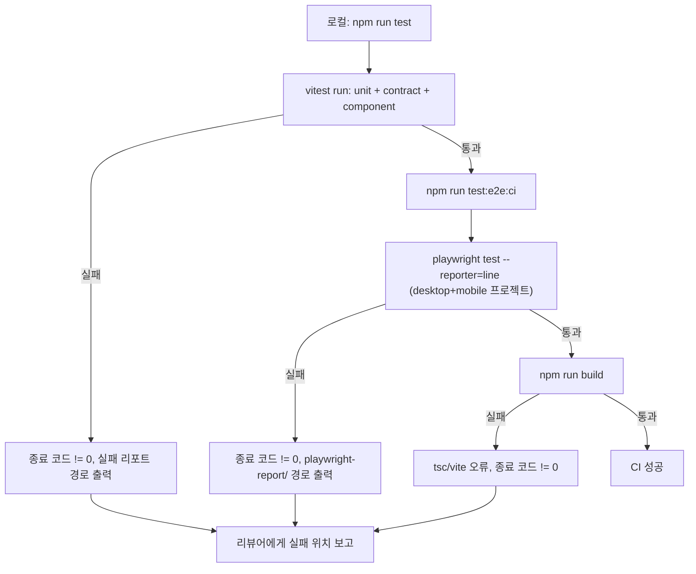

# FND-PR-03 — 테스트 기반 구성

## Overview

도메인 단위 테스트, API 계약 테스트, 컴포넌트 테스트, E2E 테스트 디렉터리를 정식으로 구성하고, 로컬 실행 명령과 CI용 headless 명령을 `package.json` script로 등록한다. 이 PR의 결과물은 "빈 smoke test와 production build가 CI와 로컬에서 동일하게 통과한다"는 재현 가능한 실행 파이프라인이다.

## Background

`PREP-PR-01`(리빌드 착수 준비 정리)에서 UI PR 캡처 요구사항(`AGENTS.md`, `docs/delivery/development-pr-review-qa-workflow.md`)이 `AUTH-PR-02`(순서상 두 번째, UI 포함)보다 먼저 필요한 문제를 막기 위해 최소 Playwright 스캐폴드(`playwright.config.ts`, `tests/e2e/smoke.spec.ts`, `test:e2e`/`test:e2e:ci` script)를 이미 추가했다. 이 PR은 그 최소 스캐폴드를 대체하지 않고, 여기에 도메인 단위 테스트 러너(예: Vitest)와 컴포넌트 테스트, API 계약 테스트 디렉터리를 추가해 `FND-PR-02`에서 작성한 임시 위치의 테스트 파일들을 정식 구조로 옮긴다.

## Scope

### 포함

- 도메인 단위 테스트 러너 도입 및 `tests/unit/` 구성
- API 계약 테스트 구성(`tests/contract/`) — `FND-PR-02`에서 임시 작성한 schema 계약 테스트를 이 구조로 이동
- 컴포넌트 테스트 구성(`tests/component/`)
- 기존 `tests/e2e/`(PREP-PR-01에서 생성된 Playwright 스캐폴드) 유지 및 CI headless 명령 확정
- 테스트 산출물 경로(`coverage/`, `playwright-report/`, `test-results/`) ignore 처리 확인
- CI에서 실패 시 종료 코드 비-0과 보고서 경로가 명확한지 검증

### 제외

- 실제 기능 테스트 커버리지 확대(각 기능 PR이 자기 몫의 테스트를 추가)
- GitHub Actions 등 실제 CI 워크플로 YAML 작성(이 PR은 로컬에서 CI와 "동일하게 재현되는 명령"까지만 책임지며, 파이프라인 YAML 자체는 별도 결정 필요 — 오픈 이슈로 기록)

## 연결 근거

- 요구사항: 모든 P0 요구사항의 검증 기반
- Delivery 작업: `FND-005` (`docs/delivery/00-foundation-and-contracts.md:109-120`)
- 관련 선행 작업: `PREP-PR-01`(Playwright 최소 스캐폴드 — `playwright.config.ts`, `package.json`의 `test:e2e`/`test:e2e:ci`)
- 선행 PR: `FND-PR-02`

## 선행 조건 (Definition of Ready)

- `FND-PR-02`가 사용자에 의해 `merged` 상태로 전환됨
- `PREP-PR-01`의 Playwright 스캐폴드가 `main`에 존재함(`playwright.config.ts`, `tests/e2e/smoke.spec.ts`)
- 도메인 단위 테스트 러너 선택(Vitest 권장 — Vite 프로젝트와 동일 생태계, 별도 설정 최소화)에 대한 이견이 없음

## 작업 단위별 구현 개요

### FND-005 테스트 기반

1. Vitest(또는 동등 러너) devDependency 추가 및 `vitest.config.ts` 작성(Vite 설정 재사용)
2. `tests/unit/`, `tests/contract/`, `tests/component/` 디렉터리 생성
3. `FND-PR-02`에서 임시 위치에 작성한 도메인/계약 테스트 파일을 해당 디렉터리로 이동(import 경로만 수정, 테스트 내용은 변경하지 않음)
4. `package.json` script 추가:
   - `"test": "vitest run"`
   - `"test:watch": "vitest"`
   - `"test:ci": "vitest run --reporter=dot && npm run test:e2e:ci"`
5. `.gitignore`에 `coverage/` 추가(없다면)
6. 빈 smoke test(`tests/unit/smoke.test.ts` — 항상 통과하는 최소 테스트)를 추가해 파이프라인 자체가 동작함을 증명
7. 의도적으로 실패하는 테스트를 임시로 추가해 종료 코드가 0이 아님을 확인한 뒤 제거(리뷰 증거로 로그만 남김)

## 프로세스 / 상태 전이

이 PR은 도메인 상태 전이가 아니라 "테스트 실행 파이프라인"의 흐름을 계약으로 고정한다.

## 데이터/API 영향

없음. 테스트 인프라와 script만 변경한다.

## Acceptance Criteria

### Happy Path

Given 깨끗한 checkout 상태에서, when `npm run test`를 실행하면, then unit/contract/component 테스트가 모두 통과하고 종료 코드 0을 반환한다.

Given 동일한 checkout에서, when `npm run test:e2e:ci`와 `npm run build`를 순서대로 실행하면, then 둘 다 성공한다.

### Failure Case

Given 의도적으로 실패하는 테스트가 포함된 상태에서, when `npm run test`를 실행하면, then 종료 코드가 0이 아니고 실패한 테스트 이름과 리포트 경로가 콘솔에 명확히 출력된다.

Given `tests/e2e/`의 smoke 테스트가 실패하는 상태에서, when `npm run test:e2e:ci`를 실행하면, then `playwright-report/`에 실패 원인을 확인할 수 있는 리포트가 생성된다.

### Boundary

Given 저장소 루트에서, when 전체 테스트 스위트를 실행하면, then 저장소 루트에 임시 캡처나 리포트 파일이 생성되지 않고 모두 ignore된 디렉터리 안에만 생성된다.

## 예상 변경 파일

- `package.json` (scripts 확장)
- `vitest.config.ts` (신규)
- `tests/unit/`, `tests/contract/`, `tests/component/` (신규 디렉터리, `FND-PR-02` 산출물 이동)
- `.gitignore` (`coverage/` 추가)

## 테스트 계획

- `npm run test` 성공/실패 양쪽 케이스 실행 로그
- `npm run test:e2e:ci` 성공 로그(desktop-chromium, mobile-chromium 두 프로젝트)
- `npm run build` 성공 로그
- 저장소 루트에 산출물이 생기지 않는지 `git status --short` 확인

## UI 증거 계획

해당 없음 — 이 PR은 화면을 변경하지 않는다. (다만 `test:e2e:ci` 통과 로그 자체가 완료 증거)

## 코드 리뷰·QA 체크리스트

- `FND-PR-02`에서 작성한 테스트가 내용 변경 없이 정확히 이동됐는가(회귀 없음)
- 실패 시 종료 코드와 리포트 경로가 실제로 확인 가능한가(주장이 아니라 재현된 로그로)
- 테스트 산출물이 저장소 루트를 오염시키지 않는가
- CI 파이프라인 YAML 부재가 오픈 이슈로 명시적으로 남았는가(범위 밖이므로 회피가 아니라 기록)

## Done Checklist

- [ ] Requirements implemented
- [ ] Acceptance criteria verified
- [ ] 독립 코드 리뷰 pass
- [ ] 독립 QA pass
- [ ] 화면 변경 시 desktop/mobile 캡처 완료 (해당 없음 — 화면 변경 없음)
- [ ] 사용자 PR 머지 확인

## 실행 시 추가 문서

- 이 폴더에 구현 중/후 `test-results.md`, `review-notes.md`, `qa-report.md`를 추가로 생성한다(지금은 생성하지 않음).
