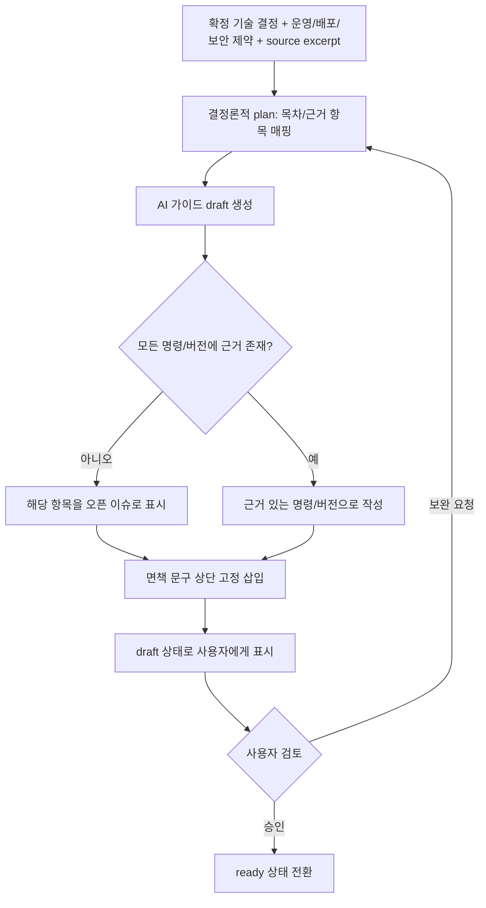

# GDE-PR-01 — 설정 가이드

## Overview

확정 기술 결정, 운영·배포·보안 제약, 관련 참고 자료 근거로 Agent가 설정 가이드 전체를 새로 생성한다. 명령어·버전은 확정 설계와 업로드된 자료에서 근거를 찾을 수 있는 내용만 작성하고, 가이드 본문에 "실행 전 최신 버전과 명령어를 직접 확인하라"는 고정 면책 문구를 포함한다(`DEC-041`).

## Background

이 PR은 원래 `GDE-504 설정 가이드 명령·버전 검증 방식`이 미결정이라 `docs/delivery/development-pr-review-qa-workflow.md` PR 단위표에서 `blocked`였다. 2026-09-16 리빌드 착수 준비 정리(`PREP-PR-01`)에서 사용자가 "확정 설계/자료 근거만 인용 + 면책 문구" 방식으로 결정했고(`DEC-041`, `docs/product/10-decision-log.md`), `docs/delivery/05-sources-guides-export.md`의 GDE-504 절과 `docs/delivery/traceability.md`의 `DOC-007`이 이미 `ready`/`planned`으로 갱신됐다. 이 계획은 그 결정을 실제 구현 범위로 옮긴다.

**주의(구현 전 확인 필요):** `docs/ui/screens/05-documents-and-guide.md`의 F-GUIDE-DRAFT 화면 설계는 아직 "G07 명령·버전 검증 방식 미확정"이라는 예전 문구를 담고 있다. 이 PR 착수 전에 해당 UI 문서를 `DEC-041` 기준으로 갱신해야 화면 문구가 실제 정책과 어긋나지 않는다(이번 계획 작성 범위 밖 — 별도로 처리 필요).

## Scope

### 포함

- 확정 기술 결정 + 운영/배포/보안 제약 + source excerpt를 입력으로 설정 가이드 전체 생성
- 사전 조건, 설치 순서/명령, 환경 변수 이름과 보관 원칙, 외부 서비스 연결, 실행·검증 방법, 실패 시 확인 사항, 보안 주의사항 섹션 생성
- 근거 없는 명령·버전을 추측하지 않고 오픈 이슈로 표시
- 가이드 상단 고정 면책 문구 삽입
- `draft` 상태 표시, 사용자 승인 전 상태

### 제외

- 기존 `docs/guide/*` 링크 모음으로 대체하는 방식(성공 조건에서 명시적으로 금지)
- 요구사항/PRD의 기술 결정 자체를 가이드가 임의로 바꾸는 것
- 문서 다운로드/복사 자체(`EXP-PR-01`)

## 연결 근거

- 요구사항: `DOC-007`
- Delivery 작업: `GDE-504` (`docs/delivery/05-sources-guides-export.md`)
- 결정: `DEC-016`, `DEC-041`
- 화면 설계: `docs/ui/screens/05-documents-and-guide.md` F-GUIDE-DRAFT (갱신 필요, 위 Background 참고)
- 선행 PR: `SRC-PR-02`(근거 연결), `DOC-PR-01`~`DOC-PR-04`(Requirements~PRD 생성과 직접 편집 영향, 확정 기술 결정 원천)

## 선행 조건 (Definition of Ready)

- `DOC-PR-01`~`DOC-PR-04`가 머지되어 확정 기술 결정과 PRD가 존재함
- `SRC-PR-02`가 머지되어 source excerpt 근거 연결이 가능함
- `docs/ui/screens/05-documents-and-guide.md` F-GUIDE-DRAFT의 G07 문구가 `DEC-041` 기준으로 갱신됨

## 작업 단위별 구현 개요

1. **입력 조립**: 확정 기술 결정, 운영/배포/보안 제약, 관련 source excerpt를 `DocumentPlanBuilder`류 결정론적 절차로 모은다(API 호출 아님).
2. **가이드 생성 AI 호출**: 확정 설계 + 근거 excerpt만 컨텍스트로 전달하고, 근거 없는 버전/명령을 만들지 말라는 system/developer 규칙을 강제한다.
3. **면책 문구 고정 삽입**: AI 출력과 무관하게 애플리케이션이 문서 최상단에 "실행 전 최신 버전과 명령어를 직접 확인하라" 문구를 항상 붙인다.
4. **오픈 이슈 표시**: 근거가 부족한 항목은 확정 사실로 서술하지 않고 오픈 이슈 섹션에 표시한다.
5. **draft 상태와 승인 흐름**: 생성 직후 `draft`로 표시하고, 사용자 승인 전에도 다운로드는 허용하되 문서 첫 부분에 초안 상태를 포함한다(`docs/ui/screens/05-documents-and-guide.md` F-GUIDE-DRAFT 참고).

## 프로세스 / 상태 전이

## 데이터/API 영향

- `GeneratedDocument`에 `setup_guide` 문서 유형 추가(`DOC-401` 공통 프레임 확장)
- `POST /api/blueprint/documents/generate` 요청에 `documentType: "setup_guide"` 케이스 추가
- 서버 registry: `SETUP_GUIDE_DRAFT` task 신설 여부는 구현 시 `docs/product/12-ai-orchestration-and-model-policy.md`의 `AiTaskType`에 등록돼야 함(현재 목록에 없음 — 구현 전 확인 필요)

## Acceptance Criteria

### Happy Path

Given 확정 기술 결정과 관련 source excerpt가 있는 프로젝트에서, when 사용자가 설정 가이드 생성을 요청하면, then 사전 조건부터 보안 주의사항까지 전체 섹션을 갖춘 `draft` 문서가 생성되고 상단에 면책 문구가 포함된다.

### Failure Case

Given 근거가 될 확정 기술 결정이 부족한 프로젝트에서, when 가이드 생성을 요청하면, then 근거 없는 명령/버전을 추측해 작성하지 않고 해당 항목이 오픈 이슈로 표시된다.

### Boundary

Given 이미 생성된 draft 가이드가 있을 때, when 사용자가 관련 기술 결정을 변경한 뒤 재생성을 요청하면, then 이전 draft를 덮어쓰지 않고 변경된 근거만 반영한 새 draft가 만들어지며 면책 문구는 항상 유지된다.

## 예상 변경 파일

- `api/blueprint/documents/generate.js` (setup_guide 케이스 추가)
- `src/features/documents/setup-guide-plan-builder.ts` (신규)
- `src/features/documents/setup-guide-view.tsx` (신규)
- `docs/product/12-ai-orchestration-and-model-policy.md`, `docs/product/13-prompt-and-response-contracts.md` (SETUP_GUIDE task 등록 — 구현 착수 시 별도 소규모 문서 PR로 먼저 반영 권장)

## 테스트 계획

- 계약: setup_guide 생성 요청/응답 schema, 근거 부족 시 오픈 이슈 처리
- 컨텐츠 검증: 면책 문구가 모든 생성 결과에 항상 포함되는지(AI 출력과 무관하게 애플리케이션이 강제)
- E2E: 확정 설계 → 가이드 생성 → draft 검토 → 재생성 시 이전 근거 유지

## UI 증거 계획

- desktop 1440×900, mobile 390×844
- draft 상태, 오픈 이슈 포함 상태, 승인 후 ready 상태 캡처

## 코드 리뷰·QA 체크리스트

- [ ] 면책 문구가 AI 응답 내용과 무관하게 항상 삽입되는지(모델이 빠뜨려도 애플리케이션이 보정)
- [ ] 근거 없는 버전/명령을 모델이 반환해도 그대로 노출되지 않는지(schema/도메인 검증)
- [ ] `docs/guide/*` 정적 링크 모음으로 대체하지 않았는지
- [ ] `AiTaskType` registry에 새 task가 등록되고 golden eval 대상에 포함됐는지

## Done Checklist

- [ ] Requirements implemented
- [ ] Acceptance criteria verified
- [ ] 독립 코드 리뷰 pass
- [ ] 독립 QA pass
- [ ] 화면 변경 시 desktop/mobile 캡처 완료
- [ ] 사용자 PR 머지 확인

## 실행 시 추가 문서

- 이 폴더에 구현 중/후 `test-results.md`, `review-notes.md`, `qa-report.md`를 추가로 생성한다(지금은 생성하지 않음).
