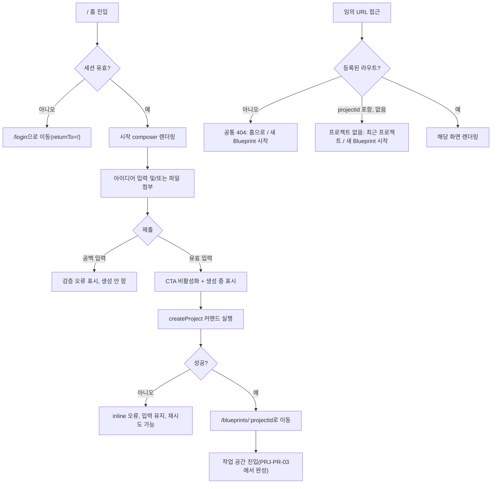

# PRJ-PR-01 — 라우팅·프로젝트 생성

## Overview

Blueprint의 핵심 라우트(`/`, `/blueprints/new`, `/blueprints/:projectId`, `/blueprints/:projectId/:documentType`)를 구성하고, 홈 화면의 시작 composer에서 아이디어 또는 파일로 새 프로젝트를 생성해 작업 공간으로 진입하는 흐름을 완성한다. 존재하지 않는 경로와 존재하지 않는 프로젝트 ID를 구분된 화면으로 처리한다.

## Background

1단계(프로젝트와 저장)의 첫 PR 단위다. 인증 선행 단계(`AUTH-PR-01~03`)가 이미 사용자별 owner namespace를 제공한다고 가정한다. 리빌드 이전 `/survey`, `/prd` 경로는 마이그레이션하지 않고(`DEC-017`, `DEC-018`) 공통 404로 처리해야 하므로, 라우팅 기반을 새로 짜는 이번 PR에서 그 규칙을 처음부터 반영해야 다음 PR들이 잘못된 경로 가정 위에서 시작하지 않는다.

## Scope

### 포함

- `/`, `/blueprints/new`, `/blueprints/:projectId`, `/blueprints/:projectId/:documentType` 라우트 구성
- 일반 404 화면, 프로젝트 없음 화면
- 홈 시작 composer(아이디어 입력 + 파일 첨부 트리거)와 새 프로젝트 생성 커맨드
- 제목 없을 때 첫 설명을 100자 이내 임시 제목으로 변환
- 중복 제출 방지(빠른 연속 클릭 시 프로젝트 1개만 생성)

### 제외

- IndexedDB 영속 저장소 구현 자체(`PRJ-PR-02`에서 구현. 이번 PR은 메모리 상태 또는 최소 stub로 라우팅·생성 로직만 검증)
- 최근 프로젝트 목록, 20/21개 제한(`PRJ-PR-02`)
- 작업 공간 셸의 3패널 레이아웃(`PRJ-PR-03`)
- 파일 텍스트 추출 자체(`SRC-PR-01`) — 이번 PR은 파일 첨부 UI 트리거만 연결

## 연결 근거

- 요구사항: `PJT-001`, `PJT-005`
- Delivery 작업: `PRJ-101`, `PRJ-102` (`docs/delivery/01-project-lifecycle.md`)
- 결정: `DEC-017`(마이그레이션 없음), `DEC-018`(구 경로 404)
- 화면 설계: `docs/ui/screens/01-home-and-start.md`(H01~H11, F-HOME-EMPTY), `docs/ui/05-home-projects-and-files.md`(UI-HOME-001, UI-ERR-404)
- 선행 PR: `AUTH-PR-01`, `AUTH-PR-02`, `AUTH-PR-03` (머지 완료 필요)

## 선행 조건 (Definition of Ready)

- `AUTH-PR-03`(사용자 저장 격리)이 사용자 머지 완료 상태여야 한다.
- 현재 인증 사용자의 owner namespace를 조회하는 인터페이스가 존재해야 한다(구체 IndexedDB 구현은 없어도 됨).
- `docs/product/06-architecture.md`의 라우팅 표와 충돌 없음을 확인한다.

## 작업 단위별 구현 개요

**PRJ-101 라우팅과 404**

- React Router에 4개 라우트 등록, `/survey`·`/prd`·미정의 경로는 공통 404 컴포넌트로 연결
- 프로젝트 ID가 라우트 파라미터로 들어오지만 리포지토리에 없는 경우 일반 404와 다른 "프로젝트 없음" 컴포넌트 렌더링(자동 리다이렉트 금지)
- 브라우저 뒤로가기 시 이전 URL의 화면이 다시 렌더링되지 않도록 라우트 가드가 매번 최신 상태를 조회하게 한다.

**PRJ-102 홈과 새 프로젝트 생성**

- 홈 composer(Textarea + FileUpload 트리거 + 제출 버튼)를 구현하고 제출 시 애플리케이션 커맨드 `createProject(input)`를 호출한다.
- 커맨드는 UUID, 생성 시각, 단일 대화 thread, 초기 readiness를 만들고 첫 설명을 사용자 메시지로 1회만 기록한다.
- 제목이 비어 있으면 첫 설명을 100자 이내로 안전하게 잘라 임시 제목으로 사용한다(HTML 태그·제어문자 제거).
- 제출 버튼은 커맨드가 완료(성공 또는 실패)될 때까지 비활성화해 중복 클릭을 차단한다.

## 프로세스 / 상태 전이

## 데이터/API 영향

- 서버 API 변경 없음(이번 PR은 클라이언트 라우팅과 생성 커맨드만 다룬다). 프로젝트 저장은 `PRJ-PR-02`가 구현하는 저장소 인터페이스의 최소 stub(예: in-memory Map)을 임시로 사용하고, `PRJ-PR-02`에서 IndexedDB 구현으로 교체한다.
- `BlueprintAggregate` 최소 타입(`id`, `title`, `createdAt`, `threadId`)만 이번 PR에서 확정하고 나머지 필드는 `PRJ-PR-02`/`PRJ-PR-03`에서 확장한다.

## Acceptance Criteria

### Happy Path

Given 인증된 사용자가 홈에 있고, when 아이디어를 입력하고 제출하면, then `/blueprints/:projectId`로 이동하고 첫 설명이 단일 대화 메시지로 기록된다.

Given 제목 없이 첫 설명만 입력한 경우, when 프로젝트가 생성되면, then 첫 설명이 100자 이내로 안전하게 잘린 임시 제목이 부여된다.

### Failure Case

Given 사용자가 빈 입력으로 제출을 시도하면, when 검증이 실행되면, then 프로젝트를 생성하지 않고 인라인 오류만 표시한다.

Given 사용자가 등록되지 않은 URL에 직접 접근하면, when 라우트가 매칭되지 않으면, then 공통 404 화면을 표시하고 자동 리다이렉트하지 않는다.

Given 사용자가 존재하지 않는 `projectId`로 접근하면, when 리포지토리 조회가 실패하면, then 일반 404가 아니라 "프로젝트 없음" 화면을 표시한다.

### Boundary

Given 사용자가 제출 버튼을 빠르게 여러 번 클릭하면, when 첫 요청이 처리 중이면, then 두 번째 이후 클릭은 무시되고 프로젝트와 첫 메시지가 정확히 1개만 생성된다.

## 예상 변경 파일

- `src/app/router.tsx` (라우트 등록)
- `src/pages/blueprint-home-page.tsx` (신규)
- `src/pages/not-found-page.tsx`, `src/pages/project-not-found-page.tsx` (신규)
- `src/features/projects/` 하위 `createProject` 커맨드와 최소 타입 (신규)
- `src/components/blueprint/` 홈 composer 컴포넌트 (신규, `@sfood/ui` 우선 사용)

## 테스트 계획

- 단위: 제목 있음/없음 생성, 100자 트림 로직, 공백 입력 거부
- 단위: 중복 클릭 시 커맨드 1회만 실행되는 락/디바운스 로직
- 통합: 라우트별 렌더링(정상 4개 라우트, 구 경로 404, 미정의 경로 404, 없는 projectId)
- 컴포넌트: composer 키보드 제출, 파일 첨부 트리거 노출

## UI 증거 계획

- desktop 1440×900: 홈 빈 상태, 입력 중, 생성 중, 생성 실패, 일반 404, 프로젝트 없음 화면
- mobile 390×844: 홈 빈 상태, 생성 중 상태
- Playwright + Agent Browser로 각 상태의 DOM/포커스 순서 별도 검증

## 코드 리뷰·QA 체크리스트

- [ ] `/survey`, `/prd` 접근 시 리다이렉트 없이 404인지 확인 (DEC-018)
- [ ] 임시 제목 생성 시 HTML/제어문자가 섞이지 않는지 확인
- [ ] 중복 클릭 방지가 네트워크 지연 상황에서도 유지되는지 확인
- [ ] `@sfood/ui` public export만 사용했는지, 임의 색상값이 없는지 확인
- [ ] 프로젝트 없음 화면과 일반 404 화면이 시각적으로 구분되는지 확인

## Done Checklist

- [ ] Requirements implemented
- [ ] Acceptance criteria verified
- [ ] 독립 코드 리뷰 pass
- [ ] 독립 QA pass
- [ ] 화면 변경 시 desktop/mobile 캡처 완료
- [ ] 사용자 PR 머지 확인

## 실행 시 추가 문서

- 이 폴더에 구현 중/후 `test-results.md`, `review-notes.md`, `qa-report.md` 등을 추가로 생성한다(지금은 생성하지 않음).
