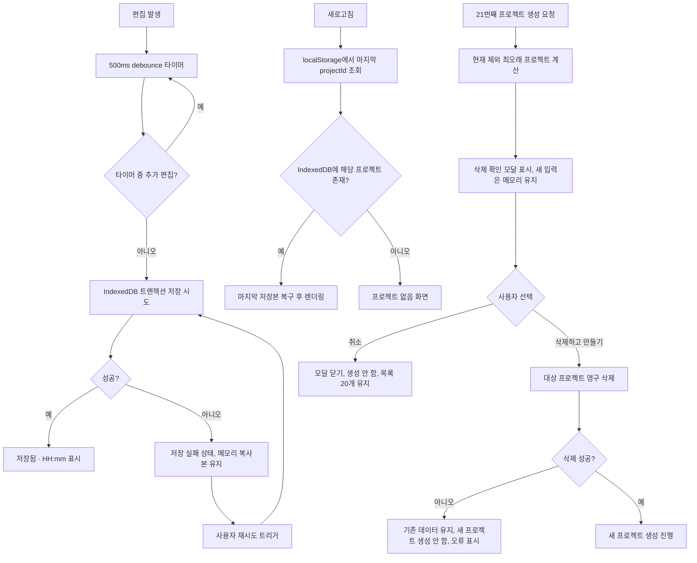

# PRJ-PR-02 — 저장·최근 목록

## Overview

프로젝트를 사용자별 IndexedDB namespace에 실제로 영속화하고, 새로고침 후 마지막 상태를 복구하며, 최근 프로젝트를 최근 사용 순으로 최대 20개까지 유지한다. 21번째 생성 시 가장 오래된 프로젝트의 삭제를 사용자에게 확인받고, 저장 실패 시 데이터를 잃지 않고 재시도할 수 있게 한다.

## Background

`PRJ-PR-01`은 라우팅과 생성 커맨드를 in-memory stub으로 검증했다. 이 PR은 그 stub을 실제 IndexedDB 저장소로 교체하고, `DEC-001`/`DEC-011`(20개 제한과 확인 후 삭제)을 구현한다. 서버 DB가 없는 MVP 구조이므로(`docs/product/06-architecture.md`) 저장 실패·quota 초과·저장 중 새로고침 같은 실패 경로를 이 PR에서 견고하게 다뤄야 이후 단계(대화, 문서 생성)가 데이터 유실 위험 위에서 쌓이지 않는다.

## Scope

### 포함

- `ProjectRepository` 인터페이스의 IndexedDB 구현(namespace, `schemaVersion`, 트랜잭션)
- 프로젝트 aggregate + activity 단일 트랜잭션 저장, 500ms debounce 자동 저장
- 최근 프로젝트 목록(수정 시간순, 최초 6개 + 전체 보기, 최대 20개)
- 21번째 생성 시 삭제 확인 모달과 원자적 삭제 처리
- 새로고침 후 마지막 프로젝트/저장 상태 복구(localStorage에는 마지막 projectId·활성 탭·UI 설정만)

### 제외

- 작업 공간 셸의 3패널 레이아웃과 탭 전환 UI(`PRJ-PR-03`)
- 대화 메시지 자체의 도메인 규칙(`CON-PR-01` 이후)
- 이전 앱(설문 서비스)의 저장 데이터 마이그레이션(`DEC-017`에 따라 하지 않음 — 명시적으로 스코프 밖)

## 연결 근거

- 요구사항: `PJT-002`, `PJT-003`, `PJT-004`
- Delivery 작업: `PRJ-103`, `PRJ-104` (`docs/delivery/01-project-lifecycle.md`)
- 결정: `DEC-001`, `DEC-011`, `DEC-017`
- 화면 설계: `docs/ui/05-home-projects-and-files.md`(UI-HOME-002, UI-PRJ-001), `docs/ui/screens/01-home-and-start.md`(F-HOME-RECENT, F-PROJECT-LIMIT)
- 선행 PR: `PRJ-PR-01` (머지 완료 필요)

## 선행 조건 (Definition of Ready)

- `PRJ-PR-01`이 사용자 머지 완료 상태여야 한다.
- 인증된 사용자의 `ownerKey` 파생 규칙이 확정돼 있어야 한다(`AUTH-PR-03`).
- `docs/product/06-architecture.md`의 `ProjectRepository` 인터페이스 정의와 충돌 없음을 확인한다.

## 작업 단위별 구현 개요

**PRJ-103 IndexedDB 저장소**

- `ownerKey` 기준 namespace와 `schemaVersion`을 가진 IndexedDB 스토어를 연다.
- 프로젝트 aggregate와 activity(최근 이벤트) 저장을 하나의 IndexedDB 트랜잭션으로 묶는다.
- 편집 발생 시 500ms debounce 후 저장을 예약하고, 저장 중 추가 편집이 들어오면 최신 상태로 재예약한다.
- quota 초과 또는 트랜잭션 실패 시 메모리의 작업 복사본을 유지하고 저장 실패 상태로 전환한다(자동 롤백하지 않음).
- 이전 앱의 storage key를 읽거나 변환하지 않는다.

**PRJ-104 최근 프로젝트와 20개 제한**

- 목록을 `lastOpenedAt` 내림차순으로 조회하고 최초 6개 + `전체 보기`로 노출한다.
- 21번째 생성 요청 시 현재 프로젝트를 제외한 최오래 프로젝트를 계산해 삭제 확인 모달에 표시한다.
- `취소`: 새 프로젝트 입력을 메모리에 유지한 채 모달만 닫는다.
- `삭제하고 만들기`: 대상 프로젝트를 영구 삭제한 뒤에만 새 프로젝트를 생성한다(원자적 순서 보장).
- 삭제 처리 중에는 모달을 닫거나 중복 실행할 수 없다.

## 프로세스 / 상태 전이

## 데이터/API 영향

- `ProjectRepository`(`list`, `get`, `save`, `delete`, `migrate`) IndexedDB 구현 확정. `docs/product/06-architecture.md`의 인터페이스와 동일해야 한다.
- IndexedDB 스키마: `projects` object store(`ownerKey` + `id` 복합 키 또는 별도 namespace DB), `schemaVersion` 필드로 마이그레이션 대비.
- localStorage에는 `lastProjectId`, `activeTab`, UI 환경설정만 저장하고 프로젝트 본문은 저장하지 않는다.

## Acceptance Criteria

### Happy Path

Given 사용자가 프로젝트를 편집하고, when 500ms 동안 추가 입력이 없으면, then 자동 저장이 실행되고 저장 상태가 `저장됨 · HH:mm`으로 바뀐다.

Given 사용자가 저장된 프로젝트에서 새로고침하면, when 앱이 다시 부팅되면, then 마지막 프로젝트와 마지막 저장 상태가 복구된다.

### Failure Case

Given IndexedDB 트랜잭션이 quota 초과로 실패하면, when 저장이 시도되면, then 메모리의 현재 편집 내용을 잃지 않고 저장 실패 상태와 재시도 버튼을 표시한다.

Given 삭제 확인 모달에서 삭제 요청이 실패하면, when 삭제 처리가 실패하면, then 새 프로젝트를 생성하지 않고 기존 20개 목록을 그대로 유지한다.

### Boundary

Given 사용자가 정확히 20개의 프로젝트를 가지고 있으면, when 21번째 프로젝트를 생성 요청하면, then 삭제 확인 모달이 표시된다.

Given 사용자가 19개 이하의 프로젝트를 가지고 있으면, when 새 프로젝트를 생성하면, then 삭제 확인 없이 즉시 생성된다.

## 예상 변경 파일

- `src/infrastructure/storage/indexeddb-project-repository.ts` (신규)
- `src/infrastructure/storage/schema-migration.ts` (신규)
- `src/features/projects/recent-projects-query.ts` (신규)
- `src/features/projects/enforce-project-limit.ts` (신규)
- `src/components/blueprint/project-limit-modal.tsx` (신규)
- `src/pages/blueprint-home-page.tsx` (최근 목록 연결, `PRJ-PR-01`에서 만든 파일 수정)

## 테스트 계획

- 단위: debounce 저장 타이밍, 저장 실패 시 메모리 상태 보존
- 단위: 20/21개 경계 계산 로직(19→생성, 20→생성, 21→모달)
- 통합: IndexedDB 트랜잭션 성공/실패 fixture, 스키마 마이그레이션 시나리오
- E2E: 새로고침 후 마지막 상태 복구, 21번째 생성 시 취소/삭제 각각 검증
- E2E: 저장 중 추가 편집이 유실되지 않는지 확인

## UI 증거 계획

- desktop 1440×900: 최근 프로젝트 0/6/20개 목록, 21번째 삭제 확인 모달, 저장 중/저장됨/저장 실패 상태
- mobile 390×844: 최근 프로젝트 목록, 삭제 확인 모달
- Playwright + Agent Browser로 모달 포커스 트랩과 취소/확인 키보드 동작 별도 검증

## 코드 리뷰·QA 체크리스트

- [ ] 저장 실패 시 자동으로 마지막 저장본으로 되돌리지 않는지 확인(현재 편집 보존 원칙)
- [ ] 삭제와 생성이 원자적으로 순서화됐는지(삭제 실패 시 생성 안 함) 확인
- [ ] 이전 앱 storage key를 읽지 않는지 코드 검색으로 확인
- [ ] localStorage에 프로젝트 본문이 저장되지 않는지 확인
- [ ] 목록이 항상 정확히 최대 20개로 제한되는지 확인

## Done Checklist

- [ ] Requirements implemented
- [ ] Acceptance criteria verified
- [ ] 독립 코드 리뷰 pass
- [ ] 독립 QA pass
- [ ] 화면 변경 시 desktop/mobile 캡처 완료
- [ ] 사용자 PR 머지 확인

## 실행 시 추가 문서

- 이 폴더에 구현 중/후 `test-results.md`, `review-notes.md`, `qa-report.md` 등을 추가로 생성한다(지금은 생성하지 않음).
