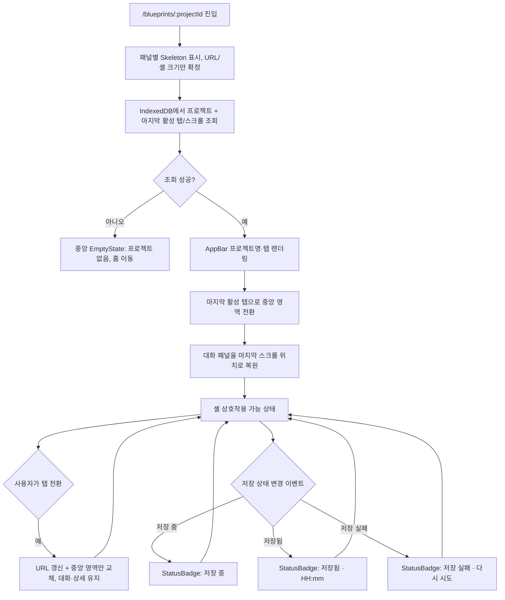
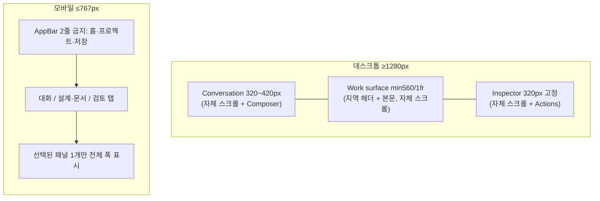

# PRJ-PR-03 — 작업 공간 셸

## Overview

프로젝트 작업 공간에 상단 AppBar(프로젝트명, 문서 탭, 저장 상태, 내보내기)와 대화·중앙 작업·상세 3패널 레이아웃을 구성하고, 데스크톱과 모바일에서 각각 반응형으로 동작하게 한다. 새로고침 후 마지막 문서 탭과 대화 스크롤 위치를 복구한다.

## Background

`PRJ-PR-01`은 라우팅과 생성, `PRJ-PR-02`는 영속 저장과 최근 목록을 완성했다. 이 PR은 그 위에서 실제 작업 공간 셸을 구성하는 마지막 1단계 PR이며, 이후 2단계(대화·폼)부터는 이 셸 안에 기능을 채워 넣기만 하면 되므로 셸 자체를 바꾸지 않는 것이 이번 PR의 완료 기준이다(`docs/product/08-delivery-plan.md` 1단계 종료 조건).

## Scope

### 포함

- 데스크톱 3패널(대화/작업 영역/상세) 레이아웃과 그리드, 패널별 독립 스크롤
- AppBar(홈 이동, 프로젝트명, 문서 탭, 저장 상태 배지, 내보내기 진입점, 사용자 메뉴)
- 대화·작업 영역·상세 패널의 빈 상태 구성
- 마지막 문서 탭과 대화 스크롤 위치 복구
- 반응형 분기(1280 이상 / 1024~1279 / 768~1023 / 767 이하)와 모바일 하단 탭 전환

### 제외

- 대화 메시지 도메인 로직과 실제 질문 폼(`CON-PR-01` 이후)
- 설계 보드·문서 본문 내용(`DSG-PR-*`, `DOC-PR-*`)
- 상세 패널 내부 콘텐츠(제안 상세 등 — 이번 PR은 빈 상태와 컨테이너만)

## 연결 근거

- 요구사항: `PJT-002`(재개), `PJT-003`(복구), `NFR-002`(5개 viewport)
- Delivery 작업: `PRJ-105` (`docs/delivery/01-project-lifecycle.md`)
- 결정: `DEC-003`(숫자 점수 없는 준비도 — 상세 패널 상태 표시에 적용)
- 화면 설계: `docs/ui/01-workspace-shell.md`(UI-SHELL-001, AppBar 해부, 반응형)
- 선행 PR: `PRJ-PR-02` (머지 완료 필요)

## 선행 조건 (Definition of Ready)

- `PRJ-PR-02`가 사용자 머지 완료 상태여야 한다.
- IndexedDB에서 마지막 활성 탭·스크롤 위치를 저장/조회할 수 있는 필드가 확정돼 있어야 한다.
- `sfood-ds` MCP로 `Tabs`, `StatusBadge`, `Drawer` 컴포넌트의 controlled state 지원 여부를 조회하고 부족한 부분을 디자인 시스템 보강 후보로 기록한다.

## 작업 단위별 구현 개요

**PRJ-105 작업 공간 셸과 복구**

- AppBar: 홈 이동 버튼, 프로젝트명(말줄임 + tooltip), 문서 전환 `Tabs`(URL과 동기화), 저장 상태 `StatusBadge`, 내보내기 버튼, 사용자 메뉴 순서로 배치.
- 중앙 영역은 선택된 탭에 따라 자리표시자 컨테이너(`DesignBoard`/`Requirements`/`PRD` 자리, 이번 PR은 빈 상태만)를 교체 렌더링한다.
- 대화·작업·상세 패널은 각각 독립 스크롤을 가지며 body는 스크롤되지 않는다(`height: 100dvh`).
- 반응형: 1280 이상 3패널 그리드, 1024~1279 대화 34%/중앙 66%+상세 Drawer, 768~1023 상단 모드 탭 전환, 767 이하 AppBar 2줄 금지 + 하단 탭 바.
- 새로고침 시 `PRJ-PR-02`가 저장한 마지막 활성 탭과 대화 스크롤 위치를 복구하고, 복구 전에는 패널별 `Skeleton`을 표시한다.

## 프로세스 / 상태 전이

## 데이터/API 영향

- 서버 API 변경 없음. `PRJ-PR-02`의 저장소에 `activeTab`, `conversationScrollAnchor` 필드를 추가로 읽고 쓴다(UI preference로 취급, `docs/delivery/01-project-lifecycle.md:92` "마지막 프로젝트 ID, 활성 탭과 UI 환경설정만 localStorage" 원칙에 따라 activeTab은 localStorage에, 프로젝트별 상세 상태는 IndexedDB에 저장하도록 구분한다).
- 패널 리사이즈 값(대화 패널 폭)은 프로젝트 데이터가 아니라 브라우저 UI preference로 별도 저장한다(`docs/ui/01-workspace-shell.md` 패널 리사이즈 절).

## Acceptance Criteria

### Happy Path

Given 사용자가 이전에 PRD 탭을 열어둔 상태로 새로고침하면, when 작업 공간이 다시 로드되면, then PRD 탭이 선택된 채로 복구된다.

Given 데스크톱 1440px 뷰포트에서, when 작업 공간을 열면, then 대화·중앙·상세 3패널이 각각 소유권이 구분된 채로 표시된다.

### Failure Case

Given 저장 상태가 실패로 전환되면, when 사용자가 다른 탭으로 전환해도, then 미저장 입력과 저장 실패 배지가 유지된다(자동으로 사라지지 않음).

Given 삭제되었거나 존재하지 않는 프로젝트로 진입하면, when 셸이 초기화를 시도하면, then 3패널 대신 복구 안내 `EmptyState`를 표시한다.

### Boundary

Given 뷰포트가 1024px 미만 767px 이상이면, when 작업 공간을 열면, then 상세 패널이 Drawer로 전환되고 AppBar는 한 줄을 유지한다.

Given 뷰포트가 767px 이하이면, when 작업 공간을 열면, then AppBar가 2줄로 늘어나지 않고 하단에 대화/설계·문서/검토 탭이 표시된다.

## 예상 변경 파일

- `src/components/blueprint/workspace-shell.tsx` (신규)
- `src/components/blueprint/app-bar.tsx` (신규)
- `src/components/blueprint/conversation-panel.tsx`, `document-panel.tsx`, `review-panel.tsx` (신규, 빈 상태만)
- `src/pages/blueprint-workspace-page.tsx` (신규, `PRJ-PR-01`의 라우트 대상 연결)
- `src/features/projects/workspace-recovery.ts` (신규, 마지막 탭/스크롤 복구 로직)

## 테스트 계획

- 컴포넌트: AppBar 요소 순서, 프로젝트명 말줄임 + tooltip, 저장 상태 배지 3종
- 컴포넌트: 반응형 4개 분기(1280+, 1024~1279, 768~1023, ~767)에서 레이아웃 스냅샷
- 통합: 새로고침 후 활성 탭/스크롤 복구, 프로젝트 없음 EmptyState 분기
- 접근성: Tab 순서(AppBar → 현재 표시 패널), 숨긴 패널로 포커스 이동 금지

## UI 증거 계획

- desktop 1440×900: 3패널 정상, 저장 중/저장됨/저장 실패, 상세 패널 닫힘(중앙 확장)
- tablet 1024×768 부근: 상세 Drawer 전환 상태
- mobile 390×844: 하단 탭 전환 3종(대화/설계·문서/검토)
- Playwright + Agent Browser로 리사이즈 핸들 키보드 조작과 패널별 스크롤 독립성 별도 검증

## 코드 리뷰·QA 체크리스트

- [ ] 패널 리사이즈 값이 프로젝트 데이터가 아니라 UI preference로 저장되는지 확인
- [ ] 767px 이하에서 AppBar가 2줄로 늘어나지 않는지 확인
- [ ] 저장 실패 상태가 탭 전환 후에도 유지되는지 확인
- [ ] `sfood-ds` MCP 조회 결과와 실제 사용 컴포넌트가 일치하는지, 커스텀 `Tabs` wrapper가 필요한 이유가 기록됐는지 확인
- [ ] Tab 순서가 숨겨진 패널로 이동하지 않는지 키보드로 확인

## Done Checklist

- [ ] Requirements implemented
- [ ] Acceptance criteria verified
- [ ] 독립 코드 리뷰 pass
- [ ] 독립 QA pass
- [ ] 화면 변경 시 desktop/mobile 캡처 완료
- [ ] 사용자 PR 머지 확인

## 실행 시 추가 문서

- 이 폴더에 구현 중/후 `test-results.md`, `review-notes.md`, `qa-report.md` 등을 추가로 생성한다(지금은 생성하지 않음).
