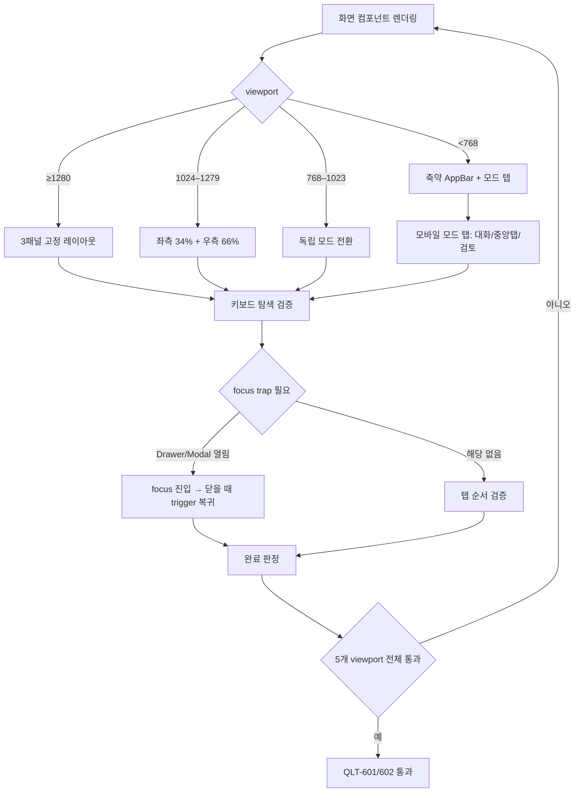

# QLT-PR-01 — 접근성·반응형·성능

## Overview

6단계 통합 품질 단계의 첫 PR이다. `QLT-601`(접근성), `QLT-602`(반응형), `QLT-603`(성능) 세 작업 단위를 검증해 지정된 5개 viewport와 키보드 경로에서 제품이 사용 가능하고, 초기 로드와 긴 입력에서 응답성을 유지함을 증명한다. 이 PR은 새 기능을 추가하지 않고 0~5단계에서 이미 구현된 화면을 대상으로 접근성·반응형·성능 결함을 찾아 고친다.

## Background

`docs/product/08-delivery-plan.md` 6단계 목표는 "정상 흐름과 실패 흐름, 접근성, 반응형과 운영 안전성을 출시 가능한 수준으로 검증"하는 것이다. `docs/delivery/06-quality-and-release.md`는 QLT-601~608 여덟 개 작업 단위를 정의하는데, 이 중 접근성·반응형·성능 세 개는 서로 독립적으로 검증 가능하고(다른 QLT 작업의 보안/전체 E2E/AI eval과 성격이 다름) 반드시 화면이 이미 존재해야 실행할 수 있으므로 0~5단계 완료 후에만 시작 가능하다. `docs/ui/06-overlays-responsive-and-states.md`와 `docs/ui/07-visual-acceptance.md`가 화면별 완료 게이트를 규정하지만 지금까지는 화면 단위 PR에서 부분적으로만 검증됐고, 이 PR에서 전체 화면을 가로질러 일관성을 재검증한다.

## Scope

### 포함

- `QLT-601` 접근성: landmark/heading, 폼 label 연결, Drawer/Modal focus trap, live region, WCAG AA 대비, reduced motion
- `QLT-602` 반응형: 모바일 360×800/390×844, 태블릿 768×1024, 데스크톱 1280×800/1440×900 5개 viewport 전체 화면 레이아웃 검증
- `QLT-603` 성능: 초기 앱 셸 인터랙티브 2.5초 목표, 긴 대화/문서 렌더링, 10MB 파일 추출, 자동 저장 중 입력 응답성

### 제외

- 보안 점검(`QLT-604`), 전체 E2E 시나리오(`QLT-605`), AI 품질 회귀(`QLT-608`) — `QLT-PR-02`
- 사용자 검증(`QLT-606`), 출시 정리(`QLT-607`) — `QLT-PR-03`
- 새로운 화면/기능 추가 — 발견된 결함은 이 PR 범위에서 수정하되 새 기능은 별도 PR로 분리

## 연결 근거

- 요구사항: `NFR-001`(키보드/이름/대비), `NFR-002`(5개 viewport), `NFR-003`(셸/긴 콘텐츠/입력 응답)
- Delivery 작업: `docs/delivery/06-quality-and-release.md` QLT-601, QLT-602, QLT-603
- 결정: 없음(신규 결정 불필요, 기존 화면 명세를 그대로 검증)
- 화면 설계: `docs/ui/06-overlays-responsive-and-states.md`, `docs/ui/07-visual-acceptance.md`, `docs/ui/screen-state-matrix.md`
- 선행 PR: 인증 선행~`DOC-PR-04`, `SRC-PR-02`, `EXP-PR-01`(0~5단계 전체 화면이 존재해야 함)
- 차단 gate: `NFR-002`의 지원 브라우저 범위는 `docs/delivery/traceability.md` 기준 아직 미결정 — 이 결정이 나기 전에는 "지원 브라우저" 항목만 `blocked`로 남기고 나머지(viewport/키보드/성능)는 진행한다.

## 선행 조건 (Definition of Ready)

- 0~5단계에 속한 모든 PR 단위가 사용자에 의해 머지됨
- `docs/ui/screen-state-matrix.md`의 상태 fixture가 실제 화면과 어긋나지 않음
- 브라우저 지원 범위 결정(`NFR-002`)이 완료되거나, 완료 전까지는 Chromium 계열만 기준으로 진행하기로 별도 합의됨

## 작업 단위별 구현 개요

1. **QLT-601 접근성 감사**: 기존 화면(로그인, 홈, 작업 셸, 대화, 설계 보드, 문서, 파일) 각각에 대해 landmark 순서, heading 위계, 폼 label/description/error 연결, Radio/Checkbox 실제 의미, Drawer/Modal focus trap과 close 시 focus 복귀, live region 알림, 대비, reduced motion을 점검하고 결함을 수정한다.
2. **QLT-602 반응형 감사**: `docs/ui/06-overlays-responsive-and-states.md`의 반응형 상태표(AppBar/Conversation/Work surface/Inspector/ToC/Question options/Diff/Requirement table)를 5개 viewport에서 실제로 확인하고, 브레이크포인트 전환 시 현재 입력·선택·스크롤 위치가 초기화되지 않는지 검증한다.
3. **QLT-603 성능 측정**: 앱 셸 TTI, 긴 대화/문서 렌더링, 10MB 파일 검증·추출, 자동 저장 중 타이핑 응답성을 측정하고 LIGHT/DEFAULT/FINAL 작업별 latency·비용을 분리 기록한다. 번들 크기 경고와 불필요한 의존성을 정리한다.
4. 결함 수정은 화면별로 별도 커밋하되 이 PR 안에서 처리한다(새 PR로 분리하지 않음 — 회귀 수정이므로).

## 프로세스 / 상태 전이

## 데이터/API 영향

없음. 이 PR은 화면 렌더링과 상호작용만 다루며 도메인 데이터 구조나 API 계약을 변경하지 않는다. 성능 측정을 위한 계측 코드(latency 기록)를 추가할 경우 `docs/product/06-architecture.md`의 request ledger 스키마를 그대로 사용하고 새 필드를 만들지 않는다.

## Acceptance Criteria

### Happy Path

Given 로그인부터 문서 다운로드까지 이어지는 핵심 화면이 모두 구현돼 있다
When 키보드만으로 전체 흐름을 수행한다
Then 프로젝트 생성부터 문서 다운로드까지 마우스 없이 완료된다
And 5개 기준 viewport(360×800, 390×844, 768×1024, 1280×800, 1440×900) 모두에서 레이아웃이 깨지지 않는다

### Failure Case

Given Drawer 또는 Modal이 열려 있다가 닫혔다
When 사용자가 Tab 키로 이동한다
Then 닫힌 오버레이 내부 요소가 Tab 순서에 남아있지 않다

### Boundary

Given 320px 폭의 매우 작은 화면이다
When 페이지를 렌더링한다
Then 페이지 전체 수평 스크롤이 발생하지 않는다

## 예상 변경 파일

- `src/components/**/*.tsx` (접근성/반응형 결함 수정 대상, 실제 파일은 감사 결과에 따라 결정)
- `src/styles/*.css` (반응형 breakpoint 보정)
- 새 파일 생성 없음(원칙적으로 기존 화면 수정만)

## 테스트 계획

- Playwright: 5개 viewport project로 핵심 화면 스냅샷·상호작용 테스트
- Playwright: 키보드만으로 로그인→프로젝트 생성→질문 답변→제안 승인→문서 이동→다운로드→로그아웃 시나리오
- Agent Browser: 동일 시나리오의 DOM/포커스 순서 수동 재검증
- 성능: Lighthouse 또는 동등 도구로 TTI 측정, 자동 저장 중 keydown-to-paint 지연 측정

## UI 증거 계획

- desktop 1440×900, 1280×800 / tablet 768×1024 / mobile 390×844, 360×800 각 화면 캡처
- Drawer/Modal 열림·닫힘 focus 상태 캡처
- reduced-motion 설정에서의 전환 캡처

## 코드 리뷰·QA 체크리스트

- [ ] `@sfood/ui` public export만 사용했는지 (신규 로컬 Button/Input 없음)
- [ ] 접근성 수정이 기존 확정 동작(다른 요구사항)을 깨지 않았는지
- [ ] 5개 viewport 모두에서 실제 캡처로 확인했는지 (문서상 주장이 아니라 증거)
- [ ] 성능 계측이 사용자 원문/대화 내용을 기록하지 않는지

## Done Checklist

- [ ] Requirements implemented
- [ ] Acceptance criteria verified
- [ ] 독립 코드 리뷰 pass
- [ ] 독립 QA pass
- [ ] 화면 변경 시 desktop/mobile 캡처 완료
- [ ] 사용자 PR 머지 확인

## 실행 시 추가 문서

- 이 폴더에 구현 중/후 `test-results.md`, `review-notes.md`, `qa-report.md` 등을 추가로 생성한다(지금은 생성하지 않음).
