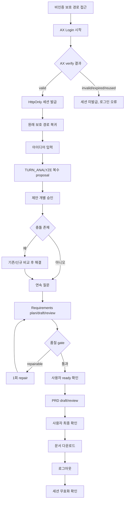

# QLT-PR-02 — 보안·전체 회귀·AI eval

## Overview

`QLT-604`(보안·개인정보), `QLT-605`(전체 E2E), `QLT-608`(AI 품질 회귀) 세 작업 단위를 하나의 PR로 검증한다. `docs/product/08-delivery-plan.md`가 정의한 8개 필수 E2E 시나리오와 `docs/delivery/06-quality-and-release.md`의 17개 QLT-605 흐름을 결정론적 fixture로 반복 실행 가능하게 만들고, 비밀값 노출과 AI golden eval 회귀가 없음을 증명한다.

## Background

인증 선행 단계부터 5단계까지 각 PR은 자신의 범위 안에서만 검증됐다. 그러나 여러 기능이 상호작용할 때(예: 세션 만료 중 문서 생성, AI 실패 중 파일 첨부)의 통합 회귀는 어떤 개별 PR도 검증하지 않는다. `docs/process/07-process-test-spec.md`가 정의한 19개 PATH와 `docs/process/06-failure-and-recovery.md`의 실패·복구 계약을 전체 프로세스 수준에서 한 번에 재검증해야 한다. 보안 항목(`QLT-604`)과 AI 품질 회귀(`QLT-608`)도 여러 단계에 걸쳐 있어 개별 PR 단위로는 완전히 검증되지 않으므로 이 PR에서 통합한다.

## Scope

### 포함

- `QLT-604` 보안: 비밀값 미노출, API 인증 경계, `returnTo`/토큰 재사용 차단, 로그 안전성, Markdown sanitization, 행동 분석 미전송
- `QLT-605` 전체 E2E: 17개 흐름(인증 5개 + 기능 12개) 및 `docs/product/08-delivery-plan.md`의 8개 필수 시나리오 전체
- `QLT-608` AI 품질 회귀: golden fixture, coverage/정합성 fixture, prompt injection/schema 실패 fixture, model·prompt pairwise 비교

### 제외

- 접근성/반응형/성능 세부 결함 수정 — `QLT-PR-01`에서 선행 완료돼야 함(이 PR은 그 결과를 전제로 회귀만 확인)
- 사용자 인터뷰, release checklist 정리 — `QLT-PR-03`

## 연결 근거

- 요구사항: `NFR-004`(안내·최소 전송·비밀 보호), `NFR-005`(비식별 오류·지연), `NFR-007`(행동 이벤트 미전송), `AI-006`(golden eval), 그리고 인증/AI 파이프라인에 걸친 모든 P0
- Delivery 작업: `docs/delivery/06-quality-and-release.md` QLT-604, QLT-605, QLT-608
- 프로세스 근거: `docs/process/07-process-test-spec.md`(19개 PATH, Given/When/Then 시나리오), `docs/process/06-failure-and-recovery.md`(오류별 복구 계약, idempotency)
- 결정: `DEC-007`(fallback 없는 재시도), `DEC-019`(행동 분석 미수집), `DEC-029`(원장·budget), `DEC-030`(golden eval gate)
- 선행 조건: `QLT-PR-01` 완료(공유 화면의 접근성/반응형 결함이 회귀 테스트 결과를 오염시키지 않아야 함), 인증 선행~5단계 전체 PR 머지

## 선행 조건 (Definition of Ready)

- `QLT-PR-01`이 머지되어 화면 결함이 이 PR의 E2E 테스트 실패 원인이 되지 않음
- 인증, AI, 문서, 자료 각 단계의 계약 fixture(`docs/process/07-process-test-spec.md`의 fixture 계약)가 코드로 존재함
- golden fixture 세트(`docs/delivery/ai-model-prompt-and-evaluation.md` 참고)가 버전 관리되고 있음

## 작업 단위별 구현 개요

1. **QLT-604 보안 점검**: 클라이언트 번들 grep으로 `OPENAI_API_KEY`/`AX_AUTH_CLIENT_SECRET`/`AX_SESSION_SECRET` 부재 확인, 비인증 직접 API 호출 401 및 OpenAI 미호출 확인, 서버 로그 fixture에서 사용자 원문 부재 확인, 외부 분석 endpoint로의 네트워크 요청 0건 확인.
2. **QLT-605 전체 E2E — 인증군**: `PATH-AUTH-SUCCESS`, `PATH-AUTH-DENIED`, `PATH-AUTH-EXPIRED`, `PATH-AUTH-API-BYPASS`, `PATH-AUTH-USER-SWITCH` 5개를 실행해 `docs/product/08-delivery-plan.md`의 시나리오 1(로그인→로그아웃)과 시나리오 8(세션 만료·401·A/B 격리)을 커버한다.
3. **QLT-605 전체 E2E — 기능군**: `PATH-HAPPY-IDEA`(시나리오 2: 아이디어→PRD→다운로드), `PATH-HAPPY-FILE`/`PATH-PARTIAL-FILE`(시나리오 3: 파일→문서), `PATH-CONFLICT`(시나리오 4: 충돌 해결), `PATH-AI-RETRY`/`PATH-SAVE-RETRY`(시나리오 5: AI 실패 재시도), `PATH-REFRESH`(시나리오 6: 새로고침 복구), `PATH-DOC-EDIT`, `PATH-PRD-LOCK`, `PATH-AI-BUDGET`, `PATH-DOC-PIPELINE` 등 나머지 12개 흐름을 실행한다. 모바일 시나리오(시나리오 7)는 `QLT-PR-01`에서 검증한 반응형 레이아웃 위에서 동일 기능 흐름을 재생한다.
4. **QLT-608 AI 품질 회귀**: 질문/추출/설명/추천/compaction golden fixture, Requirements/PRD coverage fixture, prompt injection과 잘못된 참조 ID fixture, schema 실패 fixture를 모두 실행하고 현재 model/prompt와 후보 구성을 pairwise 비교한다.
5. flaky 없이 기본 실행에서 통과하도록 결정론적 fixture(시간·UUID·Agent 결과 고정)를 사용한다.

## 프로세스 / 상태 전이

## 데이터/API 영향

- 없음(신규 API 계약 변경 없음). 이 PR은 기존 계약이 통합 시나리오에서 실제로 지켜지는지 검증하는 테스트 코드와 fixture만 추가한다.
- 로그·request ledger 검증을 위한 fixture 서버(계약 테스트용)를 `tests/` 하위에 추가할 수 있다.

## Acceptance Criteria

### Happy Path

Given 모든 인증/문서/AI 파이프라인 계약 fixture가 준비돼 있다
When 8개 필수 E2E 시나리오를 순서대로 실행한다
Then 모든 시나리오가 독립 데이터로 반복 실행 가능하고 기본 실행에서 flaky 재실행 없이 통과한다

### Failure Case

Given 프로젝트가 AI hard budget에 도달했다
When 사용자가 추가 AI 보완을 요청한다
Then provider 호출이 발생하지 않고 확정 설계와 기존 문서가 그대로 유지된다

### Boundary

Given 사용자 A가 로그아웃하고 사용자 B가 로그인한다
When B가 프로젝트 목록을 조회한다
Then A의 프로젝트가 하나도 노출되지 않는다

## 예상 변경 파일

- `tests/e2e/**` (19개 PATH별 Playwright 시나리오 파일)
- `tests/contract/**` (AI/인증/문서 계약 fixture)
- `tests/golden/**` (AI golden eval fixture)
- 보안 점검 스크립트(예: `scripts/check-bundle-secrets.mjs`, 신규 파일 필요 시)

## 테스트 계획

- Playwright: 19개 PATH를 fixture 서버 대상으로 자동 실행
- 계약 테스트: 인증/AI/문서 API의 정상·오류 fixture
- golden eval: task별 model/prompt pairwise 비교, coverage 100% 확인
- 보안: 번들 grep, 네트워크 요청 감사(외부 analytics 미호출 확인)

## UI 증거 계획

- 이 PR 자체는 새 화면을 만들지 않으므로 필수 UI 캡처는 없음. 단, 시나리오 7(모바일) 재생 중 실패가 발견되면 해당 화면의 desktop/mobile 캡처를 첨부한다.

## 코드 리뷰·QA 체크리스트

- [ ] 모든 fixture가 실제 OpenAI 상태에 의존하지 않는지
- [ ] request ledger/원장에 사용자 원문이 기록되지 않는지
- [ ] golden eval 실패 시 배포를 막는 gate가 실제로 CI에서 동작하는지
- [ ] 인증 우회, secret 노출 관련 발견 사항이 즉시 Critical로 분류됐는지

## Done Checklist

- [ ] Requirements implemented
- [ ] Acceptance criteria verified
- [ ] 독립 코드 리뷰 pass
- [ ] 독립 QA pass
- [ ] 화면 변경 시 desktop/mobile 캡처 완료
- [ ] 사용자 PR 머지 확인

## 실행 시 추가 문서

- 이 폴더에 구현 중/후 `test-results.md`, `review-notes.md`, `qa-report.md` 등을 추가로 생성한다(지금은 생성하지 않음).
