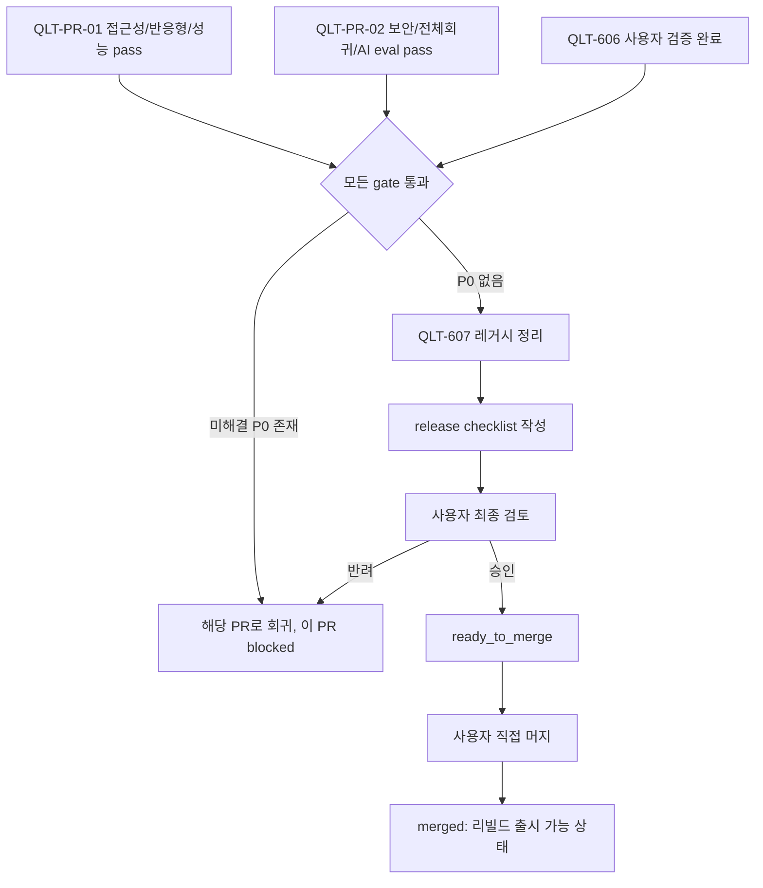

# QLT-PR-03 — 사용자 검증·출시 정리

## Overview

27개 PR 단위 중 마지막 PR이다. `QLT-606`(사용자 검증)과 `QLT-607`(출시 정리)을 완료해 P0 결함 0건과 release checklist를 확보하고, 리빌드 제품을 출시 가능한 상태로 마무리한다. 이 PR은 새 기능이나 회귀 테스트를 추가하지 않고, `QLT-PR-01`·`QLT-PR-02`가 만든 증거를 종합해 최종 판정을 내린다.

## Background

`docs/product/08-delivery-plan.md`는 6단계 완료 조건으로 "지원 브라우저에서 핵심 흐름 수동 확인"과 "알려진 P0 결함 없음"을 요구한다. `docs/delivery/06-quality-and-release.md`의 QLT-606은 사용자 행동 analytics 없이 관찰·인터뷰로 성공 지표(`docs/product/02-prd.md` 성공 지표 절)를 검증하도록 명시하고, QLT-607은 레거시 코드/페이지 제거와 배포 문서 최신화를 요구한다. 이 두 작업은 QLT-PR-01/02가 만든 자동화 증거만으로는 판정할 수 없는 사람 중심 검증과 정리 작업이므로 별도 PR로 분리한다.

## Scope

### 포함

- `QLT-606` 사용자 검증: 첫 입력~첫 제안 확정, AI 제안과 확정 정보 구분, 부족 영역 이해, requirements ready/PRD 잠금 이해, 문서 편집 영향 이해, 오류 후 복구 이해에 대한 관찰·인터뷰 기반 검증
- `QLT-607` 출시 정리: 미사용 이전 페이지/feature/API/CSS 제거, `/survey`·`/prd` 404 최종 확인, README·환경 변수·배포 문서 갱신, 임시 산출물 미포함 확인
- release checklist 작성과 `docs/delivery/traceability.md` 최종 상태 갱신

### 제외

- 새로운 자동화 테스트 작성 — `QLT-PR-01`, `QLT-PR-02`에서 이미 완료
- 새 기능 추가 또는 버그 아닌 개선 — 발견된 P0 결함 수정만 이 PR에 포함하고, P1 이하 개선은 후속 작업 ID로 분리

## 연결 근거

- 요구사항: `NFR-006`(한글 UI·응답·문서), 모든 P0 요구사항의 최종 확인
- Delivery 작업: `docs/delivery/06-quality-and-release.md` QLT-606, QLT-607
- 결정: `DEC-017`(마이그레이션 없음), `DEC-018`(`/survey`, `/prd` 404), `DEC-019`(analytics 미수집)
- 선행 조건: `QLT-PR-01`, `QLT-PR-02` 완료(자동화 증거가 이미 확보돼 있어야 사용자 검증 결과와 종합 판정 가능)
- 참고: `docs/product/02-prd.md` "성공 지표"(사용성/결과 품질/신뢰성) 절과 "출시 조건" 절 전체

## 선행 조건 (Definition of Ready)

- `QLT-PR-01`(접근성·반응형·성능), `QLT-PR-02`(보안·전체 회귀·AI eval)가 모두 사용자에 의해 머지됨
- `docs/delivery/traceability.md`에 blocked 상태로 남은 P0 요구사항이 없음
- 사용자 검증에 참여할 대상자와 시나리오가 준비됨(신규 프로젝트 사용자 다수 대상 관찰)

## 작업 단위별 구현 개요

1. **QLT-606 사용자 검증 세션 진행**: `docs/product/02-prd.md` 핵심 사용자 여정(여정 A/B/C)을 따라 관찰 세션을 진행하고, 다음을 개인 원문 없이 요약 기록한다 — 첫 제안 확정까지 도움 필요 여부, AI 제안/확정 구분 인지, 부족 영역 이해도, requirements ready→PRD 잠금 이해, 문서 편집 영향 인지, 오류 후 복구 행동.
2. **성공 지표 대조**: 관찰 결과를 `docs/product/02-prd.md` 성공 지표(80% 이상 도움 없이 첫 제안 확정, 중앙값 60초 이내 첫 제안, 반복 질문 5% 이하 등)와 대조하고 미달 항목을 P0/P1로 분류한다.
3. **QLT-607 레거시 정리**: 저장소에서 리빌드 이전 코드(`/survey`, `/prd` 라우트, 사용하지 않는 API/CSS)를 찾아 제거하고, `/survey`·`/prd` 접근 시 공통 404 Frame이 표시되는지 확인한다.
4. **문서 최신화**: `README.md`, `docs/guide/deploy-guide.md`(이미 `PREP-PR-01`에서 재작성됨 — 최신 아키텍처와 일치하는지 재확인만 수행), 환경 변수 목록을 최종 점검한다.
5. **release checklist 작성**: `docs/delivery/06-quality-and-release.md`의 "출시 차단 조건" 12개 항목을 모두 해소 확인하고, 각 항목의 증거 링크를 `docs/delivery/traceability.md`에 연결한다.

## 프로세스 / 상태 전이

## 데이터/API 영향

없음. 레거시 제거로 인한 라우트 삭제(`/survey`, `/prd`)는 이미 `DEC-018`로 확정된 404 처리이며 이번 PR은 그 확정 동작이 실제로 지켜지는지 최종 확인만 한다.

## Acceptance Criteria

### Happy Path

Given `QLT-PR-01`, `QLT-PR-02`가 모두 머지됐다
When 신규 사용자 관찰 세션을 진행한다
Then 80% 이상의 참가자가 도움 없이 첫 제안을 확정한다
And 확정까지 중앙값 60초 이내에 첫 제안이 표시된다

### Failure Case

Given 사용자 검증에서 P0 사용성 문제가 발견됐다
When release checklist를 작성한다
Then 해당 문제는 출시 차단으로 기록되고 `ready_to_merge`로 표시하지 않는다

### Boundary

Given `/survey`, `/prd` 경로에 접근한다
When 페이지가 로드된다
Then 리다이렉트 없이 공통 404 Frame이 표시된다

## 예상 변경 파일

- `README.md`
- 레거시 라우트/컴포넌트 삭제 대상 (0단계 이전 잔존 코드가 있다면)
- `docs/delivery/traceability.md` (최종 상태 갱신)
- `docs/delivery/06-quality-and-release.md`에 연결된 release checklist 문서(필요 시 신규 `docs/delivery/evidence/QLT-PR-03/release-checklist.md`)

## 테스트 계획

- 자동 테스트: 기존 `QLT-PR-02`의 전체 회귀 테스트를 최종 1회 재실행해 레거시 정리가 회귀를 만들지 않았는지 확인
- 수동: `/survey`, `/prd` 404 확인, README 절차대로 처음부터 배포 재현
- 사용자 검증: 관찰 세션 기록(원문 미포함 요약)

## UI 증거 계획

- 레거시 제거로 화면이 바뀌면 해당 desktop/mobile 캡처
- `/survey`, `/prd` 404 화면 캡처(desktop 1440×900, mobile 390×844)

## 코드 리뷰·QA 체크리스트

- [ ] 삭제된 레거시 코드가 다른 기능에서 참조되지 않는지
- [ ] 사용자 검증 기록에 개인 식별 정보나 원문이 없는지
- [ ] release checklist의 모든 항목이 실제 증거 링크를 가지는지(주장만으로 체크되지 않았는지)
- [ ] `docs/delivery/06-quality-and-release.md` 출시 차단 조건 12개가 모두 해소 확인됐는지

## Done Checklist

- [ ] Requirements implemented
- [ ] Acceptance criteria verified
- [ ] 독립 코드 리뷰 pass
- [ ] 독립 QA pass
- [ ] 화면 변경 시 desktop/mobile 캡처 완료
- [ ] 사용자 PR 머지 확인

## 실행 시 추가 문서

- 이 폴더에 구현 중/후 `test-results.md`, `review-notes.md`, `qa-report.md` 등을 추가로 생성한다(지금은 생성하지 않음).
