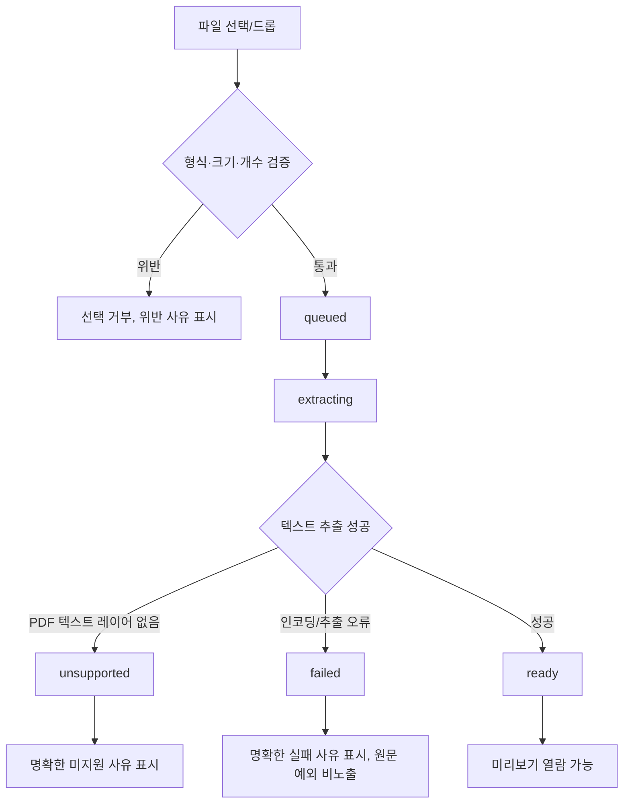

# SRC-PR-01 — 파일 제한·추출

## Overview

사용자가 TXT, Markdown, 텍스트 PDF 참고 자료를 업로드하면 형식·크기·개수를 업로드 전에 검증하고, 지원 파일은 텍스트로 추출해 미리보기와 이후 Agent 요청에 사용할 수 있게 한다. 지원하지 않는 파일이나 추출 실패는 명확한 상태로 표시한다.

## Background

`docs/product/02-prd.md`의 여정 B(기존 자료에서 시작)는 회의록·Markdown·텍스트 자료 업로드로 시작하는 경로를 요구하며, `DEC-005`(TXT/Markdown/텍스트 PDF, 파일당 10MB, 프로젝트당 5개)와 `DEC-013`(PDF 문단 중심 추출, 표는 일반 텍스트 평탄화, OCR 미지원)이 이미 확정돼 있다. 이 PR 전에는 파일을 업로드할 방법이 전혀 없으므로 여정 B와 이후 SRC-PR-02(근거 연결), GDE-PR-01(설정 가이드)이 모두 이 PR에 의존한다.

## Scope

### 포함

- `SourceDocument` 저장 모델과 파일 추출기 registry
- 지원 형식(`.txt`, `.md`, `.markdown`, 텍스트 레이어가 있는 `.pdf`) 검증
- 파일당 10MB, 프로젝트당 최대 5개 제한을 추출 전에 검증
- 업로드 진행(queued/extracting/ready/unsupported/failed) UI
- TXT/Markdown 인코딩 오류 탐지, PDF 문단 우선 추출과 표 평탄화
- 파일마다 민감정보 제거 안내 표시

### 제외

- 근거(source excerpt) 연결과 설계 항목 표시 — SRC-PR-02
- 설정 가이드 생성 — GDE-PR-01
- 문서 다운로드/복사 — EXP-PR-01
- OCR, 이미지 PDF 지원(DEC-013로 미지원 확정)

## 연결 근거

- 요구사항: `SRC-001`
- Delivery 작업: `SRC-501`, `SRC-502` (`docs/delivery/05-sources-guides-export.md`)
- 결정: `DEC-005`, `DEC-013`, `DEC-020`
- 화면 설계: `docs/ui/05-home-projects-and-files.md` UI-FILE-001, 파일 행, AI 데이터 안내
- 선행 PR: `PRJ-PR-01`(프로젝트 라우팅), `PRJ-PR-02`(저장) — 프로젝트 저장소가 있어야 SourceDocument를 붙일 수 있음

## 선행 조건 (Definition of Ready)

- `PRJ-PR-01`, `PRJ-PR-02`가 사용자에 의해 머지됨
- IndexedDB `ProjectRepository`가 동작함(`docs/product/06-architecture.md` 저장소 인터페이스)
- `@sfood/ui`의 FileUpload, StatusBadge 컴포넌트 사용 가능 확인(`FND-PR-01` 완료)

## 작업 단위별 구현 개요

1. **파일 선택과 제한 검증**: `FileUpload` 위에 Blueprint 파일 목록 feature를 조합한다. 선택 즉시 확장자·MIME·크기·개수를 검증하고, 위반 파일은 업로드 큐에 넣지 않는다.
2. **추출기 registry**: 파일 유형별 추출기를 공통 인터페이스(`extract(file): { status, text, preview, hash, error }`)로 등록한다.
3. **TXT/Markdown 추출**: 인코딩 오류를 탐지해 실패 시 `failed` 상태로 표시한다.
4. **PDF 추출**: 텍스트 레이어 유무를 먼저 판정해 없으면 `unsupported`, 있으면 문단 순서로 추출하고 표는 일반 텍스트로 평탄화한다.
5. **파일 행 UI**: 파일명(긴 이름은 확장자 보존 가운데 생략), 크기, 상태, 민감정보 안내, 미리보기·제거 행동을 표시한다.
6. **일부 실패 처리**: 5개 파일 중 일부가 실패해도 성공한 파일은 그대로 유지한다.

## 프로세스 / 상태 전이

## 데이터/API 영향

- 신규 IndexedDB store: `sourceDocuments` (프로젝트 단위, `ownerKey` namespace 하위)
- 서버 API 신규 없음 — 추출은 클라이언트에서 수행(서버는 이후 Agent 요청 시 발췌만 수신)
- 원본 바이너리 장기 보관을 보장하지 않는다(추출 텍스트/preview/hash만 지속 저장)

## Acceptance Criteria

### Happy Path

Given 프로젝트에 자료가 없는 상태에서, when 사용자가 8MB TXT 파일 1개를 업로드하면, then 파일이 `queued → extracting → ready`로 전이하고 미리보기에 추출된 텍스트가 표시된다.

### Failure Case

Given 이미지 전용 PDF(텍스트 레이어 없음)를 업로드했을 때, when 추출을 시도하면, then 파일 상태가 `unsupported`로 표시되고 원본 예외 메시지 대신 사용자용 사유 문구가 노출된다.

### Boundary

Given 프로젝트에 파일 5개가 이미 있을 때, when 사용자가 6번째 파일을 추가하면, then 업로드가 거부되고 왜 거부됐는지(5개 제한) 표시된다. 11MB 파일 업로드 시도도 동일하게 추출 전 거부된다.

## 예상 변경 파일

- `src/domain/blueprint/source-document.ts` (신규)
- `src/infrastructure/files/extractors/{txt,markdown,pdf}.ts` (신규)
- `src/infrastructure/storage/source-document-repository.ts` (신규)
- `src/features/sources/*` (업로드 UI, 파일 행 컴포넌트)
- `src/components/blueprint/*` (FileUpload 조합)

## 테스트 계획

- 단위: 확장자/MIME 불일치 거부, 10MB/5개 경계, PDF 표 평탄화 fixture, TXT 인코딩 오류 fixture
- 컴포넌트: 파일 행 상태별 렌더, 긴 파일명 생략, 일부 성공·일부 실패 동시 표시
- E2E: 정상 업로드 → 미리보기, 미지원 파일 업로드 → 명확한 실패 표시

## UI 증거 계획

- desktop 1440×900, mobile 390×844
- 상태별 캡처: 비어 있음, 업로드 중, ready 5개, unsupported 1개 포함, failed 1개 포함
- Playwright + Agent Browser로 동일 상태 검증

## 코드 리뷰·QA 체크리스트

- [ ] 10MB/5개 경계값이 추출 전에 검증되는지(추출 후 검증 아님)
- [ ] 원본 예외 메시지가 UI에 그대로 노출되지 않는지
- [ ] 파일 원문이 로그에 남지 않는지
- [ ] `@sfood/ui` public export만 사용했는지

## Done Checklist

- [ ] Requirements implemented
- [ ] Acceptance criteria verified
- [ ] 독립 코드 리뷰 pass
- [ ] 독립 QA pass
- [ ] 화면 변경 시 desktop/mobile 캡처 완료
- [ ] 사용자 PR 머지 확인

## 실행 시 추가 문서

- 이 폴더에 구현 중/후 `test-results.md`, `review-notes.md`, `qa-report.md`를 추가로 생성한다(지금은 생성하지 않음).
