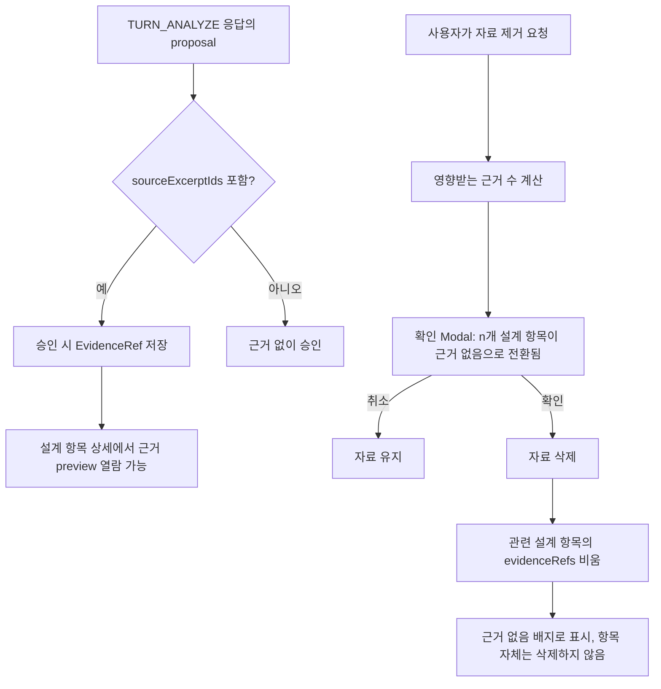

# SRC-PR-02 — 근거 연결

## Overview

파일에서 나온 proposal에 source ID·발췌·위치를 연결해 사용자가 설계 항목의 근거를 확인할 수 있게 하고, 자료를 제거해도 관련 설계 항목이 삭제되지 않고 "근거 없음" 상태로 안전하게 전환되게 한다.

## Background

`SRC-PR-01`이 파일 추출까지만 완성하므로, 추출된 텍스트가 실제로 어떤 설계 항목의 근거가 됐는지 사용자가 검증할 방법이 없다. `DEC-004`(문서 직접 편집은 공통 설계에 자동 반영)와 같은 신뢰 기반 UX 원칙상, 설계 항목의 출처를 추적할 수 없으면 사용자가 AI 제안을 신뢰하기 어렵다. `docs/product/06-architecture.md`의 문서 동기화 절과 마찬가지로, 자료 제거가 과거 확정 항목을 조용히 무효화하지 않아야 한다.

## Scope

### 포함

- proposal → source ID, 발췌, 위치 연결 저장
- 설계 항목 상세에서 근거 preview 열람
- 자료 제거 전 영향받는 근거 수 표시
- 자료 제거 후 관련 설계 항목을 삭제하지 않고 "근거 없음" 상태로 전환

### 제외

- 파일 업로드·추출 자체(`SRC-PR-01`에서 완성)
- 근거 텍스트의 사용자 직접 수정(결정 gate 미확정 — `docs/delivery/05-sources-guides-export.md:14` 차단 gate로 남아 있음)

## 연결 근거

- 요구사항: `SRC-002`
- Delivery 작업: `SRC-503` (`docs/delivery/05-sources-guides-export.md`)
- 결정: `DEC-004`
- 화면 설계: `docs/ui/05-home-projects-and-files.md` 파일 행, `docs/ui/03-design-board-and-inspector.md`(설계 항목 상세 Inspector — 구현 시 재확인)
- 선행 PR: `SRC-PR-01`, `DSG-PR-03`(설계 보드·상세 패널)

## 선행 조건 (Definition of Ready)

- `SRC-PR-01`이 사용자에 의해 머지됨(파일 추출·상태 관리 완료)
- `DSG-PR-01`~`DSG-PR-03`이 머지되어 DesignItem/EvidenceRef 도메인과 상세 패널이 존재함

## 작업 단위별 구현 개요

1. **EvidenceRef 저장**: `TURN_ANALYZE` 응답의 proposal이 참조한 `sourceExcerptIds`를 승인 시 DesignItem의 `evidenceRefs`로 저장한다.
2. **근거 preview UI**: 설계 항목 상세 패널에서 "근거 보기"를 선택하면 원본 파일명, 발췌 텍스트, 위치를 보여준다.
3. **자료 제거 확인**: 파일 제거 시 해당 파일을 근거로 삼는 설계 항목 수를 미리 표시하고 확인을 받는다.
4. **근거 없음 전환**: 확인 후 파일을 제거하면 관련 설계 항목은 삭제되지 않고 `evidenceRefs`가 비워지며 "근거 없음" 배지로 표시된다.

## 프로세스 / 상태 전이

## 데이터/API 영향

- `DesignItem.evidenceRefs: EvidenceRef[]` 필드 추가(스키마 마이그레이션 필요, 기존 항목은 빈 배열로 초기화)
- 서버 API 변경 없음(클라이언트 도메인 command로 처리)

## Acceptance Criteria

### Happy Path

Given 파일에서 추출된 발췌로 승인된 설계 항목이 있을 때, when 사용자가 해당 항목의 "근거 보기"를 선택하면, then 원본 파일명과 발췌 텍스트, 위치가 표시된다.

### Failure Case

Given 근거로 사용 중인 파일을 제거하려 할 때, when 사용자가 제거를 취소하면, then 파일과 관련 설계 항목 모두 변경되지 않는다.

### Boundary

Given 하나의 파일이 5개 설계 항목의 근거일 때, when 사용자가 그 파일을 제거하고 확인하면, then 5개 항목 모두 삭제되지 않고 "근거 없음"으로 전환되며 제거 확인 Modal에 정확히 5라는 영향 수가 표시돼 있었어야 한다.

## 예상 변경 파일

- `src/domain/blueprint/design-item.ts` (evidenceRefs 필드 추가)
- `src/infrastructure/storage/migrations/*` (schemaVersion 증가)
- `src/features/design-items/evidence-preview.tsx` (신규)
- `src/features/sources/remove-source-confirm.tsx` (신규)

## 테스트 계획

- 단위: EvidenceRef 저장/조회, 자료 제거 시 영향 항목 계산
- 저장소: 마이그레이션 전/후 기존 DesignItem 데이터 무결성
- 컴포넌트: 근거 preview 렌더, 제거 확인 Modal의 영향 수 표시
- E2E: 근거 연결 → preview 열람 → 자료 제거 → "근거 없음" 확인

## UI 증거 계획

- desktop 1440×900, mobile 390×844
- 근거 preview 열림 상태, 자료 제거 확인 Modal, "근거 없음" 배지 상태 캡처

## 코드 리뷰·QA 체크리스트

- [ ] 자료 제거가 설계 항목을 삭제하지 않고 상태만 바꾸는지
- [ ] 원문 전체가 아니라 발췌만 근거로 저장·표시되는지(로그 노출 없음)
- [ ] 마이그레이션이 기존 데이터를 손상하지 않는지

## Done Checklist

- [ ] Requirements implemented
- [ ] Acceptance criteria verified
- [ ] 독립 코드 리뷰 pass
- [ ] 독립 QA pass
- [ ] 화면 변경 시 desktop/mobile 캡처 완료
- [ ] 사용자 PR 머지 확인

## 실행 시 추가 문서

- 이 폴더에 구현 중/후 `test-results.md`, `review-notes.md`, `qa-report.md`를 추가로 생성한다(지금은 생성하지 않음).
